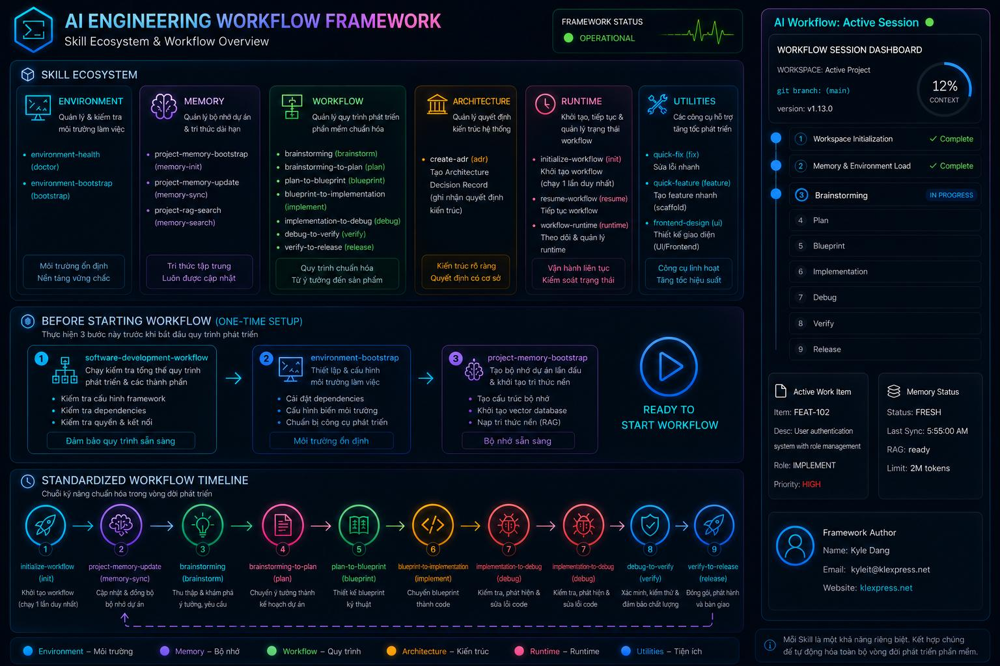

# AI Skill Framework

A premium, production-quality collection of structured AI engineering skills designed to automate and orchestrate the entire Software Development Life Cycle (SDLC) for AI Coding Agents.




---

## 🎯 Project Overview

### Purpose
The **AI Skill Framework** provides a standardized, modular set of instruction sheets (Skills) that AI Coding Agents can load to perform architectural, planning, engineering, and release tasks. It utilizes a **feature-centric workflow** where every feature is assigned a unique **Feature ID** tracked consistently from discovery to deployment.

### 🛡️ Centralized Policy Architecture (`AI_RULES.md`)
To eliminate duplicated constraints and enforce consistent agent behavior across all tasks, the framework utilizes a centralized policy file: **`AI_RULES.md`**.

This file defines the global rules for:
1.  **Approval Gate Policy**: Ensures no state changes happen without user verification.
2.  **Git Workflow Policy**: Controls branch naming, switches, commits, pushes, and tags.
3.  **Memory First Policy**: Prioritizes local Project Memory over generic repository scans.
4.  **RAG Policy**: Sets strict priorities for indexing and retrieval sequences.
5.  **Artifact Policy**: Governs folder mapping and file prefix layouts.
6.  **Versioning Policy**: Enforces SemVer and tagging layouts.
7.  **Documentation Policy**: Standardizes formatting, templates, and relative path linking.
8.  **Testing Policy**: Regulates verification gates and compile/test verification.
9.  **Release Policy**: Specifies the sequential release execution loop.

#### How Skills Reference Policies
Skills do not duplicate these common rules. Instead, they reference them at the top of their definition:
```markdown
## 🔒 GLOBAL POLICY REFERENCES
This Skill MUST strictly follow the global policies defined in [AI_RULES.md](../../AI_RULES.md):
- **Approval Gate Policy** (Section 1)
- **Git Workflow Policy** (Section 2)
```

#### How to Extend Policies and Skills
*   **Creating/Modifying Policies**: Edit `AI_RULES.md` directly. Changes automatically govern all referencing skills.
*   **Creating New Skills**:
    1.  Create a folder under `skills/<your-new-skill>/`.
    2.  Write a `SKILL.md` using the metadata frontmatter.
    3.  Reference the required global policies from `AI_RULES.md` in your skill's boundary section.
    4.  Register the new skill name in `MANIFEST.json` and catalog it in `SKILLS.md`.

---

## 🖥️ Visualizer Extension

To monitor your active session progress, checkpoints, and token usage in real-time, you can install the companion **AI Workflow Visualizer** extension:
* **[VS Code Marketplace](https://marketplace.visualstudio.com/items?itemName=kyleit.ai-skill-workflow-visualizer)**
* **[Open VSX Registry](https://open-vsx.org/extension/kyleit/ai-workflow-visualizer)**

---

## ⚡ Global Installation (CLI wrapper)

The framework includes a global CLI wrapper (`aiwf`) that allows you to trigger framework actions from any terminal and from any project directory without needing to specify the framework's clone path.

### 1. Perform One-Time Global Bootstrap Setup

Clone the repository to a folder of your choice, navigate to it, and execute the bootstrap script for your platform:

**On Linux/macOS:**
```bash
./bootstrap.sh
```

**On Windows (PowerShell - run as Administrator if needed to update PATH):**
```powershell
.\bootstrap.ps1
```

**On Windows (CMD Command Prompt):**
```cmd
bootstrap.bat
```

*This will add the CLI path to your environment `PATH` variables.*

---

### 2. CLI Commands Usage

Once bootstrapped, open a new terminal in any Git project and execute:

* **Install Framework Skills into Project**:
  ```bash
  aiwf install
  ```
  *Deploys `AI_RULES.md`, `MANIFEST.json`, `skills/`, and `templates/` into the project's local `.agents/` folder.*

* **Update/Sync Framework Skills**:
  ```bash
  aiwf update
  ```
  *Synchronizes local skills with latest framework version without overwriting user customization.*

* **Run Health Diagnostics**:
  ```bash
  aiwf doctor
  ```
  *Verifies framework installation, global wrappers availability, local folder integrity, and version metadata.*

* **Check Framework Version**:
  ```bash
  aiwf version
  ```
  *Reports framework, CLI wrapper, and repository location/version.*

* **Manage Project Memory**:
  ```bash
  aiwf memory <bootstrap | update | search> [options/query]
  ```
  *Handles full project memory bootstrapping, incremental updates via git-diff/timestamp, and semantic/keyword query searching.*

* **Safely Remove Skills**:
  ```bash
  aiwf uninstall
  ```
  *Cleans up local framework skills and rules, keeping user memory files intact.*


---

## 🔄 Workflow

The framework enforces a strict **Skill Suggestion Gate** on all unclassified natural language user requests, and a strict **Blueprint-Driven Development** model:

### ⚙️ Workspace Permission Modes
During initialization (`/init`), the user can choose the permission level:
- **Sandbox Mode** (Default): Prompt for user approval before *every* state-changing action (file creation, source code modification, test runs, memory updates).
- **Full Access Mode**: Automatically bypass repeated approval prompts for normal, non-destructive workflow tasks (writing specs/blueprints, running builds/tests, local edits). Hard-gated actions (git push, tag, commit, release, secrets...) still require manual approval.
- **Unrestricted Mode** (DANGER ZONE): Bypass all confirmation gates entirely. Git push and releases run automatically. Enabling this requires a secondary confirmation prompt.

### 0. Skill Suggestion Gate (Pre-Workflow)
When a user request is sent without a prefix command, the AI stops, classifies the request using a Classification Matrix, suggests the single best-fit Skill or presents multiple options, and **STOPS** until the user explicitly confirms (Y/N or option number).

### 1. Standard Feature Workflow (Medium/Large)
`Brainstorming` ──> `Planning` ──> `Design (Blueprint)` ──> **User Approval Gate** ──> `Implementation` ──> `Debug` ──> `Verification` ──> **STOP (Manual Release Gate)** ──> `Release` (requires explicit request)

### 2. Quick-Fix / Quick-Feature Workflow (3-Stage)
`Specification (Spec)` ──> **User Approval Gate** ──> `Technical Design (Blueprint)` ──> **User Approval Gate** ──> `Implementation` ──> `Verification` ──> **STOP (Manual Release Gate)** ──> `Release` (requires explicit request)


---

## 📁 Repository Structure

```text
ai-skill-framework/
├── docs/                      # Standardized project documentation directories
│   ├── brainstorming/         # Requirement discovery and planning prompts (FEAT-XXX_*.md)
│   ├── plans/                 # Approved project plans (FEAT-XXX_*_plan.md)
│   ├── designs/               # Technical design blueprints (FEAT-XXX_*_blueprint.md)
│   ├── issues/                # Bug fix specifications (FIX-XXX_*.md)
│   ├── quick/                 # Quick feature specifications (QUICK-XXX_*.md)
│   ├── adr/                   # Optional Architecture Decision Records (ADR-XXX_*.md)
│   ├── debug/                 # Debug and Build Diagnostics (FEAT-XXX_debug.md)
│   └── verification/          # Final Quality Gate Reports (FEAT-XXX_verify.md)
├── skills/                    # The core skill library
│   ├── blueprint-to-implementation/
│   ├── brainstorming/
│   ├── brainstorming-to-plan/
│   ├── create-adr/
│   ├── debug-to-verify/
│   ├── environment-bootstrap/
│   ├── environment-health/
│   ├── fast-fix/
│   ├── frontend-design/
│   ├── frontend-visual-debug/
│   ├── idea-to-planning-prompt/
│   ├── implementation-to-debug/
│   ├── implementation-to-release/
│   ├── initialize-workflow/
│   ├── plan-to-blueprint/
│   ├── planning-prompt-to-plan/
│   ├── project-discovery/
│   ├── project-memory-bootstrap/
│   ├── project-memory-update/
│   ├── project-rag-search/
│   ├── quick-feature/
│   ├── quick-fix/
│   ├── resume-workflow/
│   ├── software-development-workflow/
│   └── workflow-runtime/
├── bootstrap.sh               # Global CLI bootstrapper for Unix
├── bootstrap.ps1              # Global CLI bootstrapper for PowerShell
├── bootstrap.bat              # Global CLI bootstrapper for CMD
├── install.sh / install.ps1   # Local project installer
├── update.sh / update.ps1     # Local project updater
├── uninstall.sh / uninstall.ps1 # Local project uninstaller
├── doctor.sh / doctor.ps1     # Workspace diagnostics
├── version.sh / version.ps1   # Version inspector
├── CHANGELOG.md               # Main release logs
├── LICENSE                    # MIT Open Source License
├── MANIFEST.json              # Machine-readable skill registry metadata
└── SKILLS.md                  # Master index of all skills
```

---

## Author

- **Name**: Kyle Dang
- **Email**: kyleit@klexpress.net
- **Website**: [https://www.klexpress.net](https://www.klexpress.net)
