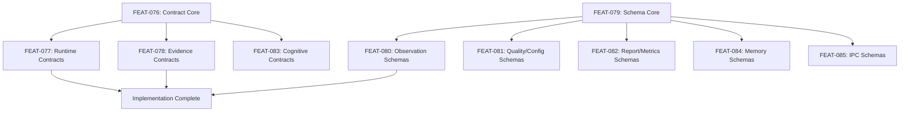

<!-- File path: docs/brainstorming/FEAT-076_to_FEAT-085_specs.md -->

# FEAT-076 to FEAT-085 — Platform Decomposition & Implementation Roadmap

This document specifies the decoupled feature breakdown and implementation parameters for the Contract & Schema platforms.

---

## 1. Subsystem Decomposition

### FEAT-076 — Contract Core Engine
- **Objective**: Implement base serialization interfaces, validation registry, and `ContractMismatchError` handlers.
- **Complexity**: High
- **Acceptance Criteria**: Registry successfully loads versioned JSON contract templates.

### FEAT-077 — Runtime and Sandbox Contracts
- **Objective**: Establish `RuntimeRequest` and `RuntimeResult` contracts.
- **Dependencies**: FEAT-076.

### FEAT-078 — Evidence and Investigation Contracts
- **Objective**: Establish `Evidence`, `Contradiction`, and `Investigation` contracts.
- **Dependencies**: FEAT-076.

### FEAT-079 — Machine Schema Engine and Validator
- **Objective**: Implement draft-07 JSON Schema validation layer using jsonschema compiler wrappers.
- **Complexity**: Medium.

### FEAT-080 — Observation Schemas
- **Objective**: Implement `Observation` and `VisualFinding` JSON validation schemas.
- **Dependencies**: FEAT-079.

### FEAT-081 — Quality Gate and Configuration Schemas
- **Objective**: Implement `QualityGate` and `RuntimeConfiguration` schemas.
- **Dependencies**: FEAT-079.

### FEAT-082 — Report and Metrics Schemas
- **Objective**: Implement `Report` and performance traces validation schemas.
- **Dependencies**: FEAT-079.

### FEAT-083 — Cognitive Interface Contracts
- **Objective**: Implement `Hypothesis` and `AgentMessage` cognitive communication contracts.
- **Dependencies**: FEAT-076.

### FEAT-084 — Memory and Baseline Schemas
- **Objective**: Implement `VisualBaseline` and `LearningOutcome` schemas.
- **Dependencies**: FEAT-079.

### FEAT-085 — Visualizer IPC Protocol Schema
- **Objective**: Formulate IPC NDJSON payloads and sidebar streams validation schemas.
- **Dependencies**: FEAT-079.

---

## 2. Implementation Order (Dependency-Aware)

- **Effort Estimates**: Each Contract FEAT requires approximately **2-3 hours**; Schema Core requires approximately **4 hours**.
