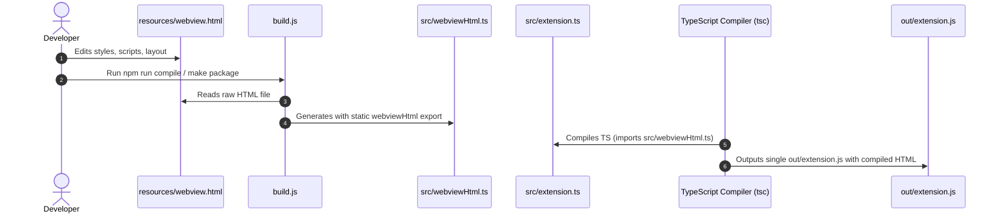

<!-- File path: docs/designs/FEAT-002_separate_webview_html_blueprint.md -->

---
feature_id: FEAT-002
feature_name: Separate Webview HTML from extension.ts
status: reviewed
stage: blueprint
created_at: 2026-07-04
updated_at: 2026-07-04
previous_artifact: ../plans/FEAT-002_separate_webview_html_plan.md
next_artifact: [Implementation (Source Code)](../../)
---

# Technical Blueprint – Separate Webview HTML from extension.ts

## 0. Project Memory Baseline
- **Memory state & Confidence**: Low (Memory configuration is not initialized locally in this workspace).
- **RAG Queries and search results summarized**: None.
- **Inspected source files**:
  - `extensions/visualizer/src/extension.ts` (for extracting HTML and verifying `getHtmlContent()`)
  - `extensions/visualizer/package.json` (for adjusting build targets)
  - `extensions/visualizer/Makefile` (for packaging verification)

## 1. Component Architecture & Design
- **Affected Layers & Folders**: Visualizer VS Code extension files under `extensions/visualizer/`.
- **Public APIs / Interface Contracts**: No external API change. Internal template string loading contract updated.
- **Folder / File Structure**:
  - `[NEW]` `extensions/visualizer/resources/webview.html` (Giao diện HTML/CSS/JS)
  - `[NEW]` `extensions/visualizer/build.js` (Build-time generation script)
  - `[MODIFY]` `extensions/visualizer/src/extension.ts` (Sử dụng template tĩnh)
  - `[MODIFY]` `extensions/visualizer/package.json` (Thêm script biên dịch build.js)

### Class & File Signatures

#### 1. `build.js`
A node script that processes the HTML template and escapes string formatting syntax:
```javascript
const fs = require('fs');
const path = require('path');

const htmlPath = path.join(__dirname, 'resources', 'webview.html');
const outputPath = path.join(__dirname, 'src', 'webviewHtml.ts');

if (!fs.existsSync(htmlPath)) {
    console.error('Source HTML file not found at:', htmlPath);
    process.exit(1);
}

let htmlContent = fs.readFileSync(htmlPath, 'utf8');

// Escape backticks (`), backslashes (\), and template literal placeholders ($)
const escapedContent = htmlContent
    .replace(/\\/g, '\\\\')
    .replace(/`/g, '\\`')
    .replace(/\$/g, '\\$');

const tsOutput = `// Auto-generated file. Do not edit manually.
export const webviewHtml = \`${escapedContent}\`;
`;

fs.writeFileSync(outputPath, tsOutput, 'utf8');
console.log('Successfully generated src/webviewHtml.ts');
```

#### 2. `src/extension.ts`
Import the generated string and update `getHtmlContent`:
```typescript
import { webviewHtml } from './webviewHtml';

// Inside VisualizerViewProvider class
private getHtmlContent(): string {
    return webviewHtml;
}
```

## 2. Sequence & Interaction Diagrams


## 3. Data Flow / Sequence Flow
At compile time, `build.js` converts the static HTML into a TS module string. During runtime initialization, the `VisualizerViewProvider` passes the `webviewHtml` string directly to `webviewView.webview.html`. This ensures zero filesystem operations at extension runtime.

## 4. Alternative Solutions Considered & Trade-offs
- **Option 1: Reading dynamically at runtime using `fs`**
  - *Trade-off*: Good for development since HTML edits apply without compilation, but path resolution is complex once packaged into a VSIX, and disk reads add a small performance penalty.
  - *Rejection Reason*: The extension needs to remain fast and standalone; runtime asset read paths in packaged VS Code extensions are error-prone. Inlining at compile time is cleaner and guarantees performance.

## 5. Architecture Decision Assessment
ADR Required: **No**
- *Reason*: This change is purely an internal build-time refactoring of code assets. It does not introduce database migrations, change authentication, or add external dependencies.

## 6. Migration & Rollback Strategy
No database migrations or backward-compatibility issues exist. To roll back, discard git modifications to `extension.ts` and `package.json` and delete the untracked files `resources/webview.html` and `build.js`.

## 7. Security & Permissions
Content Security Policy (CSP) headers in the HTML file must be strictly maintained exactly as they are currently declared. No extra permissions or external script domains are requested.

## 8. Performance & Scalability
- Zero disk-read runtime latency: The HTML is loaded instantly from memory (the compiled bundle).

## 9. Error Handling & Resilience
If the HTML template file is missing or invalid during build-time, the `build.js` script exits with status `1`, causing `npm run compile` to fail and alerting the developer immediately.

## 10. Verification & Test Strategy
1. **Compilation Check**: Run `npm run compile` to ensure no errors.
2. **Bundle Verification**: Inspect `out/extension.js` and verify that the HTML content is inlined correctly inside the final output.
3. **Smoke Test**: Load the VSIX in VS Code and verify the Webview rendering, Orange/Green status badges, and author card display correctly.
