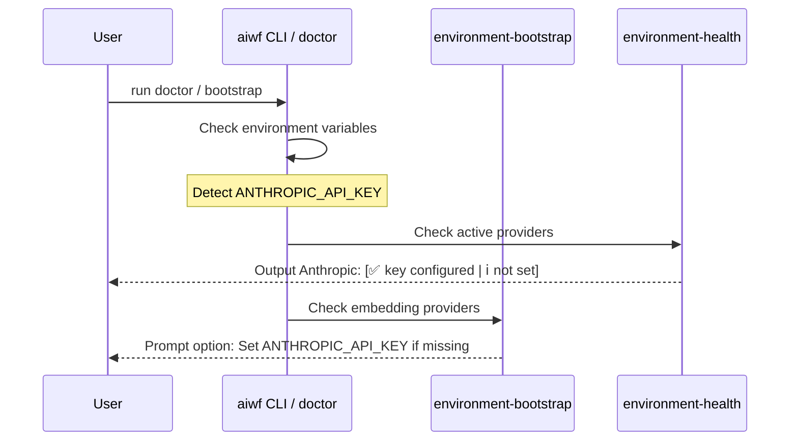

<!-- File path: docs/designs/FEAT-003_claude_environment_diagnostics_blueprint.md -->

---
feature_id: FEAT-003
feature_name: Claude Environment Configuration & Health Diagnostics
status: reviewed
stage: blueprint
created_at: 2026-07-04
updated_at: 2026-07-04
previous_artifact: ../plans/FEAT-003_claude_environment_diagnostics_plan.md
next_artifact: [Implementation (Source Code)](../../)
---

# Technical Blueprint – Claude Environment Configuration & Health Diagnostics

## 0. Project Memory Baseline
- **Memory Confidence**: High.
- **RAG Queries**: `Anthropic environment checks`, `doctor check key validation`.
- **Inspected source files**:
  - [skills/environment-bootstrap/SKILL.md](file:///e:/Cloud/_protected/agents/skills/environment-bootstrap/SKILL.md)
  - [skills/environment-health/SKILL.md](file:///e:/Cloud/_protected/agents/skills/environment-health/SKILL.md)
  - [doctor.ps1](file:///e:/Cloud/_protected/agents/doctor.ps1)
  - [doctor.sh](file:///e:/Cloud/_protected/agents/doctor.sh)

## 1. Component Architecture & Design
- **Affected Layers & Folders**: 
  - `skills/environment-bootstrap/`
  - `skills/environment-health/`
  - Root directory scripts (`doctor.ps1`, `doctor.sh`)
- **Public APIs / Interface Contracts**: None (internal script parameters and environment variables only).
- **Class / Interface Signatures**:
  - We will modify `skills/environment-bootstrap/SKILL.md` to list Anthropic Claude as a Cloud Embedding provider under Option 4.
  - We will modify `skills/environment-health/SKILL.md` to list Anthropic under active providers.
- **Data Models / Database Schema Definitions**: None.
- **Folder / File Structure**:
  - [MODIFY] [SKILL.md](file:///e:/Cloud/_protected/agents/skills/environment-bootstrap/SKILL.md)
  - [MODIFY] [SKILL.md](file:///e:/Cloud/_protected/agents/skills/environment-health/SKILL.md)
  - [MODIFY] [doctor.ps1](file:///e:/Cloud/_protected/agents/doctor.ps1)
  - [MODIFY] [doctor.sh](file:///e:/Cloud/_protected/agents/doctor.sh)

## 2. Sequence & Interaction Diagrams

## 3. Data Flow / Sequence Flow
1. Active environment reads `process.env.ANTHROPIC_API_KEY` or `process.env.CLAUDE_API_KEY`.
2. Diagnostic scripts evaluate if the variable is defined and has a length greater than 10.
3. The scripts output the status without printing the full secret key value for security (show only the first 8 characters, or masked as `sk-...`).

## 4. Alternative Solutions Considered & Trade-offs
- **Solution A**: Create separate Claude setup skills.
  - *Trade-off*: Duplicated code for file validation, harder to maintain.
- **Solution B (Selected)**: Integrate directly into the existing environment check skills.
  - *Trade-off*: Unified diagnostic outputs at the cost of slightly longer setup prompts.

## 5. Architecture Decision Assessment
ADR Required: No

Reason:
Integrating environment variable checks does not introduce new frameworks, databases, or runtime execution modules. It is an incremental enhancement of standard configurations.

Recommended Next Step:
run `/implement`

## 6. Migration & Rollback Strategy
- **Migration**: Simple pull/update. No database migrations required.
- **Rollback**: Standard git checkout to revert changes in `SKILL.md` and `doctor` scripts.

## 7. Security & Permissions
- Under no circumstances should the full `ANTHROPIC_API_KEY` be printed in terminal outputs, logs, or diagnostics reports.
- Masked values must show only the first 8 characters (e.g. `sk-ant-a...`).

## 8. Performance & Scalability
- The environment key detection is an O(1) process-level variable lookup, incurring zero network latency or system overhead.

## 9. Error Handling & Resilience
- If `ANTHROPIC_API_KEY` is not present, report warning `NOT CONFIGURED` but do not exit with error status if other providers are active.

## 10. Verification & Test Strategy
- Run the PowerShell doctor script locally: `.\doctor.ps1` and verify correct parsing.
- Run the shell doctor script: `./doctor.sh` and verify correct parsing.
- Run environment check skill prompts to verify that both Gemini and Claude configurations are checked without syntax errors.
