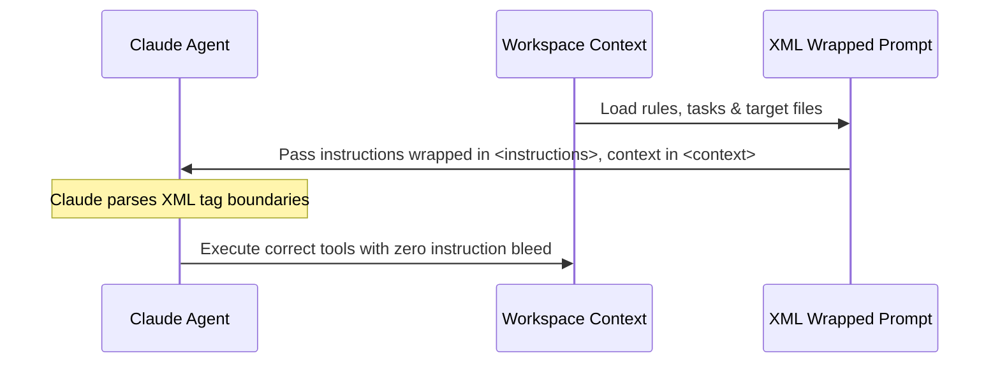

<!-- File path: docs/designs/FEAT-004_claude_xml_tags_prompts_blueprint.md -->

---
feature_id: FEAT-004
feature_name: Claude-Optimized XML Tag Prompts & Tool Execution
status: reviewed
stage: blueprint
created_at: 2026-07-04
updated_at: 2026-07-04
previous_artifact: ../plans/FEAT-004_claude_xml_tags_prompts_plan.md
next_artifact: [Implementation (Source Code)](../../)
---

# Technical Blueprint – Claude-Optimized XML Tag Prompts & Tool Execution

## 0. Project Memory Baseline
- **Memory Confidence**: High.
- **RAG Queries**: `XML tags prompt structuring`, `Claude tag formatting`.
- **Inspected source files**:
  - [AI_RULES.md](file:///e:/Cloud/_protected/agents/AI_RULES.md)
  - [skills/blueprint-to-implementation/SKILL.md](file:///e:/Cloud/_protected/agents/skills/blueprint-to-implementation/SKILL.md)
  - [skills/fast-fix/SKILL.md](file:///e:/Cloud/_protected/agents/skills/fast-fix/SKILL.md)

## 1. Component Architecture & Design
- **Affected Layers & Folders**:
  - Root policies file (`AI_RULES.md`).
  - Core execution prompt files (`skills/*/SKILL.md`).
- **Public APIs / Interface Contracts**: None (prompt text template modifications).
- **Class / Interface Signatures**:
  - Define standard XML tags in `AI_RULES.md`:
    - `<instructions>`: Wrap task guidelines and execution requirements.
    - `<context>`: Wrap files, settings, and workspace inputs.
    - `<file_content>`: Demarcate file contents when passing code context to the agent.
- **Folder / File Structure**:
  - [MODIFY] [AI_RULES.md](file:///e:/Cloud/_protected/agents/AI_RULES.md)
  - [MODIFY] [SKILL.md](file:///e:/Cloud/_protected/agents/skills/blueprint-to-implementation/SKILL.md)
  - [MODIFY] [SKILL.md](file:///e:/Cloud/_protected/agents/skills/fast-fix/SKILL.md)

## 2. Sequence & Interaction Diagrams

## 3. Data Flow / Sequence Flow
1. The framework loads rules from `AI_RULES.md` and active files from the workspace.
2. It wraps target file blocks inside `<file_content filepath="path/to/file">` tags.
3. Instructions are wrapped inside `<instructions>` block at the beginning/end of the prompt payload.
4. The LLM (Claude) parses context boundaries safely.

## 4. Alternative Solutions Considered & Trade-offs
- **Solution A**: Re-write prompts entirely in XML.
  - *Trade-off*: Clunky to maintain and breaks markdown compatibility with non-Anthropic models.
- **Solution B (Selected)**: Embed XML tag markers inline within standard GFM markdown.
  - *Trade-off*: Offers clean boundary structure with full markdown backward compatibility.

## 5. Architecture Decision Assessment
ADR Required: No

Reason:
Prompt formatting updates do not alter code architectures, database paradigms, or systems interfaces. It is a standard prompt engineering upgrade.

Recommended Next Step:
run `/implement`

## 6. Migration & Rollback Strategy
- **Migration**: Update files in repository.
- **Rollback**: Standard git checkout to revert prompt text edits.

## 7. Security & Permissions
- No impact.

## 8. Performance & Scalability
- Extremely low overhead (few extra tokens for tag elements), which is offset by increased execution precision.

## 9. Error Handling & Resilience
- Tag elements are written in standard formats so that non-XML parsing engines still treat them as text nodes without failure.

## 10. Verification & Test Strategy
- Validate that the markdown formatting remains correct when parsed by standard IDE markdown previewers.
- Test that XML boundary tags do not trigger errors when run under Google Gemini sessions.
