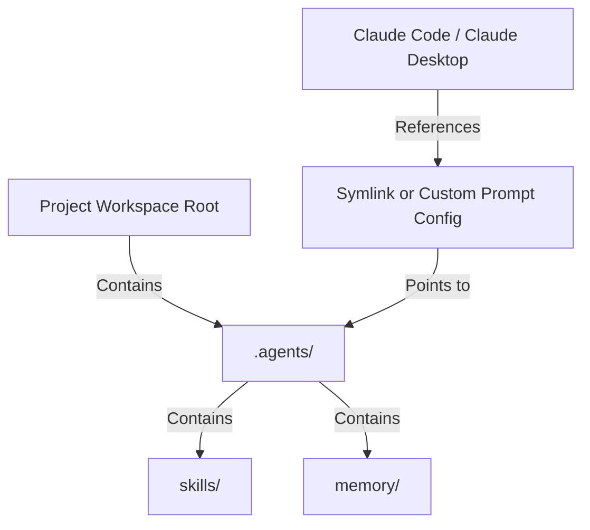

<!-- File path: docs/designs/FEAT-005_claude_workspace_discovery_blueprint.md -->

---
feature_id: FEAT-005
feature_name: Workspace & Global Customization Discovery for Claude
status: reviewed
stage: blueprint
created_at: 2026-07-04
updated_at: 2026-07-04
previous_artifact: ../plans/FEAT-005_claude_workspace_discovery_plan.md
next_artifact: [Implementation (Source Code)](../../)
---

# Technical Blueprint – Workspace & Global Customization Discovery for Claude

## 0. Project Memory Baseline
- **Memory Confidence**: High.
- **RAG Queries**: `Claude global config path`, `Claude Code customization`.
- **Inspected source files**:
  - [INSTALL.md](file:///e:/Cloud/_protected/agents/INSTALL.md)
  - [README.md](file:///e:/Cloud/_protected/agents/README.md)

## 1. Component Architecture & Design
- **Affected Layers & Folders**:
  - Documentation and guides (`INSTALL.md`, `README.md`).
- **Public APIs / Interface Contracts**: None (documentation).
- **Class / Interface Signatures**: None.
- **Folder / File Structure**:
  - [MODIFY] [INSTALL.md](file:///e:/Cloud/_protected/agents/INSTALL.md)
  - [MODIFY] [README.md](file:///e:/Cloud/_protected/agents/README.md)

## 2. Sequence & Interaction Diagrams

## 3. Data Flow / Sequence Flow
1. Developer installs the AI Skill Framework.
2. Developer configures Claude to discover skills by linking directories or setting path instructions in Claude CLI prompts.
3. Claude reads the local workspace configurations and runs rules correctly.

## 4. Alternative Solutions Considered & Trade-offs
- **Solution A**: Automated script modifying Claude's system configuration.
  - *Trade-off*: Risky, might break user configurations, hard to support across multiple OS releases.
- **Solution B (Selected)**: Clearly documented manual mapping and copy-paste command options.
  - *Trade-off*: Safer, fully transparent, respects developer preferences.

## 5. Architecture Decision Assessment
ADR Required: No

Reason:
Adding manual instructions and link configurations inside files like `INSTALL.md` does not impact application code architectures or runtimes.

Recommended Next Step:
run `/implement`

## 6. Migration & Rollback Strategy
- **Migration**: Pull latest files.
- **Rollback**: Git revert documentation edits.

## 7. Security & Permissions
- Documentation lists system configuration directory paths. No credentials or elevated permissions are stored or exposed.

## 8. Performance & Scalability
- Zero impact.

## 9. Error Handling & Resilience
- Symlink commands include safety flags (like `-Force` on PowerShell and `-f` on Unix) to prevent errors if target paths already exist.

## 10. Verification & Test Strategy
- Validate copy-paste commands on Windows and macOS.
- Confirm all markdown links inside the documentation use relative paths.
