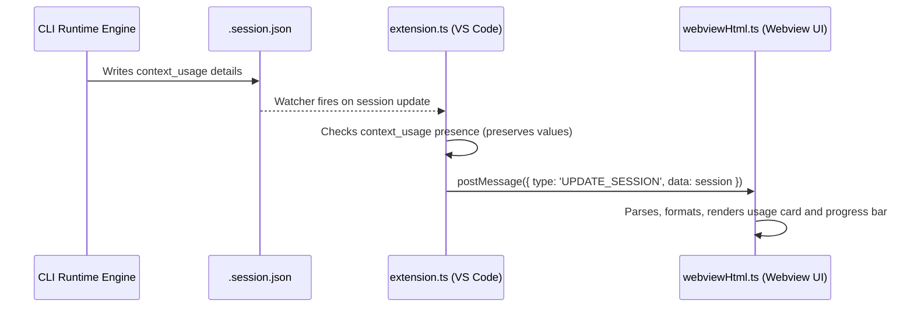

<!-- docs/designs/FEAT-011_session_usage_blueprint.md -->

---
feature_id: FEAT-011
feature_name: Update Extension UI with Full Session Token & Cost Metrics
status: draft
stage: design
created_at: 2026-07-06
updated_at: 2026-07-06
previous_artifact: ../plans/FEAT-011_session_usage_plan.md
next_artifact: None
---

# Technical Blueprint – Session Usage Panel & Metrics in VSCode Visualizer Extension

Bản vẽ thiết kế chi tiết mã nguồn giao diện (WebView) và luồng dữ liệu cho chỉ số tiêu thụ token thưa Ba.

## 1. Luồng truyền tải dữ liệu (Data Pipeline Flow)


---

## 2. Đặc tả thay đổi mã nguồn (Code Modification Spec)

### Tệp: `extension.ts`
Tại phương thức `updateSessionData()`, sửa đổi logic gán `context_usage`:
```typescript
const checkpointNum = typeof session.checkpoint === 'number' ? session.checkpoint : 1;
// Chỉ thực hiện ước lượng nếu context_usage trống hoặc thiếu thông tin tổng token
if (!session.context_usage || Object.keys(session.context_usage).length === 0 || !session.context_usage.total_tokens) {
    session.context_usage = this.estimateContextUsage(checkpointNum, session.conversation_id);
}
```

### Tệp: `webviewHtml.ts` (Javascript - Hàm định dạng và Binding)
Thêm các hàm phụ trợ định dạng:
```javascript
function formatTokens(num) {
    if (num === undefined || num === null) return "0";
    const val = Number(num);
    if (val >= 1000000) return (val / 1000000).toFixed(1) + "M";
    if (val >= 1000) return (val / 1000).toFixed(1) + "K";
    return val.toString();
}

function formatCost(num) {
    if (num === undefined || num === null || num === 0) return "N/A";
    return "$" + Number(num).toFixed(2);
}

function formatPercentage(num) {
    if (num === undefined || num === null) return "0.0%";
    return Number(num).toFixed(1) + "%";
}

function formatAccuracy(str) {
    if (!str) return "N/A";
    if (str === "exact") return "Exact";
    if (str === "provider-reported") return "Provider reported";
    if (str === "estimated") return "Estimated";
    return str.charAt(0).toUpperCase() + str.slice(1);
}
```

### Logic hiển thị thanh tiến trình & Trạng thái trống (Progress bar & Empty state)
```javascript
const percent = usage.percentage || 0;
progressBar.style.width = percent + "%";

// Xác định màu sắc theo ngưỡng phần trăm
if (percent >= 85) {
    progressBar.style.backgroundColor = "var(--vscode-charts-red, #ef4444)";
} else if (percent >= 60) {
    progressBar.style.backgroundColor = "var(--vscode-charts-orange, #eab308)";
} else {
    progressBar.style.backgroundColor = "var(--vscode-charts-blue, #00e5ff)";
}
```
*   **Empty State**: Nếu đối tượng `context_usage` không có trường dữ liệu hoặc bằng null, ẩn toàn bộ lưới chỉ số chi tiết và hiển thị văn bản cảnh báo: `Waiting for runtime usage data...`.

---

## 3. Bản vẽ thiết kế giao diện HTML (UI Card Layout)
Khối thẻ hiển thị mới sẽ được chèn vào phần đầu của `footer-section` (phía dưới danh sách checkpoints/stepper) để ưu tiên hiển thị tiến trình và trạng thái checkpoint trước:


```html
<section class="glass usage-card" id="session-usage-card" style="margin-top: 10px; padding: 12px; border-radius: 8px;">
    <div class="usage-header" style="display: flex; justify-content: space-between; align-items: center; margin-bottom: 8px;">
        <div class="eyebrow" style="margin: 0; display: flex; align-items: center; gap: 4px;">
            <span>Session Usage</span>
            <span class="info-icon" title="These metrics estimate the total token usage and cost for the entire workflow session. Values may be estimated depending on provider support." style="cursor: help; color: #7ca3c7;">ⓘ</span>
        </div>
        <div class="usage-cost-badge" id="usage-cost" style="font-weight: bold; color: #00e5ff; font-size: 13px;">$0.00 USD</div>
    </div>
    
    <div id="usage-active-state">
        <!-- Progress bar -->
        <div class="usage-progress-container" style="background: rgba(255, 255, 255, 0.08); height: 6px; border-radius: 3px; overflow: hidden; margin-bottom: 8px; position: relative;">
            <div class="usage-progress-bar" id="usage-progress-bar" style="width: 0%; height: 100%; transition: width 0.3s ease, background-color 0.3s ease;"></div>
        </div>
        
        <div class="usage-summary" style="display: flex; justify-content: space-between; font-size: 11px; margin-bottom: 10px; color: #e2e8f0;">
            <div><span id="usage-tokens-total">0</span> / <span id="usage-tokens-limit">2.0M</span> tokens</div>
            <div id="usage-percent-text">0.0%</div>
        </div>
        
        <!-- Detailed Grid -->
        <div class="usage-details-grid" style="display: grid; grid-template-columns: 1fr 1fr; gap: 6px 12px; font-size: 10.5px; border-top: 1px solid rgba(255, 255, 255, 0.08); padding-top: 8px; color: #94a3b8;">
            <div style="display: flex; justify-content: space-between;"><span>Input:</span> <strong id="usage-tokens-input" style="color: #cbd5e1;">0</strong></div>
            <div style="display: flex; justify-content: space-between;"><span>Output:</span> <strong id="usage-tokens-output" style="color: #cbd5e1;">0</strong></div>
            <div style="display: flex; justify-content: space-between;"><span>Cache:</span> <strong id="usage-tokens-cache" style="color: #cbd5e1;">0</strong></div>
            <div style="display: flex; justify-content: space-between;"><span>Thinking:</span> <strong id="usage-tokens-thinking" style="color: #cbd5e1;">0</strong></div>
        </div>
        
        <!-- Metadata -->
        <div class="usage-meta" style="margin-top: 8px; font-size: 9.5px; color: #64748b; display: grid; grid-template-columns: 1fr 1fr; gap: 4px 12px; border-top: 1px dashed rgba(255, 255, 255, 0.05); padding-top: 6px;">
            <div>Provider: <span id="usage-provider" style="color: #cbd5e1;">N/A</span></div>
            <div>Model: <span id="usage-model" style="color: #cbd5e1;">N/A</span></div>
            <div>Accuracy: <span id="usage-accuracy" style="color: #cbd5e1;">N/A</span></div>
            <div>Updated: <span id="usage-updated" style="color: #cbd5e1;">N/A</span></div>
        </div>
    </div>
    
    <div id="usage-empty-state" class="hidden" style="font-size: 11px; color: #64748b; text-align: center; padding: 10px 0;">
        Waiting for runtime usage data...
    </div>
</section>
```
