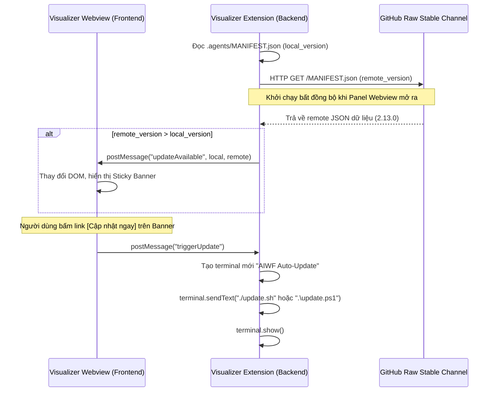

<!-- File path: docs/designs/FEAT-012_skills_update_notification_blueprint.md -->

---
feature_id: FEAT-012
feature_name: Skills Auto-Update Notification
status: reviewed
stage: blueprint
created_at: 2026-07-06
updated_at: 2026-07-06
previous_artifact: ../plans/FEAT-012_skills_update_notification_plan.md
next_artifact: [Implementation (Source Code)](../../)
---

# Technical Blueprint – Skills Auto-Update Notification

## 0. Project Memory Baseline
- **Trạng thái bộ nhớ**: FRESH
- **Độ tin cậy**: HIGH
- **Các file mã nguồn liên quan**:
  - [extension.ts](file:///Volumes/Kyle/AgentsProject/extensions/visualizer/src/extension.ts)
  - [webviewHtml.ts](file:///Volumes/Kyle/AgentsProject/extensions/visualizer/src/webviewHtml.ts)
  - [webview.html](file:///Volumes/Kyle/AgentsProject/extensions/visualizer/resources/webview.html)

---

## 1. Component Architecture & Design

### A. Affected Layers & Folders
- **Giao diện Webview (Frontend)**: `extensions/visualizer/resources/` và `extensions/visualizer/src/webviewHtml.ts`.
- **Logic xử lý VS Code Extension (Backend)**: `extensions/visualizer/src/extension.ts`.

### B. Interface & Message Contracts
Hai bên giao tiếp thông qua cơ chế `postMessage` của VS Code API:
1.  **Extension → Webview (Thông báo bản cập nhật mới)**:
    ```json
    {
      "command": "updateAvailable",
      "currentVersion": "2.12.5",
      "latestVersion": "2.13.0"
    }
    ```
2.  **Webview → Extension (Yêu cầu kích hoạt cập nhật)**:
    ```json
    {
      "command": "triggerUpdate"
    }
    ```

### C. Folder / File Structure Mappings
- **[MODIFY]** [extension.ts](file:///Volumes/Kyle/AgentsProject/extensions/visualizer/src/extension.ts): Tích hợp luồng HTTP GET bất đồng bộ, đọc file manifest cục bộ, và xử lý message `triggerUpdate` để mở terminal chạy script.
- **[MODIFY]** [webviewHtml.ts](file:///Volumes/Kyle/AgentsProject/extensions/visualizer/src/webviewHtml.ts) & [webview.html](file:///Volumes/Kyle/AgentsProject/extensions/visualizer/resources/webview.html): Tích hợp phần tử Sticky Warning Banner vào giao diện HTML, lắng nghe sự kiện `updateAvailable` để hiển thị banner, và đăng ký sự kiện click gửi `triggerUpdate`.

---

## 2. Sequence & Interaction Diagrams



---

## 3. Data Flow / Sequence Flow
1.  **Mount Webview**: Khi người dùng kích hoạt Sidebar Dashboard, VS Code Extension khởi chạy Panel và gọi hàm bất đồng bộ `checkForSkillsUpdate(panel)`.
2.  **Local Read**: Extension tìm đọc `.agents/MANIFEST.json` cục bộ trong thư mục workspace để xác định phiên bản hiện tại. Nếu file không tồn tại, mặc định coi là `"0.0.0"`.
3.  **Remote Fetch**: Sử dụng thư viện `https` tích hợp của Node.js để gửi truy vấn HTTP GET tới GitHub raw content. Thiết lập `timeout: 3000` (3 giây). Nếu có lỗi mạng hoặc quá thời gian chờ, lỗi được catch êm thấm (silent bypass) để tránh làm gián đoạn UI.
4.  **Version Comparison**: So sánh phiên bản dạng SemVer bằng cách chia chuỗi theo dấu chấm `.` và so sánh các giá trị số (Major, Minor, Patch).
5.  **UI Update**: Nếu cần cập nhật, gửi sự kiện `updateAvailable` sang Webview. JavaScript chạy trên Webview sẽ bắt sự kiện này và sửa đổi DOM để hiển thị Banner thông báo.
6.  **Update Execution**: Người dùng bấm `[Cập nhật ngay]`, Webview bắt sự kiện và gọi `vscode.postMessage({ command: 'triggerUpdate' })`. Extension nhận lệnh, kiểm tra hệ điều hành hiện tại (Windows/macOS/Linux) để khởi tạo một terminal thích hợp chạy file script cập nhật của dự án.

---

## 4. Alternative Solutions Considered & Trade-offs
- **Phương án thay thế**: Sử dụng thư viện `axios` để gọi HTTP GET.
  - *Lý do bác bỏ*: `axios` là dependency nặng bên ngoài. Tự viết wrapper nhỏ bằng thư viện `https` mặc định của Node.js sẽ giúp tệp VSIX đóng gói của extension nhẹ hơn và khởi chạy nhanh hơn rất nhiều.

---

## 5. Architecture Decision Assessment
ADR Required: **No**
- *Lý do*: Thay đổi hoàn toàn cục bộ trong VS Code Extension, không thay đổi core database schema, Git policies hay workflow checkpoints của CLI.

---

## 6. Migration & Rollback Strategy
- Bản cập nhật không thay đổi cấu trúc lưu trữ của extension, tương thích ngược 100% với các phiên bản VS Code cũ.

---

## 7. Security & Permissions
- Chỉ cho phép chạy file script `update.sh` hoặc `update.ps1` nằm trong chính thư mục làm việc hiện tại của dự án để đảm bảo an toàn bảo mật, tránh thực thi các tệp tin lạ từ thư mục ngoài.

---

## 8. Performance & Scalability
- Hoạt động kiểm tra cập nhật được chạy bất đồng bộ hoàn toàn (`Promise` không chặn), đảm bảo thời gian tải hiển thị các chỉ số ban đầu của panel Webview là dưới `50ms`.

---

## 9. Error Handling & Resilience
- Bất kỳ lỗi mạng nào (DNS failure, network offline, proxy block) đều được ghi log kín bằng `console.warn` và không hiển thị popup lỗi làm phiền người dùng.

---

## 10. Verification & Test Strategy
- **Unit Testing**: Viết một module kiểm thử nhỏ giả lập (Mocking) hàm HTTP fetch và hàm filesystem đọc manifest để xác nhận tính chính xác của hàm so sánh SemVer.
- **Manual Verification**: Sửa tạm phiên bản cục bộ trong `.agents/MANIFEST.json` thành `2.12.0` (trong khi stable là `2.13.0`), khởi chạy Visualizer Panel và kiểm tra xem banner thông báo có hiển thị chuẩn xác và premium hay không.
