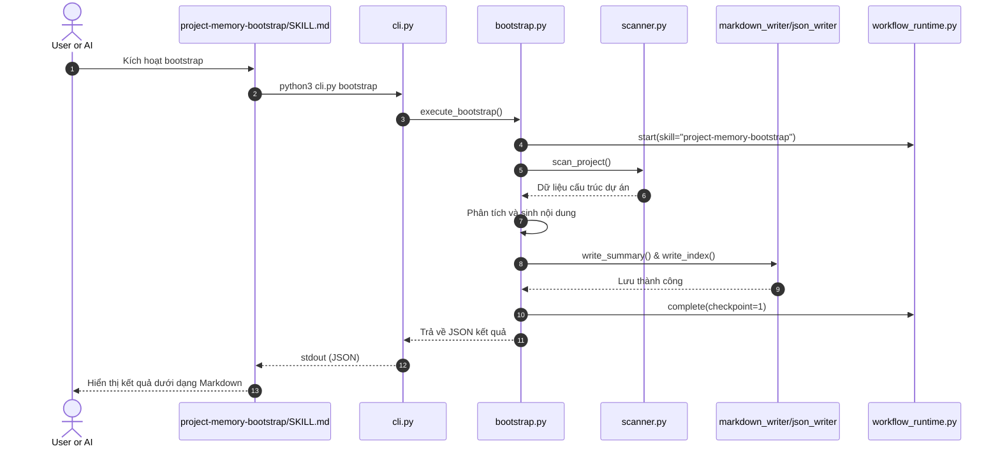

<!-- File path: docs/designs/FEAT-013_refactor_project_memory_script_first_blueprint.md -->

---
feature_id: FEAT-013
feature_name: Refactor Project Memory and RAG Skills to Script-First Architecture
status: reviewed
stage: blueprint
created_at: 2026-07-06
updated_at: 2026-07-06
previous_artifact: ../plans/FEAT-013_refactor_project_memory_script_first_plan.md
next_artifact: [Implementation (Source Code)](../../)
---

# Technical Blueprint – Refactor Project Memory and RAG Skills to Script-First Architecture

## 0. Project Memory Baseline
- **Memory State**: FRESH
- **Confidence**: High (Chúng ta đã tìm hiểu toàn bộ cấu trúc mã nguồn của `workflow-runtime`, các kỹ năng đích và kịch bản cài đặt hệ thống).
- **RAG Queries & Search Results**: Con đã xem cấu trúc chỉ mục cục bộ và cách thức RAG Vector Sync Plan hoạt động ở các bước trước để đồng bộ thiết kế mới.
- **Inspected Source Files**:
  - [skills/workflow-runtime/scripts/workflow_runtime.py](file:///Volumes/Kyle/AgentsProject/skills/workflow-runtime/scripts/workflow_runtime.py)
  - [skills/workflow-runtime/scripts/context.py](file:///Volumes/Kyle/AgentsProject/skills/workflow-runtime/scripts/context.py)
  - [skills/workflow-runtime/scripts/db.py](file:///Volumes/Kyle/AgentsProject/skills/workflow-runtime/scripts/db.py)

---

## 1. Component Architecture & Design

### Affected Layers & Folders
- Gói Python mới: [runtime/scripts/project_memory/](file:///Volumes/Kyle/AgentsProject/runtime/scripts/project_memory/)
- Các thư mục kỹ năng đích:
  - [skills/project-memory-bootstrap/](file:///Volumes/Kyle/AgentsProject/skills/project-memory-bootstrap/)
  - [skills/project-memory-update/](file:///Volumes/Kyle/AgentsProject/skills/project-memory-update/)
  - [skills/project-rag-search/](file:///Volumes/Kyle/AgentsProject/skills/project-rag-search/)

### Folder & File Structure (Proposed)
```text
runtime/scripts/project_memory/
├── __init__.py
├── cli.py               # CLI Entry Point
├── config.py            # Quản lý cấu hình memory.config.json và các đường dẫn
├── common.py            # Các hàm dùng chung (logging, path conversion)
├── filesystem.py        # Thao tác tệp tin chéo nền tảng
├── git_diff.py          # Lấy danh sách tệp thay đổi qua Git CLI
├── scanner.py           # Quét dự án và phát hiện ngôn ngữ/frameworks
├── analyzer.py          # Phân tích chi tiết các thành phần lớp
├── parser.py            # Phân tích cú pháp tệp tin nguồn
├── markdown_writer.py   # Sinh/cập nhật tệp markdown tri thức
├── json_writer.py       # Cập nhật các chỉ mục JSON
├── sqlite_writer.py     # Cập nhật cơ sở dữ liệu SQLite cục bộ (nếu cần)
├── keyword_index.py     # Tra cứu từ khóa cục bộ
├── dependency_graph.py  # Bản đồ liên kết thành phần dự án
├── vector_manifest.py   # Phân đoạn tài liệu và tạo sync plan
├── bootstrap.py         # Module nghiệp vụ khởi tạo
├── update.py            # Module nghiệp vụ đồng bộ tăng cường
└── search.py            # Module nghiệp vụ tìm kiếm RAG
```

### Public CLI Contracts
Tất cả các lệnh được cấu hình thông qua kịch bản CLI `cli.py`:
- `python3 runtime/scripts/project_memory/cli.py bootstrap`
- `python3 runtime/scripts/project_memory/cli.py update [--full]`
- `python3 runtime/scripts/project_memory/cli.py search "<query>"`

Đầu ra của các CLI commands trên luôn là chuỗi JSON có cấu trúc (Structured JSON) in ra `stdout`:
```json
{
  "status": "success | failure",
  "message": "Chi tiết kết quả thực hiện",
  "data": {}
}
```

### Class & Module Signatures

#### `config.py`
```python
def load_memory_config(config_path: str = ".agents/memory.config.json") -> dict:
    """Nạp cấu hình memory.config.json. Trả về dict cấu hình."""
    pass

def get_memory_paths(config: dict) -> dict:
    """Trả về dictionary chứa các đường dẫn đích của bộ nhớ (summary, lessons, rag)."""
    pass
```

#### `scanner.py`
```python
class ProjectScanner:
    def __init__(self, root_dir: str):
        self.root_dir = root_dir

    def detect_languages(self) -> list[str]:
        """Tự động phát hiện các ngôn ngữ lập trình chính trong dự án."""
        pass

    def detect_frameworks(self, languages: list[str]) -> list[str]:
        """Phát hiện các framework/thư viện dựa trên package.json, go.mod, etc."""
        pass

    def scan_directories(self) -> dict:
        """Quét và cấu trúc lại bản đồ thư mục dự án."""
        pass
```

#### `git_diff.py`
```python
def get_changed_files(since_commit: str = None) -> list[str]:
    """Chạy lệnh git diff --name-only lấy danh sách tệp thay đổi."""
    pass

def get_uncommitted_files() -> list[str]:
    """Chạy git status --short lấy các tệp chưa commit."""
    pass

def get_latest_commit_hash() -> str:
    """Lấy mã hash commit HEAD hiện tại."""
    pass
```

#### `vector_manifest.py`
```python
def generate_chunks(file_path: str, content: str) -> list[dict]:
    """Phân mảnh tài liệu (chunking) kèm metadata để đồng bộ hóa Vector."""
    pass

def create_sync_plan(upserts: list[dict], deletes: list[str]) -> dict:
    """Tạo tệp vector-sync-plan.json cấu trúc."""
    pass
```

#### `search.py`
```python
class RAGSearcher:
    def __init__(self, config: dict):
        self.config = config
        self.qdrant_url = "http://localhost:6333"

    def local_search(self, query: str) -> list[dict]:
        """Tìm kiếm từ khóa cục bộ trên các tệp markdown tri thức."""
        pass

    def vector_search(self, query: str) -> list[dict]:
        """Gọi API REST của Qdrant tìm kiếm vector tương đồng."""
        pass
```

---

## 2. Sequence & Interaction Diagrams

### Lệnh Khởi tạo (Bootstrap)


---

## 3. Data Flow / Sequence Flow
1. **Change Detection**: Lệnh `update` lấy mã `last_git_hash` từ `memory-state.json` và chạy lệnh Git diff để phát hiện các tệp đã sửa đổi.
2. **File Mapping**: Các tệp tin sửa đổi được đối chiếu qua `file-map.json` để tìm tài liệu bộ nhớ tương ứng cần cập nhật.
3. **Chunking & Plan Generation**: Tệp `known-problems.md` và `project-summary.md` được ghi đè/nối thêm từng phần. Sau đó, nội dung thay đổi được phân đoạn qua `vector_manifest.py` để tạo `rag/vector-sync-plan.json`.

---

## 4. Alternative Solutions Considered & Trade-offs
- **Phương án thay thế**: Sử dụng thư viện `qdrant-client` của Python.
- **Lý do bác bỏ**: Cài đặt gói ngoài có thể gây lỗi môi trường trên máy trạm của Ba và tăng thời gian cài đặt. Việc sử dụng `urllib.request` để gọi API REST của Qdrant gọn nhẹ hơn và hoàn toàn không có gói phụ thuộc.

---

## 5. Architecture Decision Assessment
- **ADR Required**: No
- **Reason**: Dự án đã áp dụng kiến trúc Script-First cho Workflow Runtime trước đó. Việc mở rộng kiến trúc này sang hệ thống Bộ nhớ và RAG là một quyết định tái cấu trúc mã nguồn thông thường để đồng bộ triết lý thiết kế hiện tại, không bổ sung công nghệ hay thư viện bên ngoài mới.

---

## 6. Migration & Rollback Strategy
- **Migration**: Các tệp `SKILL.md` sẽ được cập nhật cùng lúc với các script Python. Người dùng chỉ cần chạy `aiwf update` để cập nhật cả kịch bản và tài liệu kỹ năng mới.
- **Rollback**: Có thể khôi phục các tệp `SKILL.md` cũ từ Git và chạy trực tiếp nếu các kịch bản Python bị lỗi.

---

## 7. Security & Permissions
- Chỉ truy cập và ghi vào thư mục được cấu hình trong `memory_root` (mặc định là `.agents/memory/`).
- Các tệp nguồn dự án chỉ được đọc (Read-only), tuyệt đối không sửa đổi hay ghi đè mã nguồn.

---

## 8. Performance & Scalability
- **Quét dự án**: Sử dụng cơ chế bỏ qua (ignore) các thư mục chứa thư viện (`node_modules`, `venv`, `.git`) để giảm số lượng tệp quét và rút ngắn thời gian xử lý xuống dưới 2 giây.
- **Bộ nhớ đệm**: Lưu trữ chỉ mục cục bộ trong các tệp JSON giúp việc tra cứu từ khóa diễn ra tức thời mà không cần gọi API Vector DB.

---

## 9. Error Handling & Resilience
- **Qdrant Offline**: Nếu kết nối API Qdrant thất bại (timeout hoặc không khởi chạy), hệ thống tự động fallback sang tìm kiếm từ khóa cục bộ trên các tệp markdown (`local_search`) và trả về thông tin cảnh báo rõ ràng.
- **Git Missing**: Nếu lệnh `git` không khả dụng hoặc dự án chưa khởi tạo Git, hệ thống tự động fallback sang cơ chế so sánh timestamp của file hệ thống (`filesystem.py`).

---

## 10. Verification & Test Strategy
- Viết test tự động sử dụng thư viện `unittest` của Python tại [skills/workflow-runtime/tests/test_project_memory.py](file:///Volumes/Kyle/AgentsProject/skills/workflow-runtime/tests/test_project_memory.py).
- Sử dụng cơ chế Mocking để kiểm thử cuộc gọi API Qdrant HTTP mà không cần khởi chạy container Qdrant thực tế trong môi trường test.
- Kiểm thử tích hợp toàn diện bằng cách chạy trực tiếp các lệnh CLI trên các cấu trúc dự án mẫu được chuẩn bị trong thư mục `scratch/`.
