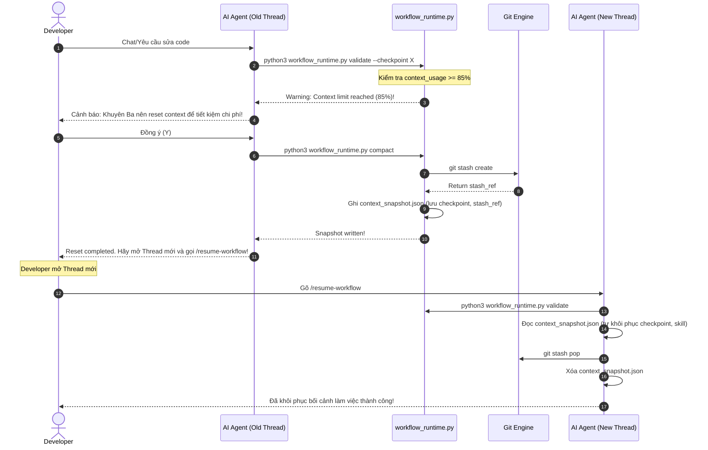

<!-- File path: docs/designs/FEAT-014_automated_context_rollover_blueprint.md -->

---
feature_id: FEAT-014
feature_name: Automated Context Rollover & Recovery
status: reviewed
stage: blueprint
created_at: 2026-07-07
updated_at: 2026-07-07
previous_artifact: ../plans/FEAT-014_automated_context_rollover_plan.md
next_artifact: [Implementation (Source Code)](../../)
---

# Technical Blueprint – Automated Context Rollover & Recovery (FEAT-014)

## 0. Project Memory Baseline
- **Trạng thái bộ nhớ**: Khớp hoàn toàn với cơ chế lưu trữ session mới tại FIX-010.
- **Tập tin phân tích**:
  - `skills/workflow-runtime/scripts/workflow_runtime.py`
  - `skills/workflow-runtime/scripts/session.py`
  - `skills/initialize-workflow/SKILL.md`

## 1. Component Architecture & Design

### A. Cấu trúc tệp cấu hình Snapshot (`context_snapshot.json`)
Lưu trữ thông tin bối cảnh SDLC để Agent ở Thread mới nạp lại tức thì:
*   **Đường dẫn**: `.agents/runtime/context_snapshot.json`
*   **Cấu trúc Schema**:
    ```json
    {
      "checkpoint": 4,
      "current_skill": "plan-to-blueprint",
      "current_command": "blueprint",
      "current_step": "Technical Blueprint Written",
      "active_feature_id": "FEAT-014",
      "git_stash_ref": "stash@{0}",
      "rollover_requested_at": "2026-07-07T10:45:00+07:00"
    }
    ```

### B. Mở rộng session schema (`.session.json`)
*   Thêm cấu hình ngưỡng token cảnh báo:
    *   `"context_rollover_threshold": 0.85` (Mặc định).

### C. Folder & File Structure
- **[MODIFY] [workflow_runtime.py](file:///Volumes/Kyle/AgentsProject/skills/workflow-runtime/scripts/workflow_runtime.py)**:
  - Thêm kiểm tra `context_usage` trong hàm `do_validate` và in cảnh báo nếu vượt ngưỡng.
  - Thêm subcommand `compact`. Hàm xử lý `do_compact(args)` sẽ ghi nhận trạng thái hiện hành, tự động gọi `git stash create` để cất giữ các thay đổi chưa commit, rồi ghi snapshot ra đĩa.
- **[MODIFY] [initialize-workflow/SKILL.md](file:///Volumes/Kyle/AgentsProject/skills/initialize-workflow/SKILL.md)**:
  - Cập nhật hướng dẫn cho Agent ở Thread mới tự động kiểm tra sự tồn tại của tệp `context_snapshot.json`, nạp lại checkpoint/skill hiện hành, thực hiện `git stash pop` để khôi phục code chưa commit, rồi xóa tệp snapshot.

---

## 2. Sequence & Interaction Diagrams

Luồng tương tác chuyển đổi Thread trò chuyện tự động (Automated Rollover):



---

## 3. Alternative Solutions Considered & Trade-offs
- **Giải pháp 1 (Thủ công)**: Báo cho người dùng tự git stash và tự mở thread mới.
  - *Đánh giá*: Tốn thao tác, người dùng dễ quên cú pháp khôi phục.
- **Giải pháp 2 (Tự động hóa 100% qua CLI)**: CLI tự động điều khiển IDE mở thread mới thông qua API (nếu IDE hỗ trợ).
  - *Đánh giá*: Phụ thuộc vào IDE API cụ thể. Việc tạo file snapshot kết hợp cảnh báo là giải pháp tương thích rộng, tin cậy nhất.

---

## 4. Architecture Decision Assessment
ADR Required: **No**

Reason:
Đây là một tính năng bổ sung nhỏ gọn trong CLI Runtime Engine và quy trình hướng dẫn của các Skills sẵn có, không thay đổi kiến trúc cơ sở dữ liệu hay mô hình bảo mật trung tâm.

---

## 5. Security & Permissions
- Chỉ cho phép ghi snapshot vào thư mục `.agents/runtime/` (thư mục an toàn được bảo vệ).
- Lệnh `git stash` chỉ thao tác trên mã nguồn local của dự án.

---

## 6. Verification & Test Strategy
- **Unit Tests**:
  - Viết test case `test_cli_compact_creates_snapshot` kiểm tra subcommand `compact` lưu chính xác checkpoint và stash_ref (nếu có).
  - Viết test case `test_load_snapshot_restores_state_and_cleans` để đảm bảo hệ thống đọc được snapshot và dọn dẹp sạch sẽ sau khi phục hồi.
