<!-- File path: docs/designs/FEAT-014_interactive_choice_protocol_blueprint.md -->

---
feature_id: FEAT-014
feature_name: Interactive Choice Protocol for AIWF
status: reviewed
stage: blueprint
created_at: 2026-07-07
updated_at: 2026-07-07
previous_artifact: ../plans/FEAT-014_interactive_choice_protocol_plan.md
next_artifact: [Implementation (Source Code)](../../)
---

# Technical Blueprint – Interactive Choice Protocol for AIWF

## 0. Project Memory Baseline
- **Memory state**: FRESH
- **Memory Confidence**: High
- **RAG Queries & Search Results**: Retrieved `MANIFEST.json` list of skills and `workflow_runtime.py` parser options.
- **Inspected source files**:
  - [workflow_runtime.py](file:///e:/AgentsProject/skills/workflow-runtime/scripts/workflow_runtime.py#L417-L484)
  - [session.py](file:///e:/AgentsProject/skills/workflow-runtime/scripts/session.py)
  - [context.py](file:///e:/AgentsProject/skills/workflow-runtime/scripts/context.py)
  - [extension.ts](file:///e:/AgentsProject/extensions/visualizer/src/extension.ts)
  - [webviewHtml.ts](file:///e:/AgentsProject/extensions/visualizer/src/webviewHtml.ts)

## 1. Component Architecture & Design

### Files to Modify or Create
- **MODIFY**: `skills/workflow-runtime/scripts/workflow_runtime.py` - Add `choice` subparser.
- **MODIFY**: `extensions/visualizer/src/extension.ts` - Watch choice file, write responses, handle IPC.
- **MODIFY**: `extensions/visualizer/src/webviewHtml.ts` - Render choices queue, styling, option layout.
- **MODIFY**: `skills/*/SKILL.md` (all SDLC skills with user prompts) - Swap console input prompts with CLI calls.
- **MODIFY**: User Documentation (`README.md`, `INSTALL.md`, `USAGE.md`, `CHANGELOG.md`).
- **NEW**: `skills/workflow-runtime/tests/test_choice.py` - Complete test suite.

### File Schema Definitions

#### A. `pending-choice.json`
```json
{
  "type": "choice | approval",
  "id": "string",
  "title": "string",
  "description": "string",
  "required": true,
  "allow_cancel": true,
  "options": [
    {
      "id": "string",
      "label": "string",
      "description": "string (optional)"
    }
  ]
}
```

#### B. `choice-response.json`
```json
{
  "id": "string",
  "selected": "string",
  "cancelled": false
}
```

#### C. `ui-capabilities.json`
```json
{
  "interactive_choice": true,
  "provider": "aiwf-visualizer",
  "version": "1.0.0"
}
```

### CLI Command Specifications
Add a new subcommand `choice` to `workflow_runtime.py` with the following parsing structure:
- `workflow_runtime.py choice create --id <id> --title <title> --desc <desc> --options <opts_json_or_list> [--type <choice|approval>] [--allow-cancel] [--required]`
- `workflow_runtime.py choice wait --id <id> [--timeout <secs>]`
- `workflow_runtime.py choice read --id <id>`
- `workflow_runtime.py choice clear`

## 2. Sequence & Interaction Diagrams

```mermaid
sequenceDiagram
    participant Agent as AI Agent (Skill)
    participant CLI as workflow_runtime.py
    participant File as Filesystem
    participant Ext as IDE Extension Backend
    participant Webview as Webview Panel UI
    participant User as Developer

    Agent->>CLI: run 'choice create --id git_branch ...'
    CLI->>File: write pending-choice.json
    Agent->>CLI: run 'choice wait --id git_branch'
    
    rect rgb(30, 41, 59)
        note right of CLI: Detects UI capabilities...
        alt UI capability = True
            Ext->>File: Watcher detects pending-choice.json
            Ext->>Webview: send 'UPDATE_PENDING_CHOICE'
            Webview->>User: Render "Workflow Actions" card & buttons
            User->>Webview: Clicks button
            Webview->>Ext: send 'SUBMIT_CHOICE'
            Ext->>File: write choice-response.json
            Ext->>File: delete pending-choice.json
        else UI capability = False or Timeout (60s)
            CLI->>Agent: Fallback: Display options in chat console
            Agent->>User: Prompt text selection
            User->>Agent: Types choice in chat
            Agent->>CLI: writes response mock
        end
    end

    File-->>CLI: watcher finds choice-response.json
    CLI->>Agent: Returns selected option ID
    Agent->>CLI: run 'choice clear'
    CLI->>File: delete choice-response.json
```



## 3. Data Flow / Sequence Flow
1. **Creation**: The active skill invokes CLI `choice create` with IDs, options, and titles. The CLI writes `pending-choice.json` to `.agents/runtime/` atomically.
2. **Polling / Wait Loop**: The skill invokes CLI `choice wait`. The CLI checks `.agents/runtime/ui-capabilities.json` or `os.environ["AIWF_INTERACTIVE_CHOICE"]`.
   - If UI is missing, it immediately prompts the developer on standard terminal input (`input()`) and writes the response mock file.
   - If UI is detected, it enters a polling loop (every 0.5s) checking for `choice-response.json`.
3. **Timeout Check**: If polling exceeds the `--timeout` threshold (default: 60s), the CLI logs a timeout warning, exits the loop, prints the options to stdout, and blocks on console standard input fallback.
4. **Resolution**: Once a response is written or captured, the skill reads the chosen selection using CLI `choice read --id <id>`, uses the response string to branch its logic, and calls CLI `choice clear` to clean up the directory.

## 4. Alternative Solutions Considered & Trade-offs
- **Option B: Storing choice in `.session.json`**: Rejected because multiple components reading/writing to `.session.json` simultaneously could create race conditions, and bloating the session state with transient visual components degrades extension performance. Separating ephemeral choices to dedicated pending/response files ensures safety and reliability.

## 5. Architecture Decision Assessment
- **ADR Required**: No.
- **Reason**: The Interactive Choice Protocol is a local IPC utility layer that preserves backward compatibility and runs strictly via filesystem exchange, requiring no architectural infrastructure changes.

## 6. Migration & Rollback Strategy
- **Backward Compatibility**: If the visualizer extension is not running, the framework automatically uses terminal stdin prompt fallback. Older framework versions or vanilla environments are not impacted.
- **Rollback**: Simply delete `.agents/runtime/*-choice.json` files and fall back to terminal interactions.

## 7. Security & Permissions
- File permissions are restricted to the local workspace folder. No remote server commands are executed.
- Input values in `choice-response.json` are validated against options IDs in `pending-choice.json` to prevent command injection.

## 8. Performance & Scalability
- Polling uses a 0.5-second sleep interval to ensure zero measurable CPU overhead.
- File system watchers in VS Code are relative patterns (`.agents/runtime/pending-choice.json`), avoiding recursive scans of large project workspaces.

## 9. Error Handling & Resilience
- **Invalid JSON**: If a file is corrupted, the reader catches the parser exception, logs a warning, and retries.
- **Crash Recovery**: If the IDE crashes, the timeout watchdog guarantees the AI will prompt the console, preventing execution from hanging.
- **Self-Cleanup**: The `choice clear` command is systematically executed in shell scripts and exception blocks to leave a clean environment.

## 10. Verification & Test Strategy
- **CLI Unit Tests**:
  - Test command argument parsing.
  - Test UI detection logic.
  - Test standard input console mocking.
  - Test polling loop timeout.
- **Extension Tests**:
  - Test watch loop triggers on file creation.
  - Test response writing and pending file deletion.
  - Test sidebar render updates.
- **Harness Scripts**: Simulate full choice flows under `skills/workflow-runtime/tests/test_choice.py` utilizing Python's `unittest` module.
```python
# test_choice.py structure mockup
class TestChoiceProtocol(unittest.TestCase):
    def test_create_and_read(self): ...
    def test_wait_timeout_fallback(self): ...
    def test_capabilities_detection(self): ...
```
