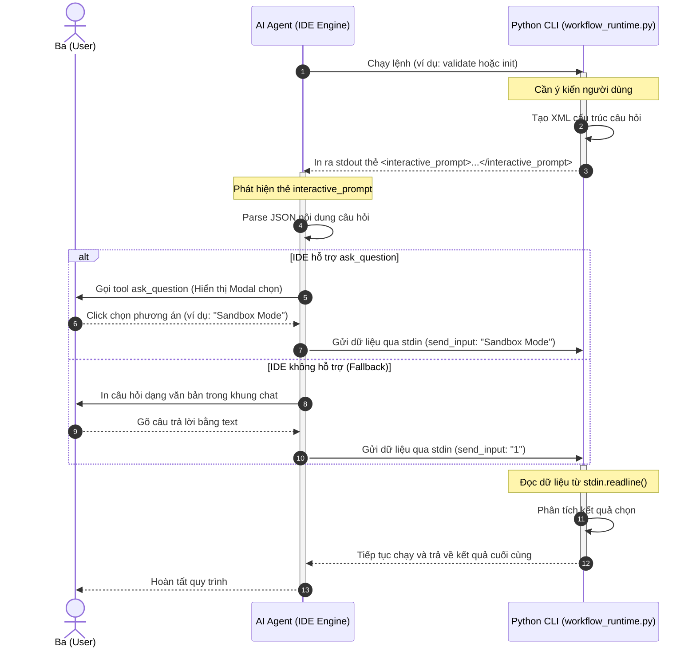

<!-- File path: docs/designs/FEAT-016_interactive_cli_prompts_blueprint.md -->

---
feature_id: FEAT-016
feature_name: Interactive CLI Prompts via IDE UI
status: approved
stage: blueprint
created_at: 2026-07-07
updated_at: 2026-07-07
previous_artifact: ../plans/FEAT-016_interactive_cli_prompts_plan.md
next_artifact: [Implementation (Source Code)](../../)
---

# Technical Blueprint – Interactive CLI Prompts via IDE UI (FEAT-016)

## 0. Project Memory Baseline
- **Trạng thái bộ nhớ**: Khớp hoàn toàn với cơ chế quản lý session hiện tại trong [session.json](file:///Volumes/Kyle/AgentsProject/.agents/.session.json).
- **Tài liệu tham chiếu chính**:
  - [AI_RULES.md](file:///Volumes/Kyle/AgentsProject/AI_RULES.md) (Chính sách Approval Gate và Skill Suggestion Gate).
  - [workflow_runtime.py](file:///Volumes/Kyle/AgentsProject/skills/workflow-runtime/scripts/workflow_runtime.py) (Quản lý CLI).
  - [utils.py](file:///Volumes/Kyle/AgentsProject/skills/workflow-runtime/scripts/utils.py) (Các tiện ích hệ thống).

## 1. Component Architecture & Design

### A. Định dạng Thẻ XML Tương tác (`<interactive_prompt>`)
Khi CLI cần yêu cầu đầu vào từ người dùng dưới dạng lựa chọn, CLI sẽ xuất ra stdout một chuỗi định dạng XML bọc JSON cấu trúc câu hỏi:
```xml
<interactive_prompt type="select">
{
  "question": "Nội dung câu hỏi cần hiển thị",
  "options": [
    "Lựa chọn 1",
    "Lựa chọn 2",
    "Lựa chọn 3"
  ],
  "default": "Lựa chọn 1"
}
</interactive_prompt>
```

### B. Hàm tiện ích tương tác trong Python CLI
Trong tệp [utils.py](file:///Volumes/Kyle/AgentsProject/skills/workflow-runtime/scripts/utils.py), bổ sung hàm `prompt_select`:
```python
import sys
import json

def prompt_select(question: str, options: list, default: str = None) -> str:
    """
    In ra cấu trúc XML/JSON đặc biệt để Agent bắt sự kiện hiển thị UI ask_question.
    Chờ nhận kết quả từ stdin (do Agent gửi send_input).
    Nếu không nhận được hoặc lỗi, trả về giá trị default.
    """
    payload = {
        "question": question,
        "options": options,
        "default": default
    }
    # In ra XML tag đặc biệt để Agent phát hiện
    print(f"\n<interactive_prompt type=\"select\">\n{json.dumps(payload, indent=2)}\n</interactive_prompt>", flush=True)
    
    try:
        # Block chờ phản hồi qua stdin
        line = sys.stdin.readline().strip()
        if not line:
            return default if default else options[0]
        
        # Hỗ trợ nhận diện cả index (1-based) hoặc chuỗi text khớp trực tiếp
        if line.isdigit():
            idx = int(line) - 1
            if 0 <= idx < len(options):
                return options[idx]
        
        # Nếu nhập chuỗi, kiểm tra khớp trong danh sách hoặc trả về chuỗi gốc
        for opt in options:
            if opt.lower() == line.lower():
                return opt
        return line
    except (IOError, KeyboardInterrupt):
        return default if default else options[0]
```

### C. File & Folder Structure
- **[MODIFY] [AI_RULES.md](file:///Volumes/Kyle/AgentsProject/AI_RULES.md)**:
  - Cập nhật **Section 1: Approval Gate Policy** và **Section 14: Skill Suggestion Gate Policy** để bắt buộc AI Agent tự động phân tách thẻ `<interactive_prompt>` trong đầu ra lệnh và thực hiện gọi công cụ `ask_question`.
- **[MODIFY] [utils.py](file:///Volumes/Kyle/AgentsProject/skills/workflow-runtime/scripts/utils.py)**:
  - Thêm hàm `prompt_select` như đã định nghĩa ở trên.
- **[MODIFY] [workflow_runtime.py](file:///Volumes/Kyle/AgentsProject/skills/workflow-runtime/scripts/workflow_runtime.py)**:
  - Thay thế lệnh `confirm = input(...)` bằng việc sử dụng `prompt_select` khi Ba lựa chọn phân quyền (permission mode).
- **[MODIFY] [SKILL.md của tất cả các Skill]**:
  - Thay thế các kịch bản hướng dẫn Agent gõ lệnh text bằng hướng dẫn gọi công cụ trực quan `ask_question`.

## 2. Sequence & Interaction Diagrams

Luồng hoạt động của Cầu nối Tương tác giữa CLI, Agent và Giao diện IDE:



## 3. Data Flow / Sequence Flow
1. CLI in thẻ XML chứa JSON câu hỏi ra stdout của tiến trình.
2. Agent đọc được đầu ra này, nhận diện thẻ `<interactive_prompt type="select">` và trích xuất JSON.
3. Agent kiểm tra danh sách công cụ khả dụng. Nếu có `ask_question`, Agent gọi công cụ đó. Nếu không, Agent in câu hỏi ra khung chat dưới dạng văn bản và chờ Ba gõ trả lời.
4. Sau khi có câu trả lời (index hoặc chuỗi text), Agent gọi `manage_task(action="send_input", input=tra_loi)` để đẩy dữ liệu vào luồng stdin của CLI.
5. CLI nhận được đầu vào qua `sys.stdin.readline()`, phân tích và tiếp tục chạy.

## 4. Alternative Solutions Considered & Trade-offs
- **WebSocket Server trong CLI (Giải pháp B)**:
  - *Đánh giá*: Kết nối mạng thời gian thực, không phụ thuộc stdout/stdin. Tuy nhiên, việc khởi tạo server trong CLI ngắn hạn là quá phức tạp, tăng rủi ro về xung đột port mạng và bị tường lửa chặn.
- **Chặn và parse stdout (Giải pháp A)**:
  - *Đánh giá*: Đơn giản nhất, tận dụng luồng giao tiếp stdin/stdout tự nhiên giữa IDE và tiến trình con. Cực kỳ bảo mật vì không mở bất kỳ cổng mạng nào.

## 5. Architecture Decision Assessment
ADR Required: **No**

Reason:
Đây là cải tiến nhỏ về luồng tương tác giữa CLI và Agent trong quá trình chạy, không thay đổi thiết kế cơ sở dữ liệu hay mô hình lưu trữ trung tâm của framework.

Recommended Next Step:
- Chạy `/implement` sau khi được duyệt bản vẽ.

## 6. Migration & Rollback Strategy
- **Migration**: Cập nhật CLI và tệp chính sách. Quy trình tương thích ngược 100% nhờ cơ chế fallback văn bản.
- **Rollback**: Nhờ sử dụng Git, nếu có lỗi, chỉ cần chạy `git checkout -- skills/` để khôi phục toàn bộ mã nguồn CLI và chính sách về trạng thái ban đầu.

## 7. Security & Permissions
- Không mở cổng mạng, không sử dụng socket kết nối ngoài.
- Dữ liệu truyền nhận chỉ bao gồm văn bản thuần các phương án lựa chọn, không chứa thông tin nhạy cảm.

## 8. Performance & Scalability
- Không làm tăng tài nguyên CPU/RAM vì CLI chỉ block luồng đọc stdin thông thường như các câu lệnh `input()` chuẩn của Python.

## 9. Error Handling & Resilience
- **Lỗi nghẽn stdin**: Nếu tiến trình CLI bị treo do chờ stdin quá lâu, Agent sẽ tự động phát hiện bằng cách sử dụng cơ chế timeout của tiến trình và đưa ra thông báo hoặc dừng tiến trình an toàn.
- **Lỗi phân tách (Parsing Error)**: Nếu nội dung JSON trong thẻ XML bị lỗi định dạng, Agent sẽ tự động bỏ qua và chuyển sang cơ chế hỏi đáp văn bản truyền thống.

## 10. Verification & Test Strategy
- **Unit Tests**:
  - Viết test case `test_prompt_select_returns_default_on_empty_input` kiểm tra xem hàm `prompt_select` có trả về giá trị mặc định khi stdin rỗng không.
  - Viết test case `test_prompt_select_parses_index_and_string` kiểm tra khả năng nhận diện cả số thứ tự (index) và chuỗi text của hàm.
- **Manual Verification**:
  - Chạy thử lệnh khởi tạo quy trình trong môi trường IDE để kiểm tra xem modal hiển thị đúng và CLI nhận đúng giá trị mode phân quyền được chọn.
  - Chạy thử CLI trên terminal thường để kiểm tra xem cơ chế fallback văn bản hoạt động chính xác.
