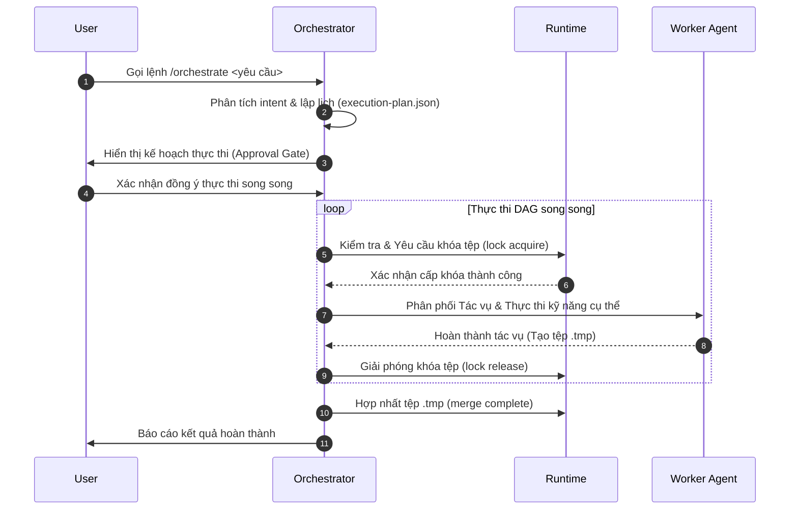

<!-- File path: docs/designs/FEAT-018_multi_agent_orchestration_blueprint.md -->

---
feature_id: FEAT-018
feature_name: Multi-Agent Orchestration Framework
status: reviewed
stage: blueprint
created_at: 2026-07-07
updated_at: 2026-07-07
previous_artifact: ../plans/FEAT-018_multi_agent_orchestration_plan.md
next_artifact: [Implementation (Source Code)](../../)
---

# Technical Blueprint – Multi-Agent Orchestration Framework (FEAT-018)

## 0. Project Memory Baseline
- **Trạng thái bộ nhớ**: Khớp hoàn toàn với cơ chế quản lý session hiện tại trong [session.json](file:///Volumes/Kyle/AgentsProject/.agents/.session.json).
- **Tài liệu tham chiếu chính**:
  - [AI_RULES.md](file:///Volumes/Kyle/AgentsProject/.agents/AI_RULES.md) (Chính sách phân quyền và khóa tệp).
  - [workflow_runtime.py](file:///Volumes/Kyle/AgentsProject/.agents/skills/workflow-runtime/scripts/workflow_runtime.py) (CLI của runtime).

## 1. Component Architecture & Design

### A. Tệp cấu trúc Runtime mới (.agents/runtime/)

1. **`execution-plan.json`** (Kế hoạch thực thi do LLM sinh ra):
   ```json
   {
     "workflow": "quick-fix | quick-feature | large-feature | memory | release",
     "tasks": [
       {
         "task_id": "TSK-001",
         "agent": "Backend",
         "read_set": ["api/"],
         "write_set": ["api/handler.go"],
         "dependencies": []
       }
     ]
   }
   ```

2. **`file-locks.json`** (Danh sách tệp đang bị khóa):
   ```json
   {
     "locks": {
       "api/handler.go": {
         "task_id": "TSK-001",
         "acquired_at": "2026-07-07T14:48:25+07:00"
       }
     }
   }
   ```

3. **`parallel-tasks.json`** (Trạng thái các tác vụ song song):
   ```json
   {
     "tasks": {
       "TSK-001": {
         "status": "pending | running | completed | failed",
         "started_at": null,
         "completed_at": null
       }
     }
   }
   ```

### B. Mở rộng `workflow_runtime.py`
Bổ sung các tham số dòng lệnh:
- `task`: `plan`, `start`, `complete`, `fail`.
- `lock`: `acquire`, `release`, `list`.
- `dependency`: `graph` (sắp xếp tô-pô cho DAG).
- `merge`: `prepare`, `complete`.
- `conflict`: `detect`, `resolve`.

---

## 2. Sequence & Interaction Diagrams



---

## 3. Data Flow / Sequence Flow
- **Bước 1 (Lập lịch)**: LLM phân tích yêu cầu của người dùng, phân rã thành các tác vụ độc lập, điền vào `execution-plan.json` với `read_set` và `write_set` tương ứng.
- **Bước 2 (Kiểm tra Khóa tệp)**: Trước khi kích hoạt bất kỳ tác vụ nào, hệ thống gọi `workflow_runtime.py lock acquire` để kiểm tra xung đột ghi tệp trong `file-locks.json`.
- **Bước 3 (Thực thi song song)**: Các tác vụ không phụ thuộc lẫn nhau chạy song song. Các thay đổi được ghi tạm vào tệp `.tmp`.
- **Bước 4 (Hợp nhất)**: Orchestrator tự động tích hợp các tệp `.tmp` vào nhánh mã nguồn chính sau khi xác minh không có xung đột.

---

## 4. Alternative Solutions Considered & Trade-offs
- **Phương án Prompt-driven thuần**: Bị từ chối do LLM không có khả năng quản lý tài nguyên hệ điều hành song song một cách đáng tin cậy và tốn token.

---

## 5. Architecture Decision Assessment
ADR Required: **No**

---

## 6. Migration & Rollback Strategy
- **Rollback**: Nếu quá trình chạy song song thất bại hoặc gặp xung đột nghiêm trọng, hệ thống sẽ thực hiện lệnh `git restore` và xóa bỏ toàn bộ khóa trong `file-locks.json` để đưa không gian làm việc về trạng thái ban đầu.

---

## 7. Security & Permissions
- Chỉ cho phép ghi tệp trong danh sách `write_set` được định nghĩa trong `execution-plan.json`. Bất kỳ tác vụ nào vi phạm quyền ghi ngoài phạm vi sẽ bị báo lỗi ngay lập tức.

---

## 8. Performance & Scalability
- Tận dụng đa luồng (multiprocessing) của Python để khởi chạy song song các Worker Agent, tối ưu hóa thời gian thực thi lên tới 3-4 lần đối với các tác vụ độc lập.

---

## 9. Error Handling & Resilience
- Nếu một tác vụ song song thất bại, các tác vụ phụ thuộc vào nó sẽ bị hủy bỏ (skip) để tránh lỗi dây chuyền. Toàn bộ khóa tệp của tác vụ thất bại sẽ được giải phóng ngay lập tức.

---

## 10. Verification & Test Strategy
- Viết các test case trong thư mục `tests/` để chẩn đoán:
  - Khóa tệp trùng lặp.
  - Sắp xếp thứ tự thực thi DAG (Topological Sort).
  - Khôi phục trạng thái khi có tác vụ bị lỗi.
