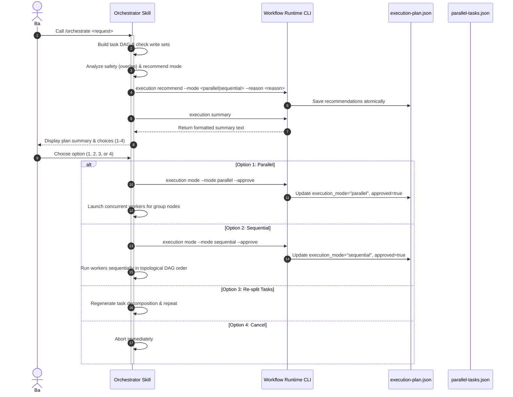

<!-- docs/designs/FEAT-019_selectable_execution_mode_blueprint.md -->

---
feature_id: FEAT-019
feature_name: User Selectable Execution Mode (Parallel vs Sequential)
status: draft
stage: design
created_at: 2026-07-07
updated_at: 2026-07-07
previous_artifact: ../plans/FEAT-019_selectable_execution_mode_plan.md
next_artifact: None
---

# Technical Design Blueprint – User Selectable Execution Mode

## 1. Sequence Diagram & System Architecture


## 2. API Design & CLI Extensions
We will add `execution` subcommand to `workflow_runtime.py`.

### 2.1 execution recommend
- **Signature**: `execution recommend --mode <parallel|sequential> --reason <reason>`
- **Behavior**: Writes `recommended_mode` and `recommended_reason` to `execution-plan.json`, and sets `execution_mode = "pending"` and `approved = false`.

### 2.2 execution mode
- **Signature**: `execution mode --mode <parallel|sequential> [--approve]`
- **Behavior**: Sets `execution_mode` to the specified mode. If `--approve` is passed, sets `approved = true`.

### 2.3 execution summary
- **Signature**: `execution summary`
- **Behavior**: Reads `execution-plan.json` and prints the summary using the verbatim output formatting:
```text
================================================================================

Execution Plan Summary

Workflow:
...

Estimated Agents:
...

Estimated Duration:
...

Estimated Tokens:
...

Parallel Groups:
...

Potential Conflicts:
...

================================================================================

Recommended Mode
...
```

## 3. Schema Extensions

### 3.1 execution-plan.json
```json
{
  "tasks": [],
  "execution_mode": "parallel|sequential|pending",
  "recommended_mode": "parallel|sequential",
  "recommended_reason": "...",
  "approved": false
}
```

### 3.2 parallel-tasks.json
Inside the `tasks` mapping, each task has an `execution_group` attribute (string/null).
```json
{
  "tasks": {
    "task_id_1": {
      "status": "pending",
      "started_at": null,
      "completed_at": null,
      "execution_group": "Group 1"
    }
  }
}
```

## 4. Conflict & Recommendation Rules
- **Rule 1**: If there are overlapping write ownerships in task `write_set` files, recommend `sequential` and list the conflicts.
- **Rule 2**: If tasks are completely independent (no overlapping write ownership), recommend `parallel`.

## 5. Visualizer & Resume State Recovery
- Context snapshot `context_snapshot.json` must be extended with:
  - `execution_mode`
  - `recommended_mode`
  - `approved`
- On resume workflow run, read `execution-plan.json`. If `approved` is true, restore task execution immediately without prompting.
