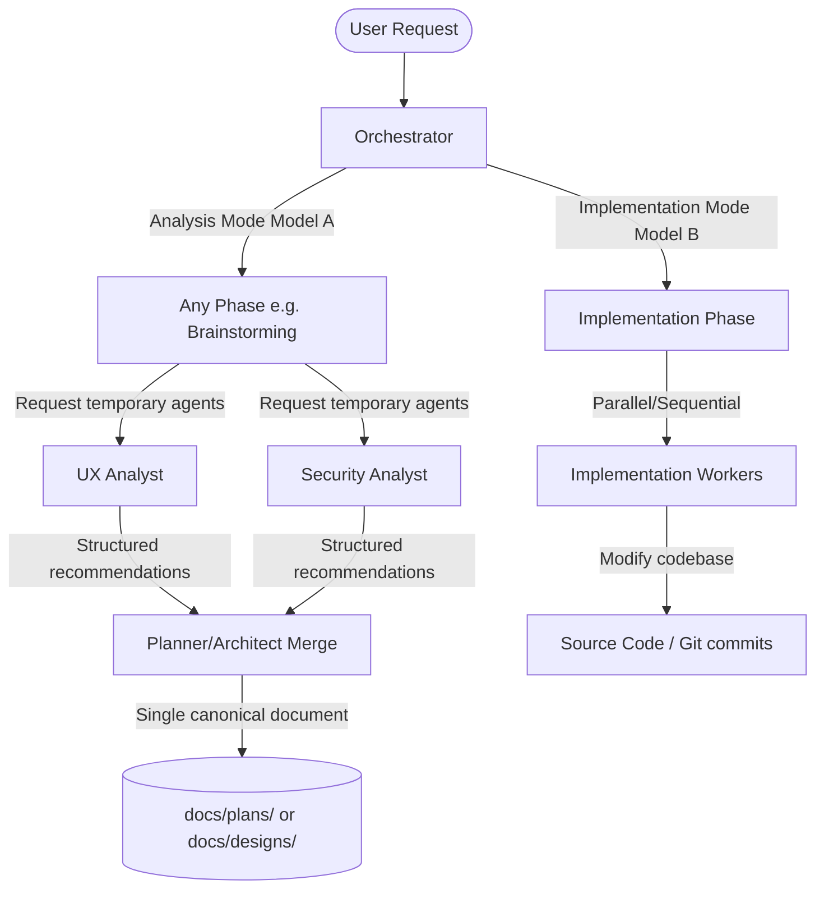

# Technical Design Blueprint – Multi-Agent Analysis Across All Phases (FEAT-020)

This design document outlines the exact technical implementation details for adding Multi-Agent Analysis to the AI Engineering Workflow Framework.

## 1. System Architecture

## 2. Proposed Changes

### Central Rules & Policies
#### [MODIFY] [AI_RULES.md](file:///Volumes/Kyle/AgentsProject/AI_RULES.md)
- Append section `20. Multi-Agent Analysis Policy` defining rules for temporary, read-only analysis agents in all phases.

### Central CLI Runtime Engine
#### [MODIFY] [workflow_runtime.py](file:///Volumes/Kyle/AgentsProject/skills/workflow-runtime/scripts/workflow_runtime.py)
- Introduce the new command sub-action: `analysis-agent`
- Implement JSON read/write logic for `.agents/runtime/analysis-agents.json` to register agent info, status, summary, and recommendations.
- Synchronize the analysis agents list to `.session.json` on any change.
- In `do_complete(args)`, remove `analysis-agents.json` to ensure clean lifecycle boundaries.

### Visualizer Webview UI
#### [MODIFY] [webviewHtml.ts](file:///Volumes/Kyle/AgentsProject/extensions/visualizer/src/webviewHtml.ts)
- Add a new visual UI block titled "Analysis Agents" which displays active/completed analysis agents, their roles, status, and summaries if present in `.session.json`.
- Clearly demarcate Analysis vs. Implementation phases.

### Interactive Docs & Simulator
#### [MODIFY] [index.html](file:///Volumes/Kyle/AgentsProject/interactive-docs/index.html)
- Add a section in the "Trình giả lập SDLC tương tác (SDLC Simulator)" tab demonstrating Multi-Agent Analysis.
#### [MODIFY] [app.js](file:///Volumes/Kyle/AgentsProject/interactive-docs/docs-assets/app.js)
- Extend mock simulation steps for brainstorming, planning, and blueprinting to show running analysis agents (e.g. UX Analyst, Security Analyst) merging their outputs.

### Workflow Skills
- Update `SKILL.md` files for brainstorming, planning, blueprint, etc. to explicitly document requesting specialist analysis agents via the Orchestrator.

### Test Suite
#### [MODIFY] [test_runtime.py](file:///Volumes/Kyle/AgentsProject/skills/workflow-runtime/tests/test_runtime.py)
- Add `test_analysis_agent_lifecycle` to verify adding, listing, merging, and automatic cleanup of analysis agents.
- Add `test_parallel_execution_phase_check` verifying that parallel execution mode is blocked at checkpoints < 5.

## 3. Verification Plan

### Automated Tests
- Run `python3 -m unittest discover -s skills/workflow-runtime/tests`

### Manual Verification
- Inspect `.session.json` directly to confirm the dynamic sync of `analysis_agents`.
- Launch the visualizer extension and review layout styling.
