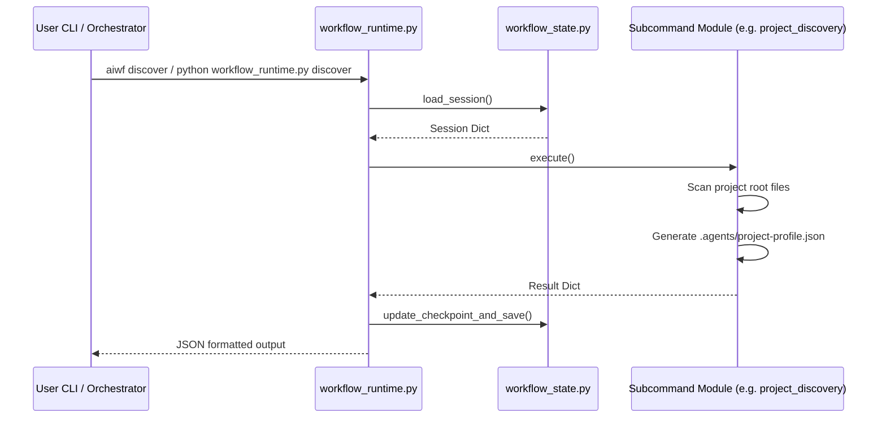

<!-- File path: docs/designs/FEAT-021_script_first_execution_blueprint.md -->

---
feature_id: FEAT-021
feature_name: Script-First Execution Refactoring
status: reviewed
stage: blueprint
created_at: 2026-07-08
updated_at: 2026-07-08
previous_artifact: ../plans/FEAT-021_script_first_execution_plan.md
next_artifact: [Implementation (Source Code)](../../)
---

# Technical Blueprint – Script-First Execution Refactoring

## 0. Project Memory Baseline
- **Memory state & Confidence**: High confidence. No memory gaps exist.
- **RAG Queries and search results**: Read existing project memory configuration, SQLite database structure, and the CLI layout of the `workflow-runtime` skill.
- **Inspected source files**: `workflow_runtime.py` and `test_runtime.py`.

## 1. Component Architecture & Design

### Affected Layers & Folders
- `skills/workflow-runtime/scripts/`: Adding core subcommands, validation utilities, and memory submodule.
- `skills/workflow-runtime/tests/`: Adding test runner suite.

### CLI Interface Contracts
Every CLI command outputs structured JSON to `stdout` in this layout:
```json
{
  "status": "success" | "failure",
  "command": "string representing the command",
  "summary": "human readable status string",
  "warnings": ["list of strings"],
  "files_read": ["list of absolute or relative paths"],
  "files_written": ["list of absolute or relative paths"],
  "next_skill": "string of recommended skill name" | null
}
```

### Folder & File Structure
```text
skills/workflow-runtime/scripts/
├── workflow_runtime.py (Extended parser mapping subcommand classes)
├── workflow_state.py (Initializes/resumes session, checks checkpoint validations)
├── approval_gate.py (Choice gating, wait loop, suggestions & confirmation states)
├── permission_mode.py (Checks and registers sandbox/full_access)
├── artifact_validator.py (Markdown syntax, frontmatter YAML, and blueprints check)
├── artifact_writer.py (Locks checking, safe writes)
├── skill_classifier.py (Intent/NLP classification metrics)
├── project_discovery.py (Tech stack scanning & project-profile.json creator)
├── environment_health.py (Inspects git, node, python, docker, PATHs)
├── validation_runner.py (Build, compile, lint, tests runner, verify checklist)
├── release_manager.py (Version bumps, changelog sections, git tag/push gates)
└── memory/
    ├── bootstrap.py (Scans and indexes, writes summaries/overview/file-map)
    ├── update.py (Incremental git diff sync)
    ├── search.py (Keyword local index lookup)
    ├── config.py
    └── ... (All other project memory helper modules)
```

## 2. Sequence & Interaction Diagrams



## 3. Data Flow / Sequence Flow
- The main parser in `workflow_runtime.py` catches command line arguments.
- It loads the global state session (`.session.json`).
- It dispatches the subcommand execution class.
- The command executes, reads files, writes output documents, and returns a results dictionary.
- The entrypoint catches the dict, appends standard fields (`command`, `status`, `summary`), saves the session atomic/safely, and prints the dict as JSON.

## 4. Alternative Solutions Considered & Trade-offs
- **Option B (Separate files)**: Handled parser logic on each file separately.
  - *Trade-off*: Duplicated session reading/writing code, making it difficult to keep validation rules centralized. Chosen Option A instead for consolidation.

## 5. Architecture Decision Assessment
ADR Required: No

Reason:
This refactoring replaces natural language prompt heuristics with deterministic Python scripts using the framework's existing programming tools. It does not introduce new external libraries or system dependencies.

## 6. Migration & Rollback Strategy
- **Migration**: Deploy the new CLI script subcommands and verify by running tests. Existing `.session.json` records remain backward compatible.
- **Rollback**: Standard git checkout is sufficient to restore previous skill instructions.

## 7. Security & Permissions
- Enforce the **Permission Mode Policy**: Commands default to `sandbox` mode. Commands executing external write/run steps must warn and assert permission mode.

## 8. Performance & Scalability
- Local python parsing overhead is negligible (< 100ms per CLI check). Memory scanning is limited to configuration files.

## 9. Error Handling & Resilience
- All subcommands run inside a `try/except` block. Exceptions are captured, mapped to `"status": "failure"`, and returned as structured JSON containing the stack trace/details in `"summary"`.

## 10. Verification & Test Strategy
- **Automated Tests**:
  - Implement a new test suite file `skills/workflow-runtime/tests/test_script_first.py` to cover all 17 requirements of the prompt including `init`, `resume`, `discover`, `memory`, `env`, `validate`, `debug`, `verify`, and `release`.
  - Ensure all 33 tests in `test_runtime.py` and `test_refactoring.py` remain fully green.
