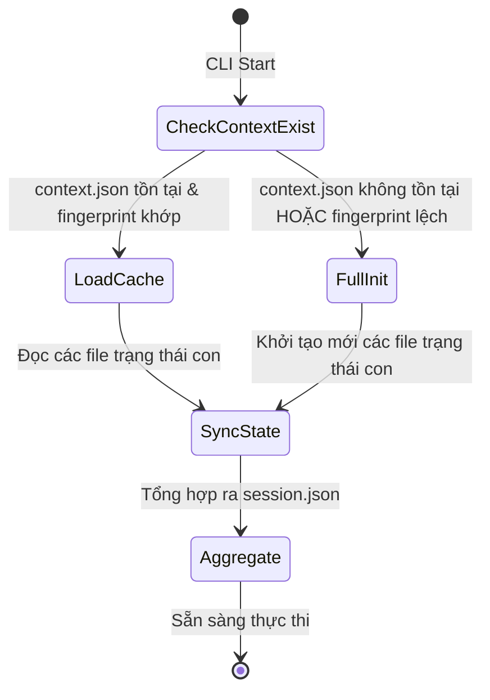

<!-- File path: docs/designs/FEAT-022_split_runtime_state_and_optimize_initialization_blueprint.md -->

---
feature_id: FEAT-022
feature_name: Split Runtime State, Optimize Initialize Workflow, and Update Extension
status: reviewed
stage: blueprint
created_at: 2026-07-08
updated_at: 2026-07-08
previous_artifact: ../plans/FEAT-022_split_runtime_state_and_optimize_initialization_plan.md
next_artifact: [Implementation (Source Code)](../../)
---

# Technical Blueprint & Implementation Contract – Split Runtime State, Optimize Initialize Workflow, and Update Extension

Tài liệu này là Thiết kế Kỹ thuật (Technical Design Blueprint) chính thức và Hợp đồng Triển khai cho nhiệm vụ tái cấu trúc hệ thống quản lý trạng thái của AI Workflow Framework.

## 0. Baseline Context & References
- **Memory Baseline**: Đọc cấu hình từ `MANIFEST.json` và cấu trúc dự án từ `.agents/memory/project-summary.md`. Trạng thái bộ nhớ: FRESH.
- **RAG Query Summaries**: Đã thực hiện quét và mapping toàn bộ CLI routing của `workflow_runtime.py` cùng tệp tin TypeScript của extension tại `extensions/visualizer/src/extension.ts`.

## 1. File-by-File Analysis & Proposed Mutations

| File Path | Operation | Responsibility | Dependency | Impact & Risk |
| :--- | :--- | :--- | :--- | :--- |
| [`skills/workflow-runtime/scripts/workflow_runtime.py`](file:///Volumes/Kyle/AgentsProject/skills/workflow-runtime/scripts/workflow_runtime.py) | `MODIFY` | Tái cấu trúc cơ chế đọc/ghi trạng thái: Đọc ghi qua `.agents/state/` độc lập, tích hợp các CLI subcommands mới, và thêm hàm đồng bộ hai chiều (Aggregate & Deconstruct). | Cần `SessionLock` hiện có của CLI để tránh concurrent write. | **High Risk**: Đây là trung tâm quản lý trạng thái. Lỗi ở đây sẽ làm hỏng toàn bộ quy trình chạy Agent. Cần kiểm tra kỹ cơ chế rollback. |
| [`skills/workflow-runtime/scripts/state_sync.py`](file:///Volumes/Kyle/AgentsProject/skills/workflow-runtime/scripts/state_sync.py) | `NEW` | Cung cấp các hàm xử lý logic phân rã tệp `.session.json` và tổng hợp ngược lại từ các file con (Aggregate/Deconstruct). Ghi file nguyên tử qua tệp tạm `.tmp` rồi `rename`. | Không có. | Low. |
| [`skills/workflow-runtime/scripts/fingerprint.py`](file:///Volumes/Kyle/AgentsProject/skills/workflow-runtime/scripts/fingerprint.py) | `NEW` | Cung cấp thuật toán tính toán và kiểm tra Project Fingerprint (SHA-256) dựa trên metadata tĩnh. | Sử dụng thư viện `hashlib` tiêu chuẩn. | Low. |
| [`extensions/visualizer/src/extension.ts`](file:///Volumes/Kyle/AgentsProject/extensions/visualizer/src/extension.ts) | `MODIFY` | Thay đổi cơ chế watch từ tệp tin đơn `.session.json` sang toàn bộ thư mục `.agents/state/`. Ghép các file trạng thái con thành ViewModel để render visualizer dashboard. | Phụ thuộc vào VS Code Workspace Watcher API. | Medium. Đảm bảo UI không bị lag và render đúng vùng giao diện bị ảnh hưởng. |
| [`AI_RULES.md`](file:///Volumes/Kyle/AgentsProject/AI_RULES.md) | `MODIFY` | Cập nhật quy tắc lưu trữ trạng thái tại Section 12 (Session State Tracking Policy). | Không có. | Low. |
| [`AGENTS.md`](file:///Volumes/Kyle/AgentsProject/AGENTS.md) | `MODIFY` | Cập nhật quy tắc quản lý trạng thái chia tách và khởi tạo. | Không có. | Low. |
| [`README.md`](file:///Volumes/Kyle/AgentsProject/README.md) | `MODIFY` | Tài liệu hóa cấu trúc trạng thái mới và các lệnh CLI. | Không có. | Low. |
| [`USAGE.md`](file:///Volumes/Kyle/AgentsProject/USAGE.md) | `MODIFY` | Tài liệu hóa cách chạy 5 lệnh CLI mới. | Không có. | Low. |
| [`CHANGELOG.md`](file:///Volumes/Kyle/AgentsProject/CHANGELOG.md) | `MODIFY` | Ghi nhận phiên bản cập nhật cấu trúc trạng thái. | Không có. | Low. |
| [`skills/workflow-runtime/tests/test_state_engine.py`](file:///Volumes/Kyle/AgentsProject/skills/workflow-runtime/tests/test_state_engine.py) | `NEW` | Chứa 11 unit tests kiểm tra toàn bộ hoạt động của State Sync Engine, Fingerprint, và CLI commands. | Pytest framework. | Low. |

## 2. Target Folder Structure

Cây thư mục của framework sau khi triển khai:
```text
.
├── AGENTS.md
├── AI_RULES.md
├── CHANGELOG.md
├── README.md
├── USAGE.md
├── extensions
│   └── visualizer
│       └── src
│           ├── extension.ts
│           └── (các files khác)
├── skills
│   └── workflow-runtime
│       ├── scripts
│       │   ├── state_sync.py
│       │   ├── fingerprint.py
│       │   └── workflow_runtime.py
│       └── tests
│           ├── test_state_engine.py
│           └── (các tests khác)
└── (các thư mục khác giữ nguyên)
```

## 3. Interface Contracts (Public & Internal)

### A. Định dạng Schema của 8 tệp trạng thái con trong `.agents/state/`

1. **`context.json`** (Thông tin tĩnh dự án):
```json
{
  "project_id": "string",
  "workspace_path": "string",
  "project_type": "string",
  "languages": ["string"],
  "frameworks": ["string"],
  "git": {
    "is_git_repository": true,
    "remote_url": "string",
    "default_branch": "string"
  },
  "permission_mode": "sandbox | full_access | unrestricted",
  "conversation_id": "string",
  "initialized_at": "string (ISO-8601)",
  "memory_provider": "string",
  "rag_provider": "string",
  "project_fingerprint": "string (SHA-256)"
}
```

2. **`workflow.json`** (Tiến trình SDLC & Checkpoint):
```json
{
  "active_workflow": "string",
  "active_phase": "string",
  "checkpoint": 1,
  "waiting_for": "string",
  "work_item": {
    "type": "FEAT | FIX | QUICK | None",
    "id": "string",
    "title": "string"
  },
  "suggested_next_skill": "string",
  "suggested_next_command": "string",
  "resume_state": {
    "step": "string",
    "skill": "string"
  }
}
```

3. **`runtime.json`** (Logs & Tiền trình chạy hiện tại):
```json
{
  "current_skill": "string",
  "current_command": "string",
  "current_step": "string",
  "current_logs": ["string"],
  "status": "in_progress | completed | failed",
  "progress": 0,
  "updated_at": "string (ISO-8601)"
}
```

4. **`approvals.json`** (Phê duyệt của người dùng):
```json
{
  "blueprint": {
    "path": "string",
    "exists": true,
    "approved": true,
    "approved_at": "string (ISO-8601)",
    "approved_by": "user"
  },
  "specification": {
    "path": "string",
    "exists": true,
    "approved": true,
    "approved_at": "string (ISO-8601)",
    "approved_by": "user"
  },
  "branch_selected": {
    "name": "string",
    "selected_at": "string (ISO-8601)"
  },
  "release": {
    "approved": true,
    "approved_at": "string (ISO-8601)",
    "approved_by": "user"
  }
}
```

5. **`usage.json`** (Token tiêu dùng):
```json
{
  "workflow_usage_summary": {
    "provider": "string",
    "model": "string",
    "input_tokens": 0,
    "output_tokens": 0,
    "cache_tokens": 0,
    "thinking_tokens": 0,
    "active_tokens": 0,
    "total_tokens": 0,
    "limit_tokens": 0,
    "percentage": 0.0,
    "estimated_cost_usd": 0.0,
    "accuracy": "string",
    "updated_at": "string"
  },
  "project_usage_summary": {
    "input_tokens": 0,
    "output_tokens": 0,
    "cache_tokens": 0,
    "thinking_tokens": 0,
    "total_tokens": 0,
    "estimated_cost_usd": 0.0,
    "updated_at": "string"
  },
  "global_usage_summary": {
    "input_tokens": 0,
    "output_tokens": 0,
    "cache_tokens": 0,
    "thinking_tokens": 0,
    "total_tokens": 0,
    "estimated_cost_usd": 0.0,
    "updated_at": "string"
  },
  "context_usage": {
    "total_tokens": 0,
    "limit_tokens": 0,
    "percentage": 0.0
  }
}
```

6. **`agents.json`** (Hành vi chạy đa tác nhân):
```json
{
  "execution_mode": "parallel | sequential",
  "recommended_mode": "parallel | sequential",
  "approved": true,
  "parallel_groups": [],
  "running_agents": [],
  "queued_agents": [],
  "blocked_agents": [],
  "waiting_dependencies": [],
  "analysis_agents": []
}
```

7. **`rules.json`** (Danh sách quy tắc được tải):
```json
{
  "active_rules": [
    {
      "rule_id": "string",
      "rule_text": "string",
      "source": "AGENTS.md | AI_RULES.md"
    }
  ],
  "loaded_at": "string (ISO-8601)"
}
```

8. **`recovery.json`** (Kiểm tra lỗi và Snapshot phục hồi):
```json
{
  "last_good_snapshot_at": "string (ISO-8601)",
  "checksums": {
    "context.json": "string",
    "workflow.json": "string",
    "runtime.json": "string",
    "approvals.json": "string",
    "usage.json": "string",
    "agents.json": "string",
    "rules.json": "string"
  },
  "recovery_source": "session.json"
}
```

### B. CLI Command Interface mới (5 Subcommands)

Mỗi subcommand mới phải trả về định dạng JSON chuẩn trên stdout:
- `python3 skills/workflow-runtime/scripts/workflow_runtime.py context`
  - *Đầu ra*: Dữ liệu JSON của `context.json`.
- `python3 skills/workflow-runtime/scripts/workflow_runtime.py rules status`
  - *Đầu ra*: Danh sách rules hoạt động dạng JSON từ `rules.json`.
- `python3 skills/workflow-runtime/scripts/workflow_runtime.py state status`
  - *Đầu ra*:
    ```json
    {
      "status": "healthy | out_of_sync",
      "state_files_present": ["context.json", ...],
      "session_synced": true
    }
    ```
- `python3 skills/workflow-runtime/scripts/workflow_runtime.py state recover`
  - *Đầu ra*:
    ```json
    {
      "status": "success",
      "recovered_files": ["context.json", ...]
    }
    ```
- `python3 skills/workflow-runtime/scripts/workflow_runtime.py state validate`
  - *Đầu ra*: Kết quả xác thực tính toàn vẹn trạng thái.

---

## 4. Algorithms & Logic Specifications

### A. Thuật toán Đồng bộ hai chiều (Bi-directional Sync Algorithm)

```python
def aggregate_state_to_session():
    """
    Chiều xuôi: Tổng hợp 8 file JSON con thành file session.json monolithic
    """
    session = {}
    for file_name in ["context.json", "workflow.json", "runtime.json", "approvals.json", "usage.json", "agents.json", "rules.json"]:
        file_path = os.path.join(".agents", "state", file_name)
        if os.path.exists(file_path):
            data = read_json(file_path)
            # Merge logic dựa trên mapping key
            if file_name == "context.json":
                session.update({
                    "workspace": {"path": data.get("workspace_path", "."), "valid": True},
                    "git": data.get("git", {}),
                    "permission_mode": data.get("permission_mode", "sandbox"),
                    "conversation_id": data.get("conversation_id", "")
                })
            elif file_name == "workflow.json":
                session.update({
                    "work_item": data.get("work_item", {}),
                    "checkpoint": data.get("checkpoint", 1),
                    "suggested_next_skill": data.get("suggested_next_skill"),
                    "suggested_next_command": data.get("suggested_next_command")
                })
            # Merge các phần còn lại...
    
    # Ghi nguyên tử đè session.json
    write_atomic(".agents/session.json", session)

def deconstruct_session_to_state(session):
    """
    Chiều ngược: Tách tệp session.json thành 8 file con
    """
    context = {
        "workspace_path": session.get("workspace", {}).get("path", "."),
        "git": session.get("git", {}),
        "permission_mode": session.get("permission_mode", "sandbox"),
        "conversation_id": session.get("conversation_id", "")
    }
    # Tách các tệp tin khác...
    
    # Ghi nguyên tử đè các file con
    write_atomic(".agents/state/context.json", context)
    # Ghi các file khác...
```

### B. Thuật toán Fingerprint dự án (Project Fingerprint Generation)
1. Đọc:
   - Đường dẫn thư mục gốc dự án (`root_path`).
   - Git remote URL (`git remote get-url origin`).
   - Kích thước file `MANIFEST.json`.
2. Tạo chuỗi ký tự tổng hợp:
   `f"{root_path}|{git_remote}|{manifest_size}"`
3. Tính hash SHA-256 từ chuỗi ký tự trên.
4. Ghi hash vào trường `"project_fingerprint"` trong `context.json`.

---

## 5. State Machine & Transitions

Trạng thái tải và phục hồi phiên làm việc khi CLI khởi chạy:


---

## 6. Validation and Safety Constraints

- **Concurrent Write Prevention**: Toàn bộ thao tác cập nhật bất kỳ tệp trạng thái nào trong `.agents/state/` bắt buộc phải được bao quanh bởi một khối block `SessionLock` độc quyền:
```python
with SessionLock():
    write_atomic(target_file, data)
    aggregate_state_to_session()
```
- **Directory Boundary Restriction**: Lệnh `aiwf state recover` và `aiwf state validate` chỉ được thao tác trên tệp tin nằm trong thư mục gốc của dự án hoặc thư mục `.agents`. Không được phép chỉnh sửa các tệp tin hệ thống bên ngoài workspace.

---

## 7. Implementation Checklist

- [ ] Tạo file mới `skills/workflow-runtime/scripts/state_sync.py` chứa logic Aggregate/Deconstruct.
- [ ] Tạo file mới `skills/workflow-runtime/scripts/fingerprint.py` chứa logic tạo fingerprint.
- [ ] Chỉnh sửa `skills/workflow-runtime/scripts/workflow_runtime.py` tích hợp các hàm trên và thêm 5 subcommands.
- [ ] Cập nhật phần watch và ViewModel trong `extensions/visualizer/src/extension.ts`.
- [ ] Cập nhật tài liệu: `AI_RULES.md`, `AGENTS.md`, `README.md`, `USAGE.md`, `CHANGELOG.md`.
- [ ] Chạy `./update.sh --force` để đồng bộ.
- [ ] Viết bộ test `skills/workflow-runtime/tests/test_state_engine.py` chứa 11 kịch bản unit test.
- [ ] Chạy thử bộ kiểm thử `pytest --ignore=public_export` và xác nhận PASS 100%.

---

## 8. Acceptance Criteria & Test Mapping

| Yêu cầu kiểm nghiệm | Kết quả mong đợi | Phương pháp xác minh | Ca kiểm thử ánh xạ |
| :--- | :--- | :--- | :--- |
| `REQ-001`: Khởi tạo chia tách file | Tạo đủ 8 file JSON con trong `.agents/state/` | Kiểm tra tồn tại thư mục và files | `test_state_splitting` trong `test_state_engine.py` |
| `REQ-002`: Khôi phục trạng thái ngược | Xoá `.session.json` -> chạy `state recover` -> tái tạo lại chính xác `.session.json` | So sánh file khôi phục với bản gốc | `test_state_recovery` trong `test_state_engine.py` |
| `REQ-003`: Project Fingerprint | Tăng tốc khởi động lần 2 dưới 50ms nhờ bỏ qua scan tốn kém | Đo thời gian chạy CLI init lần 2 | `test_initialize_reuse` trong `test_state_engine.py` |
| `REQ-004`: Lệnh CLI mới | Các subcommands: `context`, `rules status`, `state status` hoạt động đúng | Chạy lệnh và so sánh đầu ra JSON | `test_cli_commands` trong `test_state_engine.py` |
