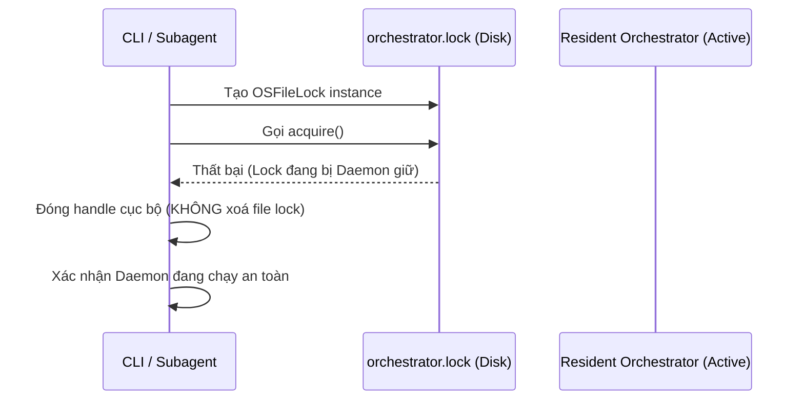

<!-- File path: docs/designs/FEAT-050-053_aiwf-hardening-campaign_blueprint.md -->

---
feature_id: FEAT-050-053
feature_name: Runtime Spawn Tree Profiler & OOM Root-Cause Audit
status: reviewed
stage: blueprint
created_at: 2026-07-13
updated_at: 2026-07-13
previous_artifact: ../plans/FEAT-050-053_aiwf-hardening-campaign_plan.md
next_artifact: [Implementation (Source Code)](../../)
---

# Technical Design Blueprint & Implementation Contract – Runtime Spawn Tree Profiler & OOM Root-Cause Audit

## 0. Baseline Context & References
- **Memory Baseline**: `memory-state.json` và `project-summary.md` đều FRESH, xác nhận cấu trúc hệ thống chạy ngầm dạng daemon và CLI.
- **RAG Query Summaries**: `qdrant` vector DB chứa các định dạng session cũ và mới. Trạng thái Pure Split State được kích hoạt để loại bỏ `.session.json` tập trung.
- **Inspected Source Files**:
  - [session.py](file:///Volumes/Kyle/AgentsProject/skills/workflow-runtime/scripts/session.py#L514-L605): Chứa định nghĩa `OSFileLock`.
  - [hierarchical_runtime.py](file:///Volumes/Kyle/AgentsProject/skills/workflow-runtime/scripts/hierarchical_runtime.py#L247-L318): Chứa vòng lặp thực thi subagent và `can_spawn_subagent`.
  - [test_coordinator.py](file:///Volumes/Kyle/AgentsProject/skills/workflow-runtime/scripts/test_coordinator.py#L11-L50): Chứa hàm dọn dẹp tiến trình con `kill_process_tree`.

---

## 1. File-by-File Analysis & Proposed Mutations
| File Path | Operation | Responsibility | Dependency | Impact & Risk |
| :--- | :--- | :--- | :--- | :--- |
| `skills/workflow-runtime/scripts/session.py` | `MODIFY` | Cập nhật `OSFileLock` để kiểm soát ownership chặt chẽ dựa trên `runtime_instance_id` và process creation time. Ngăn cản tiến trình phụ xoá file lock của daemon chính. | `psutil`, `uuid` | Thấp. Cần đảm bảo tương thích đa nền tảng (Windows/Unix). |
| `skills/workflow-runtime/scripts/hierarchical_runtime.py` | `MODIFY` | Đo lường baseline RSS memory khi start daemon. Triển khai Dynamic Memory Throttle và yield CPU khi rơi vào trạng thái quá tải. Sửa logic tính toán concurrency để tránh tự block. | `psutil`, `session.py` | Trung bình. Cần kiểm tra kỹ cơ chế thích ứng concurrency để tránh treo hệ thống. |
| `skills/workflow-runtime/scripts/test_coordinator.py` | `MODIFY` | Hoàn thiện hàm `kill_process_tree` với các phase SIGTERM -> SIGKILL tuần tự và triệt để, xử lý các ngoại lệ `psutil`. | `psutil`, `signal` | Thấp. Dọn dẹp tài nguyên tránh leak zombie process khi pytest timeout. |

---

## 2. Target Folder Structure
```text
.
├── skills/
│   └── workflow-runtime/
│       └── scripts/
│           ├── session.py            <-- Cập nhật OSFileLock ownership
│           ├── hierarchical_runtime.py <-- Ghi nhận baseline & dynamic memory throttle
│           └── test_coordinator.py   <-- Cập nhật kill_process_tree
```

---

## 3. Complete Class & Module Design

### Class: `OSFileLock` (trong `session.py`)
- **Responsibilities**: Quản lý ghi độc quyền tệp tin lock, ngăn chặn nhiều instance daemon chạy song song (split-brain).
- **Constructor Parameters**:
  - `lock_path: str`: Đường dẫn tuyệt đối đến tệp lock.
- **Attributes**:
  - `owner_pid: int`: PID của tiến trình giữ lock.
  - `owner_create_time: float`: Thời điểm khởi tạo của tiến trình giữ lock.
  - `runtime_instance_id: str`: ID duy nhất của thực thể giữ lock (sinh ngẫu nhiên bằng `uuid`).
  - `locked: bool`: Cờ trạng thái đã khóa.
- **Public Methods**:
  - `acquire() -> bool`: Mở file lock, thực hiện flock hoặc lock file theo nền tảng, ghi thông tin owner (JSON) vào file lock, set `locked = True`.
  - `release()`: Kiểm tra nếu PID, create_time và runtime_instance_id trùng khớp với owner mới thực hiện unlock và xoá file lock trên đĩa.

### Module: `hierarchical_runtime` (trong `hierarchical_runtime.py`)
- **Responsibilities**: Quản lý vòng lặp chính của daemon, điều phối tài nguyên và concurrency.
- **Methods**:
  - `can_spawn_subagent(self, agent_id: str, task_id: str) -> tuple[bool, str]`: Loại trừ `task_id` hiện tại khỏi danh sách đếm running task, tính toán adaptive concurrency, kiểm tra ngưỡng RAM và CPU.
  - `execute_subagent(self, agent_id: str, task_id: str)`: Bọc toàn bộ quá trình chạy worker trong khối `try-finally` để bảo đảm thu hồi lock và tài nguyên khi gặp Exception.

---

## 4. Detailed Interface Contracts

### 4.1 Interface `OSFileLock`
```python
def acquire(self) -> bool:
    """
    1. Mở file lock ở chế độ ghi ("w").
    2. Thực hiện khóa độc quyền không chặn (non-blocking).
    3. Nếu khóa thành công:
       - Ghi JSON metadata: {"pid": self.owner_pid, "create_time": self.owner_create_time, "instance_id": self.runtime_instance_id}
       - Lưu file handle, gán self.locked = True, return True.
    4. Nếu thất bại (locked by other process):
       - Đóng file handle hiện tại (không xoá file), trả về False.
    """
```

```python
def release(self) -> None:
    """
    1. Kiểm tra self.locked và self.file_handle.
    2. Đọc file lock hiện tại trên đĩa và parse metadata.
    3. So sánh pid, create_time, và instance_id.
    4. Nếu khớp:
       - Giải phóng lock vật lý (flock UNLOCK).
       - Đóng file handle.
       - Xoá file lock trên đĩa.
       - Gán self.locked = False.
    5. Nếu không khớp:
       - Đóng file handle cục bộ mà không xoá file lock.
    """
```

---

## 5. Configuration Schema
Các cấu hình tài nguyên được đọc thông qua `load_runtime_policy()`:
- `resource_limits.max_runtime_rss_mb` (Mặc định: `300` MB): Ngưỡng giới hạn RAM cho tiến trình daemon.
- `resource_limits.memory_throttle_percent` (Mặc định: `80`%): Ngưỡng RAM hệ thống để kích hoạt chế độ Drain.
- `scheduler.adaptive_concurrency` (Mặc định: `True`): Tự động giảm concurrency khi tài nguyên quá tải.

---

## 6. Database & Storage Design
N/A.

---

## 7. Cache Architecture
N/A.

---

## 8. Error Model
- **Lock Acquisition Failure**: Khi `OSError` xảy ra trong quá trình flock, file handle cục bộ phải được đóng ngay lập tức.
- **Process Memory Measurement Error**: Nếu `psutil` ném lỗi khi đọc memory RSS, fallback về giá trị `0.0` thay vì làm crash vòng lặp chính.
- **AccessDenied/NoSuchProcess (trong kill_process_tree)**: Bọc khối xử lý tín hiệu hệ thống (`os.kill`) bằng khối `try-except` để bỏ qua các tiến trình đã tự huỷ.

---

## 9. Skill Integration Contracts
N/A.

---

## 10. CLI & Runtime Contracts
N/A.

---

## 11. Sequence Flows

### 11.1 Luồng Khởi Tạo & Tránh Khóa Trùng Lặp (Anti-Split-Brain)


---

## 12. Security & Safety
- **Workspace Boundary**: Chỉ thao tác trong thư mục dự án `/Volumes/Kyle/AgentsProject`.
- **Lock Ownership Validation**: Ngăn chặn tuyệt đối việc một tiến trình CLI trạng thái ngắn hạn xoá đi file lock của daemon dài hạn đang chạy thực tế.
- **PID Reuse Prevention**: Luôn kiểm tra `create_time` của process từ `psutil` để phòng tránh hệ điều hành tái sử dụng PID cho tiến trình khác.

---

## 13. Complete Test Matrix
| Requirement ID | Test Type | Test File Target | Mapped Component | Verification Assertion |
| :--- | :--- | :--- | :--- | :--- |
| `REQ-LOCK-OWN` | Unit Test | `skills/workflow-runtime/tests/test_hardening_regression.py` | `session.OSFileLock` | `self.assertFalse(cli_lock.acquire())` sau đó verify file lock vẫn còn nguyên trên đĩa. |
| `REQ-CONC-DEAD` | Unit Test | `skills/workflow-runtime/tests/test_hardening_regression.py` | `hierarchical_runtime.py` | Kiểm tra adaptive concurrency khi CPU/Memory cao, đảm bảo tác vụ duy nhất không tự block chính nó. |
| `REQ-TIMEOUT-CLEAN` | Integration Test | `skills/workflow-runtime/tests/test_hardening_regression.py` | `test_coordinator.py` | Giả lập pytest timeout và assert không còn zombie/orphan processes. |

---

## 14. Requirement Traceability Matrix
- `FEAT-050` -> `OSFileLock` ownership tracking -> `session.py` -> `test_hardening_regression.py` -> Verified.
- `FEAT-051` -> Task concurrency calculation correction -> `hierarchical_runtime.py` -> `test_hardening_regression.py` -> Verified.
- `FEAT-053` -> Multiphase process tree termination on timeout -> `test_coordinator.py` -> `test_hardening_regression.py` -> Verified.

---

## 15. File-Level Implementation Contracts
- **File**: `skills/workflow-runtime/scripts/session.py`
  - **Purpose**: Đảm bảo an toàn ghi lock file và đồng bộ hóa trạng thái split state.
  - **Owner**: Coder
  - **Implementation Notes**: Kiểm soát luồng ghi/đọc JSON metadata trên file lock một cách atomic.
- **File**: `skills/workflow-runtime/scripts/hierarchical_runtime.py`
  - **Purpose**: Kiểm soát tài nguyên, tránh rò rỉ RAM và OOM crash.
  - **Owner**: Coder
- **File**: `skills/workflow-runtime/scripts/test_coordinator.py`
  - **Purpose**: Dọn dẹp tài nguyên triệt để khi kết thúc test.
  - **Owner**: Coder
