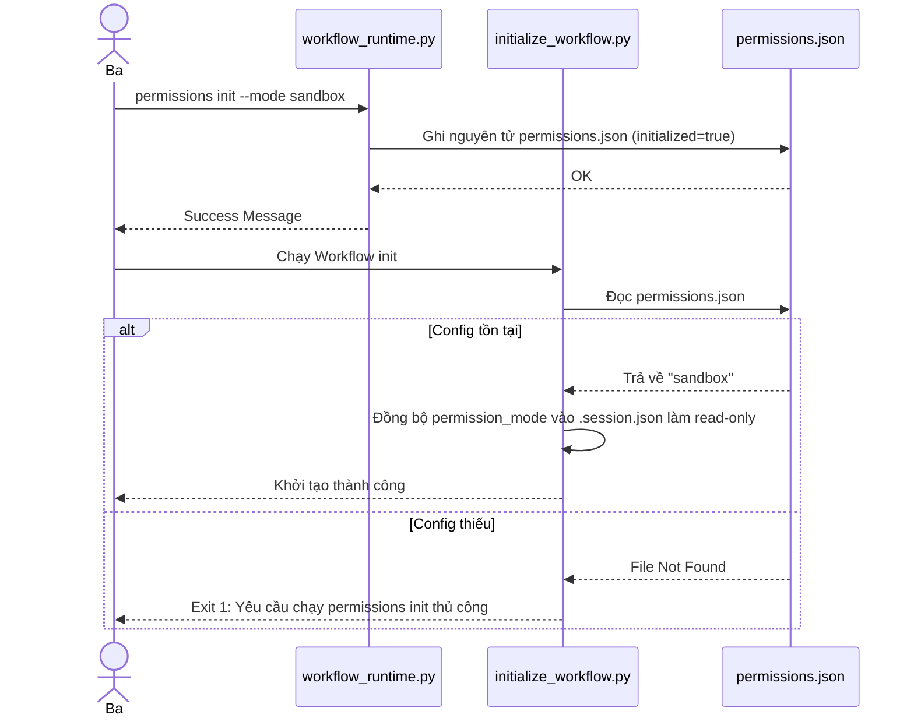

<!-- File path: docs/designs/FEAT-052_project_permissions_management_blueprint.md -->

---
feature_id: FEAT-052
feature_name: Project-Level Permission Initialization and Manual Permission Mode Management
status: reviewed
stage: blueprint
created_at: 2026-07-11
updated_at: 2026-07-11
previous_artifact: ../plans/FEAT-052_project_permissions_management_plan.md
next_artifact: [Implementation (Source Code)](../../)
---

# Technical Design Blueprint & Implementation Contract – Project-Level Permission Initialization and Manual Permission Mode Management

## 0. Baseline Context & References
- **Memory Baseline**: Tách biệt ranh giới bảo mật tĩnh của dự án ra khỏi session động. Mọi thay đổi về quyền bắt buộc phải thực hiện thủ công bởi Ba.
- **Inspected Source Files**:
  - `skills/workflow-runtime/scripts/workflow_runtime.py`
  - `skills/workflow-runtime/scripts/session.py`
  - `skills/initialize-workflow/scripts/initialize_workflow.py`

## 1. File-by-File Analysis & Proposed Mutations
| File Path | Operation | Responsibility | Dependency | Impact & Risk |
| :--- | :--- | :--- | :--- | :--- |
| `skills/workflow-runtime/scripts/session.py` | MODIFY | Coder | Task 1.1 | Đọc quyền từ permissions.json tĩnh. Không tự ý hỏi/prompt quyền. |
| `skills/workflow-runtime/scripts/workflow_runtime.py` | MODIFY | Coder | Task 1.2 | Thêm subcommand permissions và 4 lệnh quản trị tĩnh. |
| `skills/initialize-workflow/scripts/initialize_workflow.py` | MODIFY | Architect | Task 2.1 | Dừng chạy an toàn nếu permissions chưa được cấu hình. |
| `skills/workflow-runtime/tests/test_permissions.py` | NEW | Coder | Task 3.2 | Kiểm thử CLI và tính cô lập môi trường của permissions. |

## 2. Target Folder Structure
```text
.
├── .agents/
│   └── config/
│       └── permissions.json (chỉ sinh sau khi chạy CLI init)
└── skills/
    ├── initialize-workflow/
    │   └── scripts/
    │       └── initialize_workflow.py
    └── workflow-runtime/
        ├── scripts/
        │   ├── session.py
        │   └── workflow_runtime.py
        └── tests/
            └── test_permissions.py
```

## 3. Complete Class & Module Design
- **Module Name**: `permissions_manager` (Helper tích hợp trong `session.py`)
  - **Responsibilities**: Đọc, validate và lưu trữ atomic cấu hình quyền dự án.
  - **Public Methods**:
    - `def get_project_permission_config_path() -> str`: Trả về đường dẫn `.agents/config/permissions.json`, hỗ trợ ghi đè qua biến môi trường `AIWF_PERMISSION_CONFIG_ROOT` phục vụ test isolation.
    - `def load_project_permissions() -> dict`: Nạp file JSON, trả về dữ liệu cấu hình hoặc None nếu chưa init.
    - `def write_project_permissions_atomic(data: dict) -> None`: Ghi nguyên tử bằng cách ghi tệp tin `.tmp` cùng thư mục rồi `os.replace`.
    - `def validate_permissions_data(data: dict) -> tuple[bool, str]`: Kiểm tra tính hợp lệ của schema và giá trị mode.

## 4. Detailed Interface Contracts
- **CLI Commands**:
  - `python workflow_runtime.py permissions init [--mode MODE] [--force]`
    - Ghi cấu hình ban đầu. Mặc định `mode` = `sandbox`. Nếu đã tồn tại file và `--force` không được chọn, báo lỗi thoát 1.
  - `python workflow_runtime.py permissions show`
    - In định dạng JSON của cấu hình permissions hiện tại.
  - `python workflow_runtime.py permissions change --mode MODE [--force]`
    - Thay đổi quyền. Nếu nâng cấp lên mode cao hơn, yêu cầu xác nhận `[y/N]` của Ba ở chế độ tương tác.
  - `python workflow_runtime.py permissions validate`
    - Kiểm tra tính đúng đắn của file.

## 5. Configuration Schema
- **Target Schema (`.agents/config/permissions.json`)**:
```json
{
  "schema_version": "1.0.0",
  "initialized": true,
  "mode": "sandbox",
  "config_revision": 1,
  "initialized_at": "ISO-8601-Timestamp",
  "updated_at": "ISO-8601-Timestamp",
  "updated_by": "Ba",
  "source": "cli"
}
```

## 6. Database & Storage Design
- Không lưu cấu hình quyền trong SQLite nhằm bảo đảm tính độc lập và khả năng tracking lịch sử thay đổi quyền trực tiếp qua Git.

## 7. Error Model
- **PermissionUninitializedError**: Ném ra khi khởi động workflow mà chưa chạy lệnh `permissions init`.
  - **Recovery Strategy**: Hướng dẫn Ba chạy câu lệnh `python workflow_runtime.py permissions init --mode sandbox` để tiếp tục.

## 8. CLI & Runtime Contracts
- Nhóm câu lệnh: `permissions`
- Trạng thái trả về (Exit codes):
  - 0: Thành công.
  - 1: Lỗi nghiệp vụ hoặc cấu hình chưa hợp lệ.

## 9. Sequence Flows


## 10. Security & Safety
- **AI Agent Restriction**: Tuyệt đối không cho phép AI Agent tự động gọi `permissions change` hay sửa đổi trực tiếp file `permissions.json` mà không được sự chấp nhận của Ba.
- **Path Escape Prevention**: Hàm xác định đường dẫn tệp tin bắt buộc phải chuẩn hóa và validate để tránh ghi đè thư mục ngoài dự án.

## 11. Complete Test Matrix
| Requirement ID | Test Type | Test File Target | Mapped Component | Verification Assertion |
| :--- | :--- | :--- | :--- | :--- |
| `FR-01` | Unit Test | `skills/workflow-runtime/tests/test_permissions.py` | `session.py` | Khởi tạo thành công file JSON đúng schema |
| `FR-03` | Unit Test | `skills/workflow-runtime/tests/test_permissions.py` | `workflow_runtime.py` | CLI init/show/change/validate hoạt động đúng |
| `FR-04` | Integration Test | `skills/workflow-runtime/tests/test_permissions.py` | `initialize_workflow.py` | Dừng an toàn khi thiếu file cấu hình permissions |

## 12. File-Level Implementation Contracts
- **File**: `skills/workflow-runtime/scripts/session.py`
  - **Purpose**: Đọc cấu hình quyền tĩnh từ permissions.json, loại bỏ hoàn toàn prompt động.
  - **Owner**: Coder
- **File**: `skills/workflow-runtime/scripts/workflow_runtime.py`
  - **Purpose**: Đăng ký subcommand permissions và tích hợp confirm gate cho nâng quyền.
  - **Owner**: Coder
