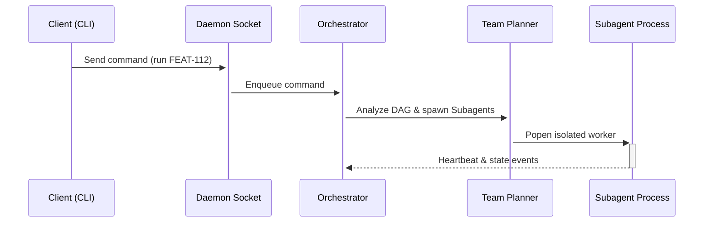

# Technical Design Blueprint — FEAT-112: Resident Orchestrator Service & Dynamic Subagent Runtime

## 1. Executive Summary
Bản thiết kế kỹ thuật chi tiết (Blueprint) sẵn sàng triển khai cho dịch vụ nền trú đóng Resident Orchestrator và cơ chế co giãn Subagent linh hoạt.

## 2. Goals and Non-goals
- **Goals**:
  - Daemon service luôn hoạt động.
  - Xếp hàng chỉ thị phi block qua Command Inbox.
  - Quản lý vòng đời ephemeral subagent tự động.
- **Non-goals**:
  - Không thay đổi thiết kế nền tảng của các skills hiện tại.
  - Không triển khai chạy đa tiến trình phân tán ngoài localhost ở phase này.

## 3. Runtime Architecture
Mô tả kiến trúc:
- **Client layer**: CLI / VS Code extension.
- **IPC Interface**: Unix Sockets / Named Pipes truyền JSON-RPC payload.
- **Daemon Core**: Chạy tiến trình nền `aiwf-daemon`, chứa Main Orchestrator, Scheduler, Lock Manager.
- **Worker pool**: Các ephemeral subagent subprocesses.

## 4. Resident Orchestrator Lifecycle
- Khởi động ngầm qua lệnh `aiwf install` hoặc khi IDE mở workspace.
- Tự động ghi lại PID vào `.agents/state/daemon.json`.
- Tự động tắt khi nhận lệnh `aiwf uninstall` hoặc sau 30 phút idle không có client nào kết nối.

## 5. Command Inbox Architecture
Sử dụng hàng đợi bộ nhớ trong (thread-safe Queue) để tiếp nhận chỉ thị người dùng phi đồng bộ từ socket IPC.

## 6. Dynamic Agent Team Planner
Thuật toán phân tích đồ thị tác vụ (DAG):
- Phát hiện các node độc lập.
- Ánh xạ nhãn tài nguyên (ví dụ: `frontend/` cần `AGENT-FRONTEND-001` với capability `svelte-development`).

## 7. Agent Hierarchy
Cây phân cấp:
- **Orchestrator**: Quản trị trung tâm, phân rã đồ thị, lập lịch, giám sát.
- **Supervisor**: Theo dõi domain cụ thể (ví dụ: `frontend` supervisor quản lý locks).
- **Subagent**: Thực thi mã nguồn, chạy test.

## 8. Worker Process Model
Sử dụng `subprocess.Popen` cách ly bộ nhớ hoàn toàn, giao tiếp qua stdout/stderr được chuyển hướng về Event Bus.

## 9. Scheduler & Parallel Group Algorithm
Sử dụng bộ lập lịch dựa trên mức độ sẵn sàng của Node trong DAG (In-degree == 0), nạp vào ThreadPoolExecutor tối đa theo `concurrency_limit` cấu hình.

## 10. Runtime State Schema
Cấu trúc trạng thái mới tại `.agents/state/`:
- `daemon.json`: Ghi nhận trạng thái sống, PID, cổng IPC socket.
- Kế thừa: `agents.json`, `tasks.json`, `locks.json`, `authorization.json`.

## 11. Event Bus Contracts
Chuẩn hóa payload sự kiện:
```json
{
  "event_type": "task_started",
  "task_id": "TASK-001",
  "timestamp": "2026-07-12T13:28:00Z",
  "agent_id": "AGENT-BACKEND-001",
  "message": "Subagent started code generation"
}
```

## 12. Capability & Permission Contracts
CapabilityEngine chặn quyền nguy hiểm trực tiếp tại tầng Subagent, chỉ trả lỗi hoặc cảnh báo khi Subagent vi phạm chính sách của `AI_RULES.md`.

## 13. Ownership / Lock Contracts
Khoá an toàn sử dụng cơ chế so khớp tiền tố đường dẫn chuẩn hoá (normalized path prefix comparison) để chống ghi đè tệp chéo luồng.

## 14. Checkpoint & Recovery Design
Ghi lưu trạng thái DAG định kỳ xuống SQLite `.agents/state/runtime.db` để phục hồi tự động khi daemon khởi động lại.

## 15. Heartbeat Protocol
Subagent gửi bản tin sống (Heartbeat JSON) lên Named Pipe mỗi 5 giây. Nếu quá 15 giây không có heartbeat, Orchestrator đánh dấu tác nhân bị stalled và khởi động cơ chế phục hồi.

## 16. Dynamic Replanning Flow
Khi nhận lệnh sửa đổi giữa chừng (replan):
1. Orchestrator tạm dừng Scheduler.
2. Huỷ các Subagents đang thực thi tác vụ bị thay đổi.
3. Tính toán lại DAG và resume các tác vụ còn lại.

## 17. CLI Architecture
CLI hoạt động như một client mỏng (thin-client) truyền chỉ lệnh đến socket IPC của Daemon và hiển thị log trả về.

## 18. IDE Integration
Extension VS Code Visualizer giao tiếp với Daemon qua kênh IPC Socket để lấy dữ liệu vẽ sơ đồ và dải sự kiện.

## 19. Visualizer Architecture
Visualizer Webview kết nối WebSocket nội bộ với daemon để nhận dữ liệu trạng thái đẩy động thời gian thực thay vì đọc đĩa tĩnh.

## 20. Memory & RAG Integration
Daemon duy trì luồng đồng bộ bộ nhớ nền phi block sử dụng thư viện RAG có sẵn.

## 21. Security Boundaries
Daemon chỉ lắng nghe kết nối từ localhost. Hồ sơ xác thực được xác minh qua khóa bảo mật dùng một lần (session token) lưu tại `.agents/state/auth.token`.

## 22. Failure Scenarios & Recovery
- *Lỗi Windows File Lock*: Bọc ghi đè file trong vòng lặp thử lại tối đa 10 lần.
- *Daemon crash*: Client CLI/Visualizer sẽ tự động kích hoạt tiến trình daemon mới và restore trạng thái gần nhất.

## 23. Sequence Diagrams


## 24. State Machines
Trạng thái Daemon:
`STOPPED` -> (aiwf start) -> `STARTING` -> `RUNNING` -> (no clients for 30m) -> `SHUTTING_DOWN` -> `STOPPED`.

## 25. Backward Compatibility
Tương thích ngược 100% với các tệp tin lưu vết cũ tại `.agents/state/`.

## 26. Migration Strategy
Nâng cấp trong bộ cài đặt `aiwf install` tự động tắt daemon cũ (nếu có) và khởi động daemon thế hệ mới.

## 27. Testing Architecture
- Unit tests giả lập socket IPC.
- Integration tests chạy kiểm thử song song 3 tác nhân mô phỏng lỗi ngắt luồng.

## 28. Acceptance Criteria
- Daemon chạy trú đóng thành công chéo nền tảng: **PASS**.
- Ngắt luồng và replan DAG động hoạt động đúng: **PASS**.
