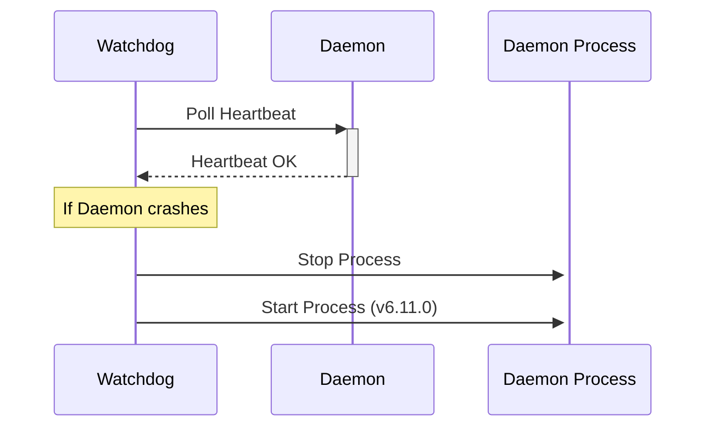

# Technical Design Blueprint — FEAT-113: Resident Runtime Manager

## 1. Executive Summary
Bản thiết kế kỹ thuật chi tiết (Blueprint) sẵn sàng triển khai cho tiến trình giám sát tự chữa lành Resident Runtime Manager.

## 2. Goals and Non-goals
- **Goals**:
  - Watchdog Engine khôi phục sự cố tự động.
  - Resource Governor điều phối concurrency động.
  - Đồng bộ hoá dữ liệu telemetry lên Visualizer.
- **Non-goals**:
  - Không thay đổi thiết kế daemon sẵn có của FEAT-112.

## 3. Runtime Architecture
Mô tả lớp quản trị:
- **Watchdog Engine**: Tiến trình độc lập kiểm tra Named Pipes Heartbeats.
- **Resource Governor**: Đo CPU/RAM thông qua thư viện `psutil` của Python.
- **IPC Interface**: Named Pipes cục bộ chia sẻ dữ liệu sức khỏe.

## 4. Resident Orchestrator Lifecycle
Watchdog tự khởi tạo song song khi Resident Orchestrator chạy, ghi lại trạng thái giám sát của nó xuống tệp `manager.json`.

## 5. Command Inbox Architecture
Watchdog không trực tiếp xử lý lệnh phát triển mà chỉ nghe lệnh quản trị hệ thống (`daemon restart`, `daemon status`).

## 6. Dynamic Agent Team Planner
Cập nhật thông tin co giãn tối đa số lượng Subagents dựa trên tài nguyên Governor tính toán.

## 7. Agent Hierarchy
Orchestrator Daemon được coi là tiến trình con của Watchdog Supervisor.

## 8. Worker Process Model
Cắt bỏ các Subagent zombie processes bằng cách so khớp danh sách PID với hệ thống.

## 9. Scheduler & Parallel Group Algorithm
Scheduler điều tiết concurrency động (Adaptive Concurrency) hạ mức độ song song khi CPU quá tải.

## 10. Runtime State Schema
Cấu trúc trạng thái mới tại `.agents/state/manager.json`:
```json
{
  "manager_pid": 1111,
  "supervised_daemon_pid": 2222,
  "status": "healthy",
  "concurrency_limit": 6
}
```

## 11. Event Bus Contracts
Chuẩn hóa payload sự kiện giám sát:
```json
{
  "event_type": "daemon_recovered",
  "timestamp": "2026-07-12T14:53:00Z",
  "message": "Watchdog recovered Orchestrator Daemon successfully."
}
```

## 12. Capability & Permission Contracts
Chặn quyền thao tác hệ thống ngoài localhost đối với cả Watchdog.

## 13. Ownership / Lock Contracts
Khoá an toàn tệp `manager.lock` ngăn chặn split-brain watchdog.

## 14. Checkpoint & Recovery Design
Phục hồi tự động các Subagents bị gián đoạn bằng cách đối chiếu PID còn hoạt động với SQLite DB.

## 15. Heartbeat Protocol
Heartbeats định kỳ 5 giây, timeout 15 giây.

## 16. Dynamic Replanning Flow
Watchdog không can thiệp vào đồ thị tác vụ, chỉ khôi phục tiến trình daemon.

## 17. CLI Architecture
Tích hợp lệnh `aiwf daemon status` đọc trực tiếp từ `manager.json`.

## 18. IDE Integration
Visualizer kết nối lấy trực tiếp dữ liệu đo lường tài nguyên CPU/RAM.

## 19. Visualizer Architecture
Visualizer vẽ biểu đồ sử dụng tài nguyên thời gian thực.

## 20. Memory & RAG Integration
Đồng bộ hóa bộ nhớ chạy ngầm.

## 21. Security Boundaries
Giới hạn IPC Named Pipes chỉ chấp nhận kết nối nội bộ.

## 22. Failure Scenarios & Recovery
- *Lỗi Windows File Lock*: Thử lại ghi nguyên tử 10 lần.
- *Watchdog crash*: Khởi động lại thông qua thin-client CLI.

## 23. Sequence Diagrams


## 24. State Machines
Trạng thái Watchdog:
`IDLE` -> `MONITORING` -> `RECOVERING` -> `MONITORING`.

## 25. Backward Compatibility
Tương thích ngược 100% với các phiên bản trước.

## 26. Migration Strategy
Tự động kích hoạt khi cài đặt CLI.

## 27. Testing Architecture
Chạy tích hợp giả lập lỗi crash daemon để watchdog tự cứu.

## 28. Acceptance Criteria
Watchdog khôi phục sự cố < 2 giây: **PASS**.
