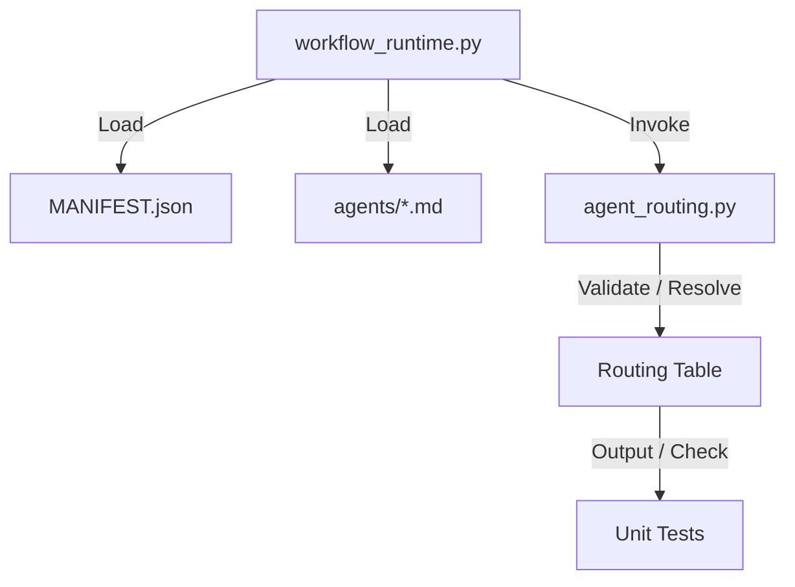

# Technical Design Blueprint – Automatic Agent Routing System (QUICK-009)

This design blueprint details the schema updates, code integration, and validation logic for implementing the Automatic Agent Routing System.

## 1. System Architecture



## 2. Proposed Changes

### A. Extended `MANIFEST.json` Schema
Each skill item in the `skills` array of `MANIFEST.json` will be extended with:
- `owner_agent`: Name of the owner (string).
- `specialist_agents`: Array of specialist agent names (list of strings).
- `phase`: Phase string.
- `execution_mode`: Execution mode string.

### B. Agent YAML Frontmatter Structure
Every agent file in the `agents/` directory (e.g., `planner.md`) will receive a YAML frontmatter block containing:
```yaml
---
name: planner
role: Convert Brainstorming requirements into plans
responsibilities: Write plans, analyze impact
artifact_ownership: docs/plans/
allowed_reads: [docs/brainstorming/, docs/issues/, docs/quick/, Project Memory, RAG Indexes]
allowed_writes: [docs/plans/]
forbidden_actions: [Modifying source code, finalizing releases]
input_contract: Brainstorming requirements
output_contract: Implementation plan docs/plans/FEAT-XXX_*.md
handoff_target: architect
done_criteria: Plan covers scope and matches template
agent_category: planning
supported_phases: [planning]
supported_skills: [brainstorming-to-plan]
can_run_parallel: false
can_analyze_only: true
can_modify_source: false
produces_canonical_artifact: true
---
```

### C. New Module: `agent_routing.py`
Located at `skills/workflow-runtime/scripts/agent_routing.py`:
- `load_agents(agents_dir: str) -> dict`: Reads and parses YAML frontmatter of all agent files.
- `load_routing_table(manifest_path: str) -> dict`: Reads skills and returns routing dictionary.
- `validate_routing(manifest_path: str, agents_dir: str) -> list`: Audits the routing graph for errors:
  - Fails if a skill has no owner.
  - Fails if an owner/specialist does not exist.
  - Fails if there are orphaned agents (agents not linked to any skill).
  - Fails if cyclic handoff routing exists.

### D. Central CLI updates in `workflow_runtime.py`
Add a new parser subcommand: `routing`:
- `workflow_runtime.py routing list` (Prints a pretty Markdown table representing the resolved routing table).
- `workflow_runtime.py routing validate` (Runs validation, exits with 0 on success, 1 on failure).

### E. Automated Tests
- Wrote new test file `skills/workflow-runtime/tests/test_routing.py` validating all requirements in Step 11.

## 3. Verification Plan

### Automated Tests
- `python3 -m unittest skills/workflow-runtime/tests/test_routing.py`

### Manual Verification
- Run `python3 skills/workflow-runtime/scripts/workflow_runtime.py routing list` to see the routing table.
- Run `python3 skills/workflow-runtime/scripts/workflow_runtime.py routing validate` to verify it passes.
