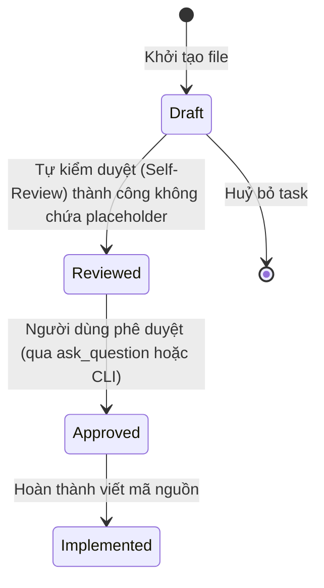

<!-- File path: docs/designs/QUICK-012_redesign_blueprint_generation_skill_blueprint.md -->
---
artifact_type: blueprint
feature_id: QUICK-012
workflow: quick-feature
status: draft
---
# Technical Design Blueprint – Redesign the Blueprint Generation Skill

Tài liệu này đóng vai trò là Hợp đồng Triển khai (Implementation Contract) chính thức cho nhiệm vụ nâng cấp kỹ năng tạo Blueprint (Blueprint Generation Skill) trong AI Workflow Framework.

## 1. Proposed Code Changes

Tất cả các thay đổi tập trung vào việc cập nhật tài liệu hướng dẫn kỹ năng (SKILL.md) và tài liệu quy tắc chung (AI_RULES.md). Không thay đổi logic chạy của runtime engine.

### [MODIFY] [skills/plan-to-blueprint/SKILL.md](file:///Volumes/Kyle/AgentsProject/skills/plan-to-blueprint/SKILL.md)
- **Mục đích**: Thay đổi template thiết kế Blueprint của các tính năng chuẩn (standard features) tại Step 5.
- **Thay đổi chi tiết**: Thay thế template cũ tại dòng 110-175 bằng template mới có cấu trúc "Hợp đồng Triển khai" cực kỳ chặt chẽ bao gồm:
  - `## 0. Baseline Context & References` (Memory documents read, RAG query summaries, source code baseline).
  - `## 1. File-by-File Analysis & Proposed Mutations` (Bảng thống kê toàn bộ file bị ảnh hưởng với các cột: Đường dẫn, Thao tác, Trách nhiệm, Sự phụ thuộc, Tác động/Rủi ro). Không cho phép dùng "update related files".
  - `## 2. Target Folder Structure` (Cây thư mục đầy đủ của hệ thống sau khi triển khai, không dùng placeholders hoặc `...`).
  - `## 3. Interface Contracts (Public & Internal)` (Đặc tả CLI, REST, RPC, database schemas, JSON/YAML schemas, internal component interfaces với input/output và dependencies).
  - `## 4. Algorithms & Logic Specifications` (Mô tả thuật toán không phổ biến, pseudo-code cụ thể, cơ chế xử lý lỗi/retry).
  - `## 5. State Machine & Transitions` (Nếu có thay đổi trạng thái, mô tả rõ: states, transitions, resume, rollback, failure, timeout).
  - `## 6. Validation and Safety Constraints` (Tất cả quy tắc kiểm tra tính hợp lệ dữ liệu và điều kiện bảo mật/phân quyền).
  - `## 7. Implementation Checklist` (Checklist công việc có thể kiểm chứng khách quan).
  - `## 8. Acceptance Criteria & Test Mapping` (Bảng ánh xạ các yêu cầu với ca kiểm thử tương ứng).

### [MODIFY] [skills/quick-feature/SKILL.md](file:///Volumes/Kyle/AgentsProject/skills/quick-feature/SKILL.md)
- **Mục đích**: Thay đổi template thiết kế Blueprint của tính năng nhanh tại Step 7.
- **Thay đổi chi tiết**: Thay thế template cũ tại dòng 200-215 bằng template mới tuân thủ cấu trúc "Hợp đồng Triển khai", đảm bảo các tính năng nhanh cũng được thiết kế chi tiết (liệt kê toàn bộ file, API contracts, schema và checklist kiểm thử chi tiết).

### [MODIFY] [skills/quick-fix/SKILL.md](file:///Volumes/Kyle/AgentsProject/skills/quick-fix/SKILL.md)
- **Mục đích**: Thay đổi template thiết kế Blueprint của sửa lỗi nhanh tại Step 7.
- **Thay đổi chi tiết**: Thay thế template cũ tại phần định nghĩa Blueprint bằng template mới tuân thủ cấu trúc "Hợp đồng Triển khai" tương tự như `quick-feature`.

### [MODIFY] [AI_RULES.md](file:///Volumes/Kyle/AgentsProject/AI_RULES.md)
- **Mục đích**: Cập nhật Section 10 (Workflow Phase Separation Policy) và Section 13 (Blueprint Mandatory Execution Policy) để củng cố quy tắc chất lượng Blueprint.
- **Thay đổi chi tiết**:
  - Tại Section 10: Quy định rõ Blueprint là Hợp đồng Triển khai, cấm sử dụng các cụm từ như "update related files", "...", "etc.", "TBD", hay các placeholder khác.
  - Tại Section 13: Bổ sung quy tắc rà soát chất lượng Blueprint (Blueprint Quality Gate) bắt buộc phải kiểm tra sự tồn tại của bảng phân tích file-by-file và checklist trước khi đánh giá trạng thái `approved`.

---

## 2. Target Folder Structure

Cây thư mục của framework sau khi triển khai (không thay đổi cấu trúc thư mục, chỉ cập nhật nội dung file):
```text
.
├── AGENTS.md
├── AI_RULES.md
├── CHANGELOG.md
├── INSTALL.md
├── LICENSE
├── MANIFEST.json
├── Makefile
├── README.md
├── SKILLS.md
├── USAGE.md
├── agents
├── bootstrap.sh
├── docs
│   ├── designs
│   │   ├── QUICK-012_redesign_blueprint_generation_skill_blueprint.md
│   │   └── (các blueprints khác)
│   ├── quick
│   │   ├── QUICK-012_redesign_blueprint_generation_skill.md
│   │   └── (các specs khác)
│   └── (các thư mục docs khác)
├── install.sh
├── runtime
├── skills
│   ├── plan-to-blueprint
│   │   └── SKILL.md
│   ├── quick-feature
│   │   └── SKILL.md
│   ├── quick-fix
│   │   └── SKILL.md
│   └── (các skills khác)
├── task.md
├── templates
├── tools
└── update.sh
```

---

## 3. Interface Contracts (Public & Internal)

### Public Template Contracts
Blueprint mới tạo ra phải tuân theo cấu trúc JSON/Markdown schema cụ thể:
- Metadata YAML Header:
```yaml
feature_id: [ID]
feature_name: [Tên tính năng]
status: reviewed
stage: blueprint
created_at: [YYYY-MM-DD]
updated_at: [YYYY-MM-DD]
previous_artifact: [Đường dẫn tới Spec hoặc Plan]
next_artifact: [Đường dẫn tới mã nguồn triển khai]
```

- Bảng Phân Tích File-by-File (File-by-File Analysis Table):
| File Path | Operation | Responsibility | Dependency | Impact & Risk |
| :--- | :--- | :--- | :--- | :--- |
| `absolute/path/to/file` | `NEW / MODIFY / DELETE / RENAME` | `Trách nhiệm cụ thể của file` | `Sự phụ thuộc vào component khác` | `Rủi ro và tác động khi thay đổi` |

---

## 4. Algorithms & Logic Specifications

### Quy trình tự kiểm tra chất lượng Blueprint (Blueprint Self-Review Algorithm)
Trước khi lưu file Blueprint, AI Agent phải thực hiện thuật toán tự kiểm duyệt logic:
1. Đọc nội dung file Blueprint đã tạo.
2. Kiểm tra xem có sự hiện diện của các chuỗi ký tự sau hay không: `...`, `etc.`, `TBD`, `to be decided`, `update related files`, `modify existing logic`, `maybe`, `likely`, `should`, `could`, `might`.
3. Nếu phát hiện bất kỳ chuỗi ký tự nào trong danh sách trên:
   - Đánh dấu trạng thái Blueprint là `draft` (không được chuyển sang `reviewed`).
   - Bắt buộc phải viết lại phần chứa ký tự đó để cung cấp quyết định thiết kế chính xác.
4. Kiểm tra xem tất cả các file bị sửa đổi được đề cập trong Blueprint có tồn tại đường dẫn tuyệt đối hoặc relative chuẩn hay không.
5. Nếu thỏa mãn tất cả tiêu chí:
   - Cập nhật status thành `reviewed` (hoặc `ready_for_approval`).

---

## 5. State Machine & Transitions

Quá trình chuyển đổi trạng thái của tài liệu Blueprint:


---

## 6. Validation and Safety Constraints

- **Cấm ghi đè bừa bãi**: Khi cập nhật `SKILL.md`, phải giữ nguyên phần frontmatter metadata ở đầu file (như name, version, author, license, category) và chỉ sửa đổi phần nội dung Markdown hướng dẫn phía dưới.
- **Đường dẫn tương đối**: Mọi link liên kết trong Blueprint phải sử dụng đường dẫn tương đối để tránh rò rỉ thông tin hệ thống của người dùng.

---

## 7. Implementation Checklist

- [ ] Cập nhật file `skills/plan-to-blueprint/SKILL.md` (Thay đổi Step 5 template).
- [ ] Cập nhật file `skills/quick-feature/SKILL.md` (Thay đổi Step 7 template).
- [ ] Cập nhật file `skills/quick-fix/SKILL.md` (Thay đổi Step 7 template).
- [ ] Cập nhật file `AI_RULES.md` (Củng cố Section 10 & Section 13).
- [ ] Chạy `./update.sh --force` để đồng bộ các skill từ root vào thư mục `.agents/skills`.
- [ ] Xác minh trạng thái của các file `.agents/skills/...` đã được cập nhật chính xác.

---

## 8. Acceptance Criteria & Test Mapping

| Yêu cầu kiểm nghiệm | Kết quả mong đợi | Phương pháp xác minh | Ca kiểm thử ánh xạ |
| :--- | :--- | :--- | :--- |
| Cập nhật SKILL.md trong `plan-to-blueprint` | Bản mẫu thiết kế Blueprint mới hiển thị đầy đủ 10 mục chi tiết không placeholder | Xem nội dung file | Kiểm tra thủ công bằng mắt |
| Đồng bộ sang thư mục `.agents` | File `.agents/skills/plan-to-blueprint/SKILL.md` khớp hoàn toàn với file ở root | Chạy lệnh `diff` giữa hai file | Chạy lệnh: `diff skills/plan-to-blueprint/SKILL.md .agents/skills/plan-to-blueprint/SKILL.md` |
| Cập nhật `AI_RULES.md` | Chứa quy định cấm placeholder và bắt buộc phân tích file-by-file chi tiết | Xem nội dung file | Kiểm tra thủ công bằng mắt |
