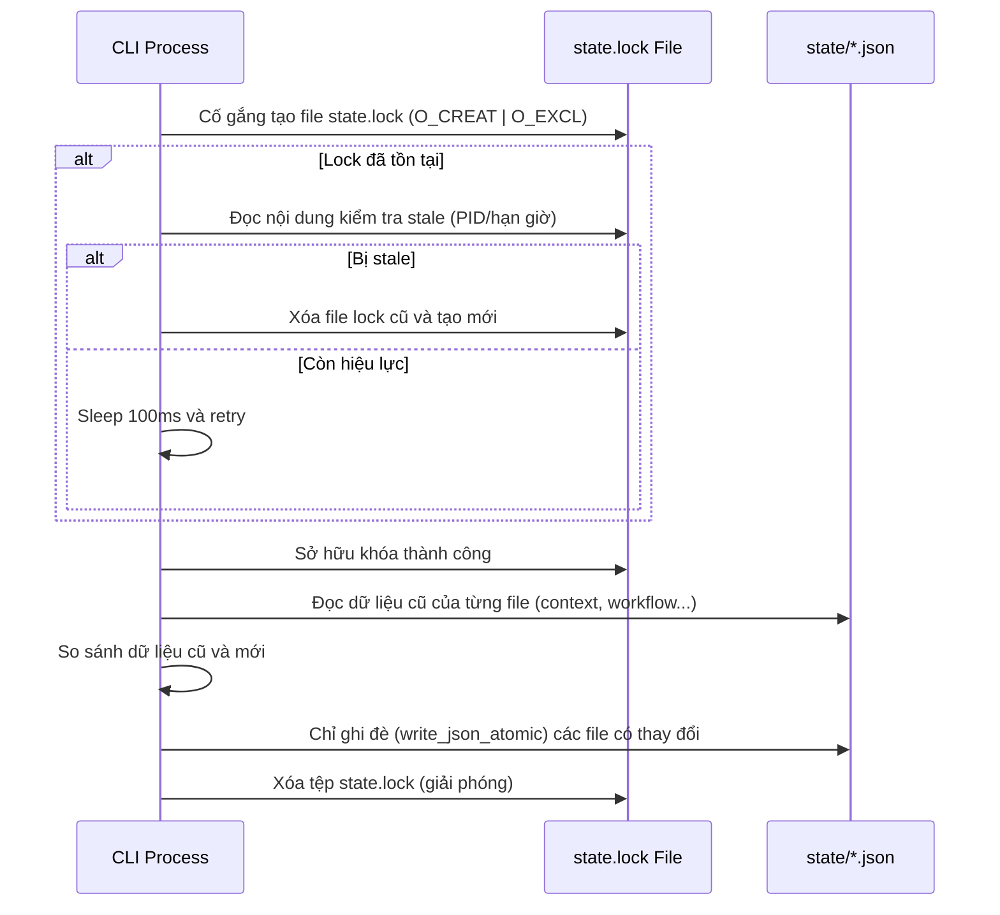

<!-- File path: docs/designs/QUICK-029_granular_state_backup_and_lock_protection_blueprint.md -->
---
artifact_type: quick-feature-blueprint
feature_id: QUICK-029
workflow: quick-feature
status: pending
---
# Technical Design Blueprint – Granular State Backup-Restore & Lock-Protected Writes

Bản thiết kế này quy định chi tiết giải pháp kỹ thuật sửa đổi cơ chế lưu/khôi phục trạng thái và đồng bộ hóa loại trừ lẫn nhau giữa các tiến trình.

---

## 1. Class & Module Design

### 1.1. Lớp `StateFileLock` (trong `state_sync.py`)
Lớp này đóng vai trò context manager để thực hiện khóa vật lý bằng tệp tin `.agents/state/state.lock`.

```python
class StateFileLock:
    def __init__(self, workspace_root: str, timeout: float = 10.0, expire_seconds: float = 10.0):
        self.workspace_root = workspace_root
        self.lock_file = os.path.join(workspace_root, ".agents", "state", "state.lock")
        self.timeout = timeout
        self.expire_seconds = expire_seconds
        self.is_locked = False

    def acquire(self) -> bool:
        # Sử dụng os.open với flags os.O_CREAT | os.O_EXCL | os.O_WRONLY để tạo file lock nguyên tử.
        # Chờ (busy wait với sleep 50-100ms) đến khi hết timeout.
        # Kiểm tra stale lock: Nếu PID trong file đã chết hoặc quá hạn expire_seconds, tự động xóa file lock cũ để thu hồi.

    def release(self) -> None:
        # Xóa tệp state.lock một cách an toàn.
```

### 1.2. Cơ chế Granular State Deconstruction & Detection
Cải tiến `deconstruct_state` trong [state_sync.py](file:///Volumes/Kyle/AgentsProject/skills/workflow-runtime/scripts/state_sync.py):
*   Thay vì luôn luôn ghi đè cả 6 tệp, ta đọc nội dung hiện tại trên đĩa của từng tệp lên.
*   So sánh dict mới với dict cũ.
*   Chỉ gọi `write_json_atomic` đối với các tệp thực sự có dữ liệu thay đổi.
*   Sử dụng `StateFileLock` bọc toàn bộ khối xử lý của `deconstruct_state` và `aggregate_state`.

---

## 2. Detailed Technical Flow

### 2.1. Quy trình ghi rã trạng thái (Write Flow)


### 2.2. Quy trình snapshot và khôi phục (Backup/Restore Flow)
*   **Granular Snapshot**: Khi chạy lệnh snapshot, ghi nhận trạng thái checksum của từng tệp.
*   **Granular Restore**: Khi khôi phục, chỉ khôi phục các tệp tin có checksum khác biệt hoặc bị thiếu, tránh ghi đè mù quáng những tệp tin đang được cập nhật độc lập bởi các tiến trình khác.

---

## 3. Implementation Plan & Modified Files

### 3.1. [state_sync.py](file:///Volumes/Kyle/AgentsProject/skills/workflow-runtime/scripts/state_sync.py)
*   Implement lớp `StateFileLock`.
*   Bọc `StateFileLock` vào `deconstruct_state` và `aggregate_state`.
*   Sửa `deconstruct_state` để so sánh dict trước khi ghi.

### 3.2. [workflow_runtime.py](file:///Volumes/Kyle/AgentsProject/skills/workflow-runtime/scripts/workflow_runtime.py)
*   Cập nhật subaction `recover` để đọc và khôi phục granular.
*   Cập nhật subaction `snapshot` để lưu trữ granular.

---

## 4. Verification Plan
*   **Unit Tests**: Tạo unit test song song trong `tests/test_runtime_stress.py` giả lập việc ghi đè đồng thời nhiều tiến trình và xác nhận không có dữ liệu bị corrupted.
