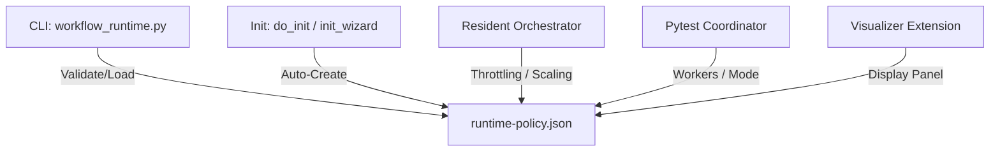

# Technical Blueprint: Centralized Runtime Policy Configuration

This document specifies the architecture, data schema, and system integration patterns for the centralized AIWF Runtime Policy Configuration.

## 1. Schema Definition
The policy resides in `.agents/config/runtime-policy.json` and adheres to the following structure:

```json
{
  "resource_limits": {
    "max_subagents": 4,
    "max_concurrency": 2,
    "max_spawn_per_minute": 4,
    "max_pending_spawns": 5,
    "max_parallel_pytest_processes": 1,
    "max_pytest_workers": 1,
    "cpu_warning_percent": 70,
    "cpu_throttle_percent": 80,
    "memory_warning_percent": 70,
    "memory_throttle_percent": 80,
    "memory_circuit_breaker_percent": 90
  },
  "scheduler": {
    "adaptive_concurrency": true,
    "pause_on_high_cpu": true,
    "pause_on_high_memory": true
  },
  "pytest": {
    "default_mode": "affected",
    "run_full_suite_only_at_final_review": true,
    "deduplicate_requests": true
  }
}
```

## 2. Integration Architecture



### Components Interaction
1. **Scaffold & Initialization (`init`)**:
   - If the file exists: validate schema. If invalid, halt startup.
   - If absent: write the default JSON configuration, validate it, and continue startup.
2. **Resident Orchestrator Scheduling (`hierarchical_runtime.py`)**:
   - Compares active performance metrics against warn/throttle/circuit-breaker values.
   - Restricts subagent spawns using `max_subagents` and rate-limits via `max_spawn_per_minute`.
   - Adheres to `max_concurrency` and trims it in half dynamically when `adaptive_concurrency` is enabled and CPU/Memory warning thresholds are crossed.
3. **Pytest Coordinator (`workflow_runtime.py`)**:
   - Limits workers using `max_pytest_workers`.
   - Blocks full test suites outside of verification/final review phases if `run_full_suite_only_at_final_review` is enabled.
   - Supports coalescing and deduplicating parallel runs if `deduplicate_requests` is enabled.

## 3. CLI Command Specifications
- `aiwf runtime policy`: Displays the current policy configuration as JSON.
- `aiwf runtime policy validate`: Validates the file schema against data types and required keys.
- `aiwf runtime policy reset`: Resets the config file to the default state.
