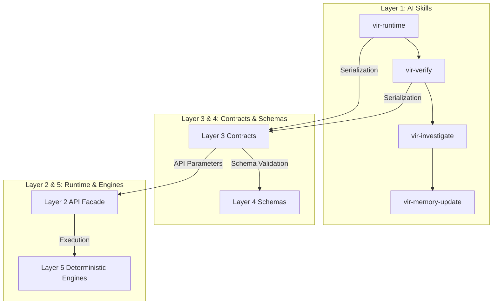

<!-- File path: docs/designs/vir_platform_architecture_blueprint.md -->

# Visual Intelligence Runtime (VIR) — Contract & Schema Platforms Blueprint

This document specifies the target architecture for Layer 3 (Contract Platform) and Layer 4 (Schema Platform) to enable standard, decoupled communication boundaries.

---

## 1. PART 1 — Contract Platform Architecture (Layer 3)

The Contract Platform manages API signatures and metadata structures versioning.

### Core Mechanics
- **Contract Hierarchy**: Base API Contract -> Subsystem Contracts -> Domain Data Structures.
- **Contract Inheritance**: Subsystem contracts inherit generic fields (like `timestamp`, `session_id`, `version`) from the Base API.
- **Versioning Strategy**: Semantic versioning (`major.minor.patch`). Minor updates are backward-compatible; major changes necessitate new contract files (e.g. `evidence_contract_v2.json`).
- **Validation**: Enforced at execution boundaries using standard validators. If mismatch occurs, it raises a structured `ContractMismatchError`.
- **Registry & Discovery**: Contract schemas are registered dynamically at startup inside `ContractRegistry` by parsing metadata directories.

---

## 2. PART 2 — Machine Schema Platform (Layer 4)

Schemas act as the machine language for state verification exchange.

- **Schema Hierarchy**: Base JSON Schema -> Module validation rules -> Field configurations.
- **Evolution & Compatibility**: Checked dynamically using a `SchemaDiff` utility. Upward migrations require schema mapping scripts if mandatory fields are introduced.
- **Runtime Loading**: Schemas are loaded into RAM caching registries at initialization.

---

## 3. PART 3 — Relationship Matrix

| Layer 1 Skill | Layer 2 Runtime API | Layer 3 Contract | Layer 4 Schema | Layer 5 Implementation |
| :--- | :--- | :--- | :--- | :--- |
| `vir-runtime` | `vir.runtime.sandbox.start_server()` | `RuntimeRequest` | `config_schema` | `SandboxOrchestrator` |
| `vir-verify` | `vir.runtime.vision.compare_pixels()` | `VisualFinding` | `observation_schema` | `PixelComparer` |
| `vir-investigate` | `vir.runtime.evidence.query()` | `Evidence`, `Contradiction` | `evidence_schema` | `RCAEngine` |
| `vir-memory-update` | `vir.runtime.memory.promote()` | `DigitalTwin` | `evidence_schema` | `BaselineManager` |

---

## 4. PART 4 — Contract Inventory

We define the primary versioned contracts mapping the API boundaries:

1. **RuntimeRequest (v1.0.0)**:
   - *Producer*: AIWF CLI Runner / active Skills.
   - *Consumer*: Sandbox Orchestrator.
   - *Required Schema*: `config_schema`.
2. **RuntimeResult (v1.0.0)**:
   - *Producer*: Sandbox Orchestrator.
   - *Consumer*: Quality gates validators.
3. **Observation (v1.0.0)**:
   - *Producer*: Sensory vision/hearing inspectors.
   - *Consumer*: DigitalTwinManager.
   - *Required Schema*: `observation_schema`.
4. **Evidence (v1.0.0)**:
   - *Producer*: Vision engines and observers.
   - *Consumer*: Evidence database engines.
   - *Required Schema*: `evidence_schema`.
5. **Contradiction (v1.0.0)**:
   - *Producer*: ConsistencyValidator.
   - *Consumer*: RCAEngine.
6. **Investigation (v1.0.0)**:
   - *Producer*: Core thinking pipeline orchestrators.
   - *Consumer*: Report publishers.

---

## 5. PART 5 — Schema Inventory

1. **Observation Schema**:
   - *Owner*: Vision & hearing sensory layers.
   - *Required Fields*: `element_selector`, `viewport_width`, `bounding_box`, `timestamp`.
2. **Evidence Schema**:
   - *Owner*: EvidenceEngine.
   - *Required Fields*: `evidence_id`, `source_agent`, `classification`, `payload`.
3. **Quality Gate Schema**:
   - *Owner*: QualityGateEvaluator.
   - *Required Fields*: `thresholds`, `verdict`, `reasons`.
4. **Runtime Configuration Schema**:
   - *Owner*: SandboxOrchestrator.
   - *Required Fields*: `build_command`, `dev_command`, `startup_timeout`.

---

## 6. PART 6 — Cross-Layer Dependency Graph

No cyclic dependencies are allowed across boundaries:

---

## 7. Master Index & Implementation Ordering

| Component Name | Type | Dependencies | Implementation Order |
| :--- | :---: | :--- | :---: |
| **Contract Platform Core** | Engine | None | 1 |
| **Schema Platform Core** | Engine | Contract Platform Core | 2 |
| **RuntimeRequest / Result** | Contract | Contract Core | 3 |
| **Evidence / Observation** | Contract | Contract Core | 4 |
| **Observation Schema** | Schema | Schema Core | 5 |
| **Evidence Schema** | Schema | Schema Core | 6 |
| **QualityGate / Report** | Contract | Contract Core | 7 |
