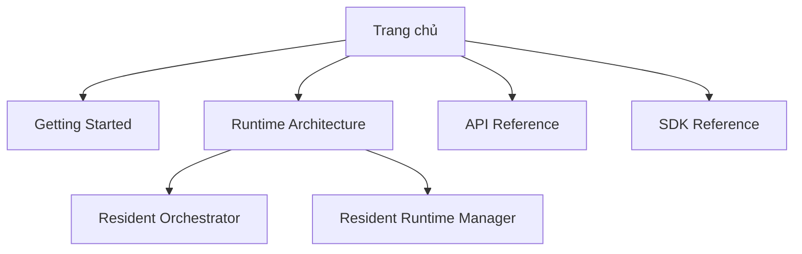

# Documentation Navigation Map

Bản đồ cấu trúc điều hướng cho trang tài liệu tương tác v2.

Hệ thống điều hướng tích hợp Breadcrumbs ở phía trên đầu trang và các liên kết Previous/Next ở chân trang để tạo luồng đọc mượt mà.
