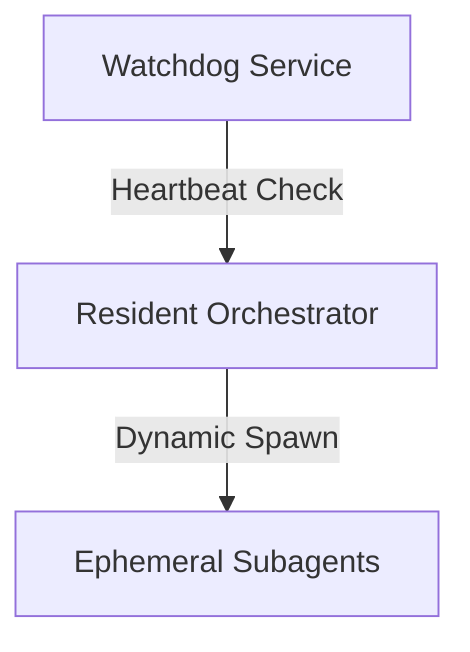

# AIWF Runtime Platform v1 Overview

Tổng quan kiến trúc nền tảng Runtime Platform v1.

## 1. Mô hình phân lớp kiến trúc
Nền tảng vận hành qua 3 lớp:
1. **Lớp Quản Trị (Runtime Manager)**: Watchdog Supervisor đảm bảo tính liên tục của hệ thống, tự động phục hồi lỗi.
2. **Lớp Điều Phối (Resident Orchestrator)**: Daemon quản lý Task DAG và Named Pipes.
3. **Lớp Thực Thi (Subagents)**: Các workers thực hiện công việc cụ thể.

## 2. Luồng giao tiếp hệ thống

