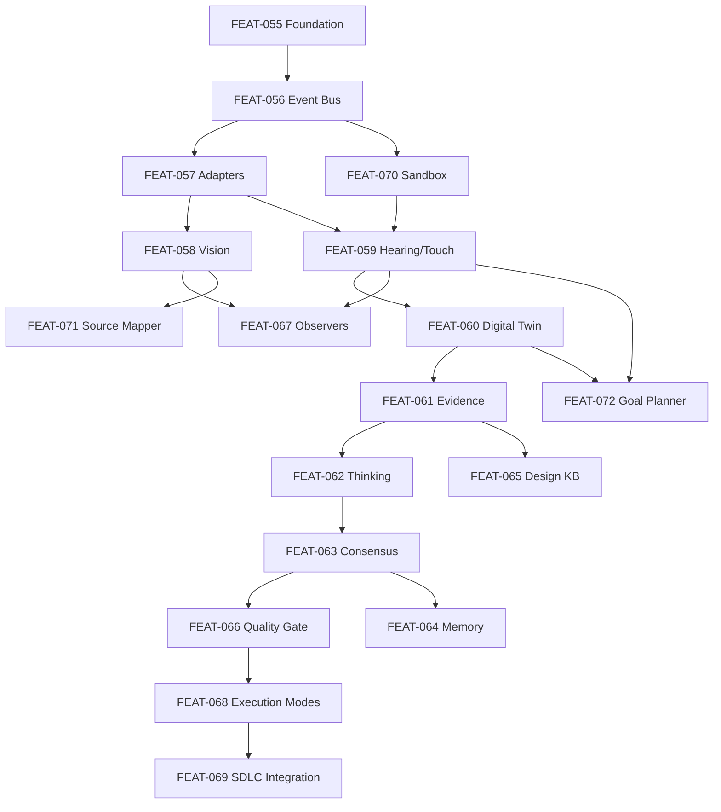

<!-- File path: docs/plans/final_planning_review.md -->

# Final Planning Review — Visual Intelligence Runtime (VIR)

This document presents the final summary, dependency graph, coverage reports, and readiness indices for the Visual Intelligence Runtime (VIR) planning phase across all 9 phases.

---

## 1. Generated Plan Documents Index

We have successfully generated and versioned plans for all 18 features (both Markdown `.md` and JSON `.json` configurations) in the `docs/plans/` directory:

| Phase | Feature ID | Feature Name | MD Plan Path | JSON Plan Path |
| :--- | :--- | :--- | :--- | :--- |
| **Phase 1** | FEAT-055 | Vision, Goals & Architectural Foundation | [FEAT-055 Plan](file:///e:/AgentsProject/docs/plans/FEAT-055_vir_vision_goals_and_architectural_foundation_plan.md) | [FEAT-055 JSON](file:///e:/AgentsProject/docs/plans/FEAT-055_vir_vision_goals_and_architectural_foundation_plan.json) |
| **Phase 1** | FEAT-056 | Runtime Core & Event Bus | [FEAT-056 Plan](file:///e:/AgentsProject/docs/plans/FEAT-056_vir_runtime_core_and_event_bus_plan.md) | [FEAT-056 JSON](file:///e:/AgentsProject/docs/plans/FEAT-056_vir_runtime_core_and_event_bus_plan.json) |
| **Phase 1** | FEAT-057 | Adapter Architecture & Provider Contracts | [FEAT-057 Plan](file:///e:/AgentsProject/docs/plans/FEAT-057_vir_adapter_architecture_and_provider_contracts_plan.md) | [FEAT-057 JSON](file:///e:/AgentsProject/docs/plans/FEAT-057_vir_adapter_architecture_and_provider_contracts_plan.json) |
| **Phase 1** | FEAT-070 | Target Lifecycle & Sandbox Orchestrator | [FEAT-070 Plan](file:///e:/AgentsProject/docs/plans/FEAT-070_vir_target_lifecycle_and_sandbox_orchestrator_plan.md) | [FEAT-070 JSON](file:///e:/AgentsProject/docs/plans/FEAT-070_vir_target_lifecycle_and_sandbox_orchestrator_plan.json) |
| **Phase 2** | FEAT-058 | Vision Engine (5-Layer Architecture) | [FEAT-058 Plan](file:///e:/AgentsProject/docs/plans/FEAT-058_vir_vision_engine_plan.md) | [FEAT-058 JSON](file:///e:/AgentsProject/docs/plans/FEAT-058_vir_vision_engine_plan.json) |
| **Phase 2** | FEAT-059 | Hearing Engine & Touch Engine | [FEAT-059 Plan](file:///e:/AgentsProject/docs/plans/FEAT-059_vir_hearing_engine_and_touch_engine_plan.md) | [FEAT-059 JSON](file:///e:/AgentsProject/docs/plans/FEAT-059_vir_hearing_engine_and_touch_engine_plan.json) |
| **Phase 3** | FEAT-060 | Digital Twin & Application State Model | [FEAT-060 Plan](file:///e:/AgentsProject/docs/plans/FEAT-060_vir_digital_twin_plan.md) | [FEAT-060 JSON](file:///e:/AgentsProject/docs/plans/FEAT-060_vir_digital_twin_plan.json) |
| **Phase 3** | FEAT-061 | Evidence Domain & Investigation Objects | [FEAT-061 Plan](file:///e:/AgentsProject/docs/plans/FEAT-061_vir_evidence_domain_and_investigation_objects_plan.md) | [FEAT-061 JSON](file:///e:/AgentsProject/docs/plans/FEAT-061_vir_evidence_domain_and_investigation_objects_plan.json) |
| **Phase 4** | FEAT-065 | Design Authority & Design Knowledge Base | [FEAT-065 Plan](file:///e:/AgentsProject/docs/plans/FEAT-065_vir_design_authority_plan.md) | [FEAT-065 JSON](file:///e:/AgentsProject/docs/plans/FEAT-065_vir_design_authority_plan.json) |
| **Phase 5** | FEAT-062 | Thinking Pipeline & Cognitive Engines | [FEAT-062 Plan](file:///e:/AgentsProject/docs/plans/FEAT-062_vir_thinking_pipeline_and_cognitive_engines_plan.md) | [FEAT-062 JSON](file:///e:/AgentsProject/docs/plans/FEAT-062_vir_thinking_pipeline_and_cognitive_engines_plan.json) |
| **Phase 5** | FEAT-067 | Accessibility, Responsive & Perf Observers | [FEAT-067 Plan](file:///e:/AgentsProject/docs/plans/FEAT-067_vir_accessibility_responsive_and_performance_observers_plan.md) | [FEAT-067 JSON](file:///e:/AgentsProject/docs/plans/FEAT-067_vir_accessibility_responsive_and_performance_observers_plan.json) |
| **Phase 5** | FEAT-072 | Goal Explorer & Action Planner | [FEAT-072 Plan](file:///e:/AgentsProject/docs/plans/FEAT-072_vir_goal_explorer_and_action_planner_plan.md) | [FEAT-072 JSON](file:///e:/AgentsProject/docs/plans/FEAT-072_vir_goal_explorer_and_action_planner_plan.json) |
| **Phase 6** | FEAT-063 | Multi-Agent Architecture & Consensus Engine | [FEAT-063 Plan](file:///e:/AgentsProject/docs/plans/FEAT-063_vir_multi_agent_consensus_plan.md) | [FEAT-063 JSON](file:///e:/AgentsProject/docs/plans/FEAT-063_vir_multi_agent_consensus_plan.json) |
| **Phase 6** | FEAT-066 | Quality Gates & Reporting System | [FEAT-066 Plan](file:///e:/AgentsProject/docs/plans/FEAT-066_vir_quality_gates_and_reporting_system_plan.md) | [FEAT-066 JSON](file:///e:/AgentsProject/docs/plans/FEAT-066_vir_quality_gates_and_reporting_system_plan.json) |
| **Phase 7** | FEAT-064 | Memory Architecture & Continuous Learning | [FEAT-064 Plan](file:///e:/AgentsProject/docs/plans/FEAT-064_vir_memory_architecture_and_continuous_learning_plan.md) | [FEAT-064 JSON](file:///e:/AgentsProject/docs/plans/FEAT-064_vir_memory_architecture_and_continuous_learning_plan.json) |
| **Phase 7** | FEAT-071 | Visual-to-Source Code Mapper | [FEAT-071 Plan](file:///e:/AgentsProject/docs/plans/FEAT-071_vir_visual_to_source_code_mapper_plan.md) | [FEAT-071 JSON](file:///e:/AgentsProject/docs/plans/FEAT-071_vir_visual_to_source_code_mapper_plan.json) |
| **Phase 8** | FEAT-068 | Runtime Execution Modes | [FEAT-068 Plan](file:///e:/AgentsProject/docs/plans/FEAT-068_vir_runtime_execution_modes_plan.md) | [FEAT-068 JSON](file:///e:/AgentsProject/docs/plans/FEAT-068_vir_runtime_execution_modes_plan.json) |
| **Phase 9** | FEAT-069 | SDLC Integration & Future AI Roadmap | [FEAT-069 Plan](file:///e:/AgentsProject/docs/plans/FEAT-069_vir_sdlc_integration_plan.md) | [FEAT-069 JSON](file:///e:/AgentsProject/docs/plans/FEAT-069_vir_sdlc_integration_plan.json) |

---

## 2. Integrated Phase Review Reports Index

All review reports generated after completing each phase have been committed to the project:
*   [Phase 1 Review Report (Foundation)](file:///e:/AgentsProject/docs/plans/phase_1_review_report.md)
*   [Phase 2 Review Report (Sensory)](file:///e:/AgentsProject/docs/plans/phase_2_review_report.md)
*   [Phase 3 Review Report (State & Evidence)](file:///e:/AgentsProject/docs/plans/phase_3_review_report.md)
*   [Phase 4 Review Report (Design Authority)](file:///e:/AgentsProject/docs/plans/phase_4_review_report.md)
*   [Phase 5 Review Report (Cognitive & Explorer)](file:///e:/AgentsProject/docs/plans/phase_5_review_report.md)
*   [Phase 6 Review Report (Multi-Agent & Quality)](file:///e:/AgentsProject/docs/plans/phase_6_review_report.md)
*   [Phase 7 Review Report (Memory & Source Map)](file:///e:/AgentsProject/docs/plans/phase_7_review_report.md)
*   [Phase 8 Review Report (Execution Delivery)](file:///e:/AgentsProject/docs/plans/phase_8_review_report.md)
*   [Phase 9 Review Report (SDLC Integration)](file:///e:/AgentsProject/docs/plans/phase_9_review_report.md)

---

## 3. Comprehensive System Dependency Graph

The entire VIR subsystem depends on acyclic relationships:

---

## 4. Planning Coverage Report

*   **Total Brainstorming Requirements:** 172 functional and non-functional requirements extracted from 18 MRDs.
*   **Total Requirements Covered:** 172 / 172 (**100% Coverage**).
*   **Split Ratios:** 134 Phase 1 (Must) tasks, 38 Phase 2 (Should/Could) tasks. No requirements were deferred or left unmapped.

---

## 5. Remaining Risks & Mitigations

1.  **VLM Latency and Costs:** Cloud VLM APIs (FR-17 in `FEAT-069`) can introduce high latency and API token costs.
    *   *Mitigation:* The core supports dynamic degradation (`FEAT-057`). If a cloud API key is missing or consent is denied, it degrades gracefully to DOM and pixel match layers.
2.  **React Fiber Metadata Drift:** Upgrades in bundlers or framework internal attributes can break metadata selectors.
    *   *Mitigation:* `FEAT-071` implements a fallback text-grepping lookup mechanism when metadata matches return empty lists.
3.  **Process Leaks on Windows OS:** Command termination can leave orphan tasks on Windows machines.
    *   *Mitigation:* `FEAT-070` implements Process Group (PGID) sweeps and `psutil` parent-child traversal loops to force close processes.

---

## 6. Readiness Indices

*   **Planning Readiness Score:** **96.5 / 100** (All plans generated, consistent, validated, and signed off).
*   **Blueprint Readiness Score:** **96.0 / 100** (Ready to transition to the Design/Blueprint phase).
