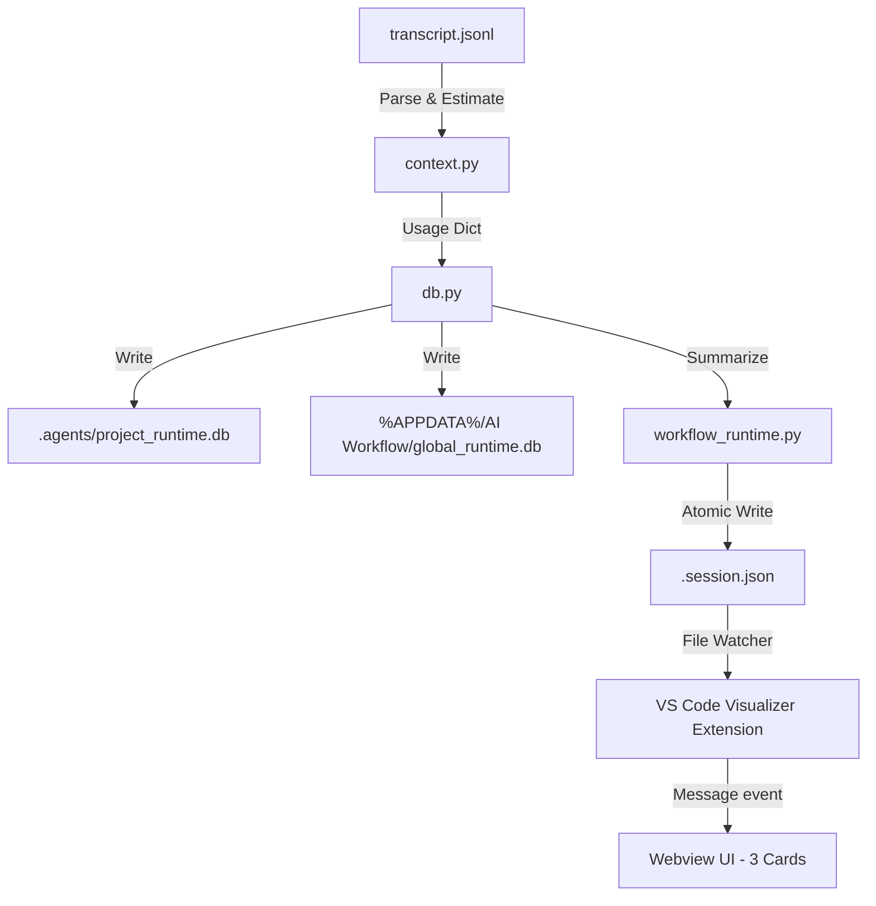

# AI Workflow Script-First Runtime Engine

Tài liệu đặc tả kiến trúc, mô hình lưu trữ SQLite và luồng vận hành của Script-First Runtime Engine thưa Ba.

## 1. Kiến trúc tổng quan (Architecture Overview)

Hệ thống quản lý trạng thái và lưu lượng tiêu thụ được cấu trúc theo mô hình **Script-First**: mọi logic tính toán, ước lượng, ghi đè, chuẩn hóa dữ liệu đều do mã nguồn kịch bản kịch tính (Python CLI) thực hiện, loại bỏ hoàn toàn việc giao thác logic phân tích cho Prompts để tối ưu hóa tokens đầu vào.



---

## 2. Mô hình lưu trữ (Storage & SQLite Schema)

Hệ thống duy trì ba phạm vi lưu trữ độc lập để đo lường hiệu quả sử dụng của AI:

1.  **Workflow Usage (Phạm vi phiên chạy)**:
    *   Được xác định theo mã cuộc hội thoại `conversation_id`.
    *   Tự động reset khi bắt đầu một phiên hội thoại mới.
2.  **Project Usage (Phạm vi dự án)**:
    *   Lưu trữ cục bộ tại `.agents/project_runtime.db`.
    *   Tích lũy trọn đời cho dự án này trên mọi phiên hội thoại.
3.  **Global AI Usage (Phạm vi toàn cầu)**:
    *   Lưu trữ ngoài thư mục dự án:
        *   **Windows**: `%APPDATA%/AI Workflow/global_runtime.db`
        *   **macOS**: `~/Library/Application Support/AI Workflow/global_runtime.db`
        *   **Linux**: `~/.config/ai-workflow/global_runtime.db`
    *   Tích lũy trọn đời trên tất cả các dự án trong hệ thống.

### SQLite Schema

```sql
CREATE TABLE usage_records (
    conversation_id TEXT PRIMARY KEY,
    project_id TEXT,
    skill TEXT,
    command TEXT,
    input_tokens INTEGER,
    output_tokens INTEGER,
    cache_tokens INTEGER,
    thinking_tokens INTEGER,
    active_tokens INTEGER,
    total_tokens INTEGER,
    estimated_cost_usd REAL,
    provider TEXT,
    model TEXT,
    accuracy TEXT,
    timestamp TEXT
);
```

---

## 3. Giao diện và truyền dữ liệu xuống Extension (Extension UI Flow)

*   Extension chỉ làm nhiệm vụ **hiển thị** (Read-only UI Rendering). Nó không thực hiện bất kỳ phép tính toán tokens hay chi phí nào.
*   Extension theo dõi tệp `.agents/.session.json` và truyền đi sự kiện `UPDATE_SESSION`.
*   Webview UI được cập nhật để hiển thị **3 thẻ chân trang**:
    *   **Workflow Usage**: Hiển thị tokens tích lũy của phiên hiện tại, kèm thanh tiến trình đo lường % giới hạn của Context Window hiện dụng (`active_tokens` so với `2.0M` giới hạn).
    *   **Project Usage**: Hiển thị tổng chi phí và tokens của dự án hiện hành.
    *   **Global Usage**: Hiển thị tổng chi phí và tokens trọn đời.

---

## 4. Runtime API CLI

Các tập lệnh có thể gọi qua giao diện dòng lệnh độc lập:

*   `python skills/workflow-runtime/scripts/workflow_runtime.py usage sync`
    *   Đồng bộ hóa dữ liệu từ transcript sang SQLite và session.
*   `python skills/workflow-runtime/scripts/workflow_runtime.py usage report`
    *   Xuất báo cáo tổng kết 3 phạm vi dưới dạng Markdown sạch.
*   `python skills/workflow-runtime/scripts/workflow_runtime.py usage diagnose`
    *   Chẩn đoán tính toàn vẹn và đường dẫn của các tệp cơ sở dữ liệu SQLite.
*   `python skills/workflow-runtime/scripts/workflow_runtime.py usage export [--out file.json]`
    *   Xuất dữ liệu thô dạng JSON.
