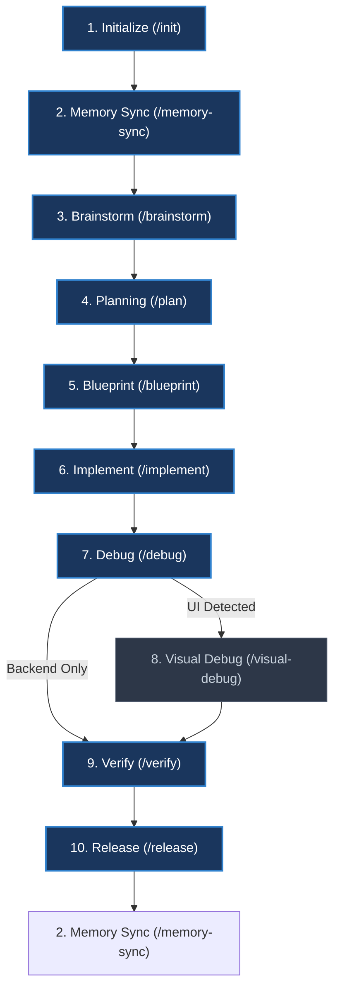

# Bảng tra cứu nhanh các Workflow Skills (AI Skills Cheat Sheet)

Tài liệu này cung cấp bảng tra cứu nhanh và sơ đồ quy trình sử dụng các công cụ (Skills) trong **AI Engineering Workflow Framework** để nhà phát triển dễ dàng quản lý và định hướng AI Agent.

---

## 🗺️ Quy trình SDLC tiêu chuẩn (Standard Workflow Map)

Dưới đây là sơ đồ Mermaid trực quan hóa luồng đi của một tính năng tiêu chuẩn từ lúc khởi tạo đến khi release:

---

## 📊 Bảng tra cứu nhanh Skills (Quick Reference Table)

| Lệnh (Slash) | Tên Skill | Phân loại | Checkpoint | Mục đích chính | Sản phẩm đầu ra (Outputs) |
| :--- | :--- | :--- | :--- | :--- | :--- |
| **`/init`** | `initialize-workflow` | `runtime` | **1** | Thiết lập không gian làm việc, cấu hình Git, RAG và phân quyền (`sandbox`/`full_access`/`unrestricted`). | Khởi tạo `.agents/.session.json` |
| **`/memory-sync`** | `project-memory-update` | `memory` | **2** | Đồng bộ hóa bộ nhớ dự án, phân tích thay đổi mã nguồn và cập nhật lessons learned. | Cập nhật cơ sở dữ liệu vector RAG |
| **`/brainstorm`** | `brainstorming` | `workflow` | **3** | Phân tích yêu cầu, khảo sát kiến trúc dự án và đề xuất giải pháp. | `docs/brainstorming/FEAT-XXX_slug.md` |
| **`/plan`** | `brainstorming-to-plan` | `workflow` | **4** | Chuyển brainstorming thành kế hoạch hành động chi tiết và danh sách công việc. | `docs/plans/FEAT-XXX_slug_plan.md` và `task.md` |
| **`/blueprint`** | `plan-to-blueprint` | `workflow` | **5** | Thiết kế chi tiết kiến trúc, cấu trúc hàm/module và định nghĩa API trước khi viết code. | `docs/designs/FEAT-XXX_slug_blueprint.md` |
| **`/implement`** | `blueprint-to-implementation` | `workflow` | **6** | Thực hiện sinh mã nguồn/chỉnh sửa file logic dựa trên bản thiết kế đã duyệt. | Mã nguồn dự án được cập nhật |
| **`/debug`** | `implementation-to-debug` | `workflow` | **7** | Biên dịch dự án, chạy linter, tự động sửa lỗi và chạy unit tests. | `docs/debug/FEAT-XXX_debug.md` |
| **`/visual-debug`**| `frontend-visual-debug` | `workflow` | **8** | Chạy kiểm thử giao diện trực quan (Visual QA) cho các thành phần UI. | Visual test report |
| **`/verify`** | `debug-to-verify` | `workflow` | **9** | Đánh giá sự tuân thủ blueprint, chạy kiểm tra tổng thể và phê duyệt chất lượng release. | `docs/verification/FEAT-XXX_verify.md` |
| **`/release`** | `implementation-to-release` | `workflow` | **10** | Đóng gói phiên bản, cập nhật changelog, push code và tag Git. | GitLab (Dự án chính) & GitHub (`public_export`) |
| **`/resume`** | `resume-workflow` | `runtime` | *N/A* | Khôi phục lại trạng thái phiên làm việc bị treo hoặc đứt quãng từ `.session.json`. | Phục hồi checkpoint đang chạy dở |
| **`/fix`** | `quick-fix` | `utility` | *Rút gọn* | Sửa lỗi nhanh bằng quy trình 3 pha rút gọn (Spec -> Blueprint -> Implement). | `docs/issues/FIX-XXX_slug.md` |
| **`/feature`** | `quick-feature` | `utility` | *Rút gọn* | Thêm tính năng nhỏ bằng quy trình 3 pha rút gọn (Spec -> Blueprint -> Implement). | `docs/quick/QUICK-XXX_slug.md` |

---

## 💡 Mẹo sử dụng và Nguyên tắc vàng (Best Practices)

1. **Nguyên tắc "No Blueprint, No Code" (Quy tắc 13 & 6 trong [AI_RULES.md](../AI_RULES.md))**:
   * Tuyệt đối không để AI sửa code trực tiếp từ chat. Hãy bắt đầu bằng việc duyệt Đặc tả (`/fix` hoặc `/feature`), sau đó duyệt Blueprint (`/blueprint`), rồi mới cho chạy `/implement`.
2. **Rollover Context dễ dàng**:
   * Khi cuộc hội thoại bị chậm hoặc quá giới hạn token (85%), hãy chạy `/workflow reset` (để tạo [context_snapshot.json](../.agents/runtime/context_snapshot.json) lưu code chưa commit), sau đó mở cuộc hội thoại mới và chạy **`/init`** để nạp lại chính xác trạng thái cũ một cách tự động.
3. **Chế độ phân quyền (Permission Modes)**:
   * Nếu lập trình viên không muốn bị hỏi "Proceed? [Y/N]" quá nhiều lần khi viết code thông thường, hãy chọn chế độ **2 (Full Access)** lúc `/init`. Các thao tác nhạy cảm (như Git push, Release) vẫn sẽ được giữ cổng bảo mật bắt buộc duyệt.
