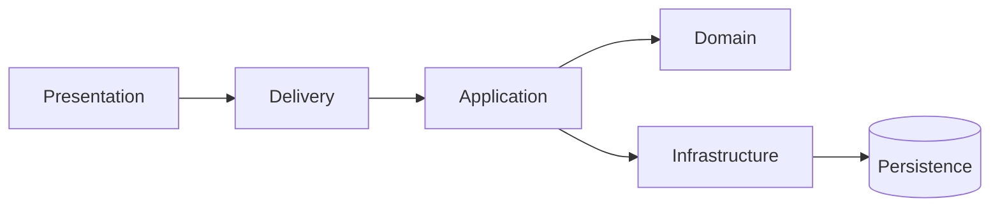
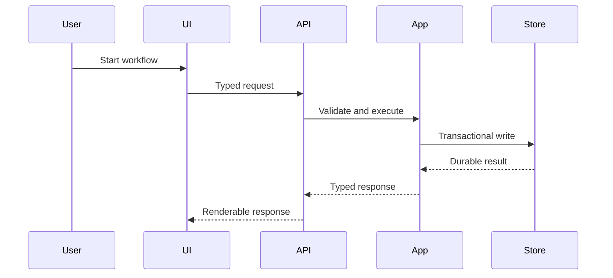
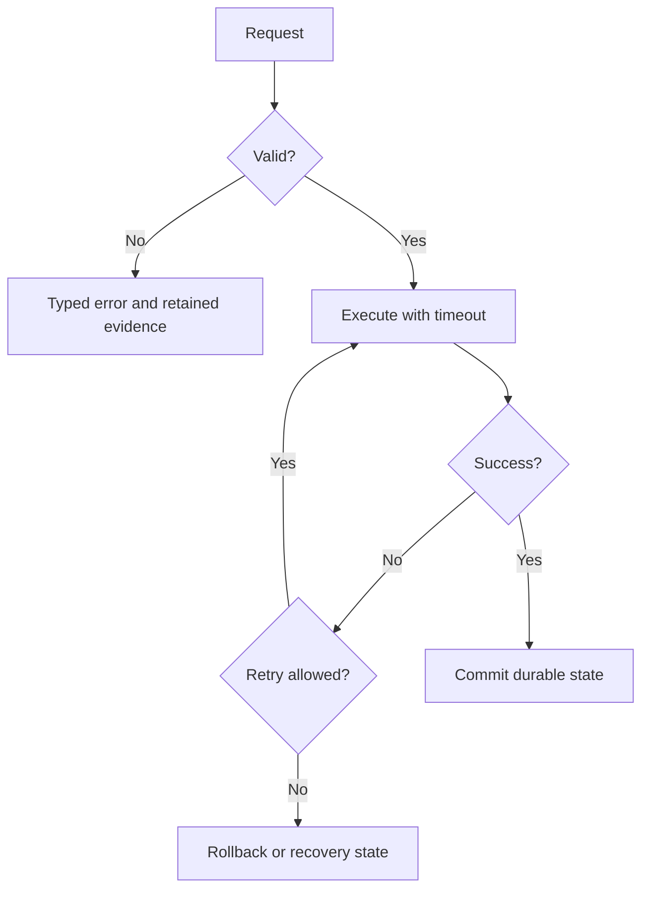

# {{WORK_ITEM_ID}} {{TITLE}} Master Blueprint

## Summary
{{ONE_SENTENCE_OUTCOME}}

## Scope and Completeness Boundary
### In Scope
{{EXHAUSTIVE_CAPABILITY_LIST}}
### Out of Scope
{{EXPLICIT_EXCLUSIONS}}
### Assumptions and Open Decisions
{{RESOLVED_ASSUMPTIONS_OR_BLOCKING_OPEN_QUESTIONS}}

## Blueprint Document Shape
Blueprint document length is not a gate. Keep a coherent contract together and
split only at a meaningful ownership, dependency, review, or context boundary.
Never omit, summarize, or mechanically divide implementation blocks to satisfy
an arbitrary line count. A size note may be recorded for navigation, but its
absence never blocks approval.

## Section 1: Document Control And Upstream Traceability
| Artifact | Relative Path | Full SHA-256 | Status |
|---|---|---|---|
| Requirement Spec | {{REQ_PATH}} | {{REQ_HASH}} | {{REQ_STATUS}} |
| Roadmap | {{ROADMAP_PATH}} | {{ROADMAP_HASH}} | {{ROADMAP_STATUS}} |
| Implementation Plan | {{PLAN_PATH}} | {{PLAN_HASH}} | {{PLAN_STATUS}} |
| Architecture Review | {{ARCH_PATH}} | {{ARCH_HASH}} | {{ARCH_STATUS}} |
| Frontend Design (when UI changes) | {{FRONTEND_DESIGN_PATH}} | {{FRONTEND_DESIGN_HASH}} | {{FRONTEND_DESIGN_STATUS}} |

## Section 2: Executive Architecture And 4-Layer DDD Topology
### Current State
{{REPOSITORY_EVIDENCE}}
### Target State
{{TARGET_COMPONENTS_AND_BOUNDARIES}}

### Dependency Rules
{{ALLOWED_AND_FORBIDDEN_DEPENDENCIES}}

## Section 3: Component Boundaries And Interface Contracts
| ID | Layer | Owner | Inputs | Outputs | Errors | Timeout/Retry | Consumers |
|---|---|---|---|---|---|---|---|
| {{COMPONENT_OR_INTERFACE_ID}} | {{LAYER}} | {{OWNER}} | {{TYPED_INPUT}} | {{TYPED_OUTPUT}} | {{ERROR_MODEL}} | {{POLICY}} | {{CONSUMERS}} |

### Implementation-Ready Code-Block Inventory
For every implementation-ready block, include adjacent metadata with `id`,
`language`, `file`, `operation`, and `implementation_ready: true`. Every block
must map to one file row and one coverage row.

{{CODE_BLOCKS_WITH_METADATA}}

For greenfield initialization, this section MUST contain one metadata-bearing,
complete full-file block for every concrete source, configuration, schema,
migration, UI, test, and asset-manifest row in the Master or its owning phase.
A matrix row without a block, a block without exactly one matrix row, or a
block containing a signature, excerpt, pseudocode, placeholder, or summary is
invalid. Internal Review Evidence MUST be written only after the canonical
validator returns its machine decision. `READY_FOR_VALIDATION`,
`REVIEW_PASSED`, and prose claims are not gate results.

## Greenfield Repository Bootstrap Contract
### Empty Repository Baseline
{{EXACT_EMPTY_REPOSITORY_EVIDENCE_AND_NONEXISTING_PRODUCT_FILES}}

### Target Repository Tree
```text
{{COMPLETE_TARGET_DIRECTORY_TREE_WITH_EVERY_FILE_OWNERSHIP}}
```

### Bootstrap Command Sequence
| Order | Command | Creates/Verifies | Exit Evidence | Consumer Phase |
|---|---|---|---|---|
| {{ORDER}} | {{EXACT_COMMAND}} | {{FILES_OR_STATE}} | {{EXPECTED_RESULT}} | {{PXX}} |

### Initial Dependency Manifest
| Ecosystem | Manifest/Lock File | Direct Dependencies | Version Policy | Offline/Cache Rule | Verification |
|---|---|---|---|---|---|
| {{ECOSYSTEM}} | {{FILE}} | {{DEPENDENCIES}} | {{VERSIONS}} | {{POLICY}} | {{COMMAND}} |

## Section 4: Data Flow And Sequence Diagram
### Happy Path

### Failure, Cancel, Retry, Resume, and Recovery

{{DETAILED_FLOW_NOTES}}

## Section 5: Concurrency Locking Safe-Write And Error Handling
| Boundary | Concurrency Model | Lock/Ownership | Idempotency | Error Taxonomy | Recovery |
|---|---|---|---|---|---|
| {{BOUNDARY}} | {{MODEL}} | {{OWNER}} | {{KEY}} | {{ERRORS}} | {{RECOVERY}} |

## Section 6: Security Safeguards Configuration Observability And Migration
{{INPUT_VALIDATION_SECRET_HANDLING_AUTHZ_LOGGING_METRICS_MIGRATION_COMPATIBILITY}}

## Section 7: File-By-File Change Matrix
| File | Layer | Operation | Owner | Imports | Exports | Exact Signatures | Lines | Profile | Commands | Code Block IDs | Tests | Evidence |
|---|---|---|---|---|---|---|---:|---|---|---|---|---|
| {{RELATIVE_FILE}} | {{LAYER}} | {{NEW_OR_MODIFY}} | {{OWNER}} | {{IMPORTS}} | {{EXPORTS}} | {{SIGNATURES}} | {{PROJECTED_LINES}} | {{PROFILE}} | {{BUILD_LINT_TYPECHECK_TEST}} | {{BLOCK_IDS}} | {{TEST_IDS}} | {{EVIDENCE_PATHS}} |

No directory, wildcard, or unbounded group may appear as a substitute for a
concrete file. Files over 500 physical lines require one family folder and one
facade/barrel/aggregate entry before approval.

Every concrete row must reference one or more real implementation-ready
code-block IDs. The complete master-plus-phase artifact set is the gate input;
a missing block, unknown ID, duplicate ID, orphan target, or file mismatch is
`CODE_BLOCK_GATE: BLOCKED`.

The Master and phase documents may be any length required for a complete
implementation contract. Split only when the new artifact is independently
executable and improves ownership or review. Source-file size policy remains a
separate implementation concern and must never cause a Blueprint block to be
truncated or omitted.

## Section 8: Specialist Implementation Sequence DAG
| Task ID | Phase | Owner | Reads | Writes | Dependencies | Outputs | Verification | Rollback |
|---|---|---|---|---|---|---|---|---|
| {{TASK_ID}} | {{PXX}} | {{OWNER}} | {{READ_SET}} | {{WRITE_SET}} | {{DEPENDENCIES}} | {{OUTPUTS}} | {{TEST_IDS}} | {{ROLLBACK}} |

## Implementation Task Contract

Every delivery task must be executable by a fresh Agent with no chat-history
context. Use one row per independently testable unit and include the exact
test-first sequence below.

| Task ID | Phase | Responsibility | Exact Files | Depends On | Consumes | Produces | Red Test/Action | Implementation Blocks | Green Command + Expected Result | Evidence | Rollback |
|---|---|---|---|---|---|---|---|---|---|---|---|
| {{TASK_ID}} | {{PXX}} | {{ONE_RESPONSIBILITY}} | {{CONCRETE_FILES}} | {{TASK_IDS}} | {{TYPED_INTERFACES}} | {{TYPED_INTERFACES}} | {{COMMAND_AND_EXPECTED_FAILURE}} | {{BLOCK_IDS}} | {{COMMAND_AND_BINARY_EXPECTATION}} | {{RETAINED_EVIDENCE_PATH}} | {{ROLLBACK}} |

No row may use `TBD`, `TODO`, `appropriate`, `handle as needed`, `write tests`
without test code or command, or `similar to another task`. If a task cannot
be completed from this table and its linked full-file blocks, the Blueprint is
`NO-GO`.

## Hierarchical Delivery Decomposition
| Family | Small Feature | Why This Boundary Exists | Phase IDs | Owned Files | Dependencies | Exit Evidence |
|---|---|---|---|---|---|---|
| {{FAMILY_ID}} | {{SMALL_FEATURE_ID_OR_DIRECT}} | {{COMPLEXITY_REASON}} | {{PXX_LIST}} | {{CONCRETE_FILE_LIST}} | {{DEPENDENCIES}} | {{EVIDENCE_PATHS}} |

The canonical artifact layout is `Master -> Family -> Small Feature -> Phase`.
A family may omit the small-feature directory only when its measured scope is
small; large families must be divided before phase planning.

## Surface Completeness Matrices

When the normalized scope contains a web, desktop, or other user interface,
the Master MUST include this exact heading and a row for every upstream route,
screen, shell, form, detail/history view, settings view, and explicit
loading/error/empty/not-found state. Each row must contain all fields shown:

| Route | Screen/Surface | Family/Small Feature/Phase | Concrete Files | Code Blocks | API/Data Contract | Validation + Loading/Error/Empty States | Test IDs | Evidence Paths |
|---|---|---|---|---|---|---|---|---|
| {{ROUTE}} | {{SURFACE}} | {{DELIVERY_UNIT}} | {{FILES}} | {{BLOCK_IDS}} | {{API_OR_DATA}} | {{STATES}} | {{TEST_IDS}} | {{EVIDENCE}} |

When the normalized scope contains backend, persistence, worker, API, or
cross-layer runtime behavior, the Master MUST include this exact heading and
separate rows for every materialized backend capability. A single repository,
routes, or scaffold row is invalid:

| Capability | Family/Small Feature/Phase | Concrete Files | Code Blocks | API/Data Contract | Error/Retry/Recovery | Test IDs | Evidence Paths |
|---|---|---|---|---|---|---|---|
| Domain/model validation | {{DELIVERY_UNIT}} | {{FILES}} | {{BLOCK_IDS}} | {{TYPES}} | {{ERRORS}} | {{TEST_IDS}} | {{EVIDENCE}} |
| Persistence/schema/repository | {{DELIVERY_UNIT}} | {{FILES}} | {{BLOCK_IDS}} | {{SCHEMA}} | {{ERRORS}} | {{TEST_IDS}} | {{EVIDENCE}} |
| Application services/use-cases | {{DELIVERY_UNIT}} | {{FILES}} | {{BLOCK_IDS}} | {{INPUT_OUTPUT}} | {{ERRORS}} | {{TEST_IDS}} | {{EVIDENCE}} |
| Delivery/API/handlers | {{DELIVERY_UNIT}} | {{FILES}} | {{BLOCK_IDS}} | {{ENDPOINTS}} | {{ERRORS}} | {{TEST_IDS}} | {{EVIDENCE}} |
| Runtime execution/integrations when present | {{DELIVERY_UNIT}} | {{FILES}} | {{BLOCK_IDS}} | {{CONTRACT}} | {{RETRY_RECOVERY}} | {{TEST_IDS}} | {{EVIDENCE}} |
| Observability/history/events when present | {{DELIVERY_UNIT}} | {{FILES}} | {{BLOCK_IDS}} | {{CONTRACT}} | {{RECOVERY}} | {{TEST_IDS}} | {{EVIDENCE}} |
| Verification fixtures/unit/integration/E2E | {{DELIVERY_UNIT}} | {{FILES}} | {{BLOCK_IDS}} | {{ASSERTIONS}} | {{FAILURE_POLICY}} | {{TEST_IDS}} | {{EVIDENCE}} |

## Project Initialization Coverage Matrix
Use this section when `project_initialization: true` or when the request starts
an application from an empty repository. Each row is a required product
obligation, not a tooling prerequisite.

| Obligation ID | Requested Capability | Scaffold Files | Code Blocks | Tests | Commands | Evidence |
|---|---|---|---|---|---|---|
| {{INIT_OBLIGATION_ID}} | {{STACK_OR_PRODUCT_OBLIGATION}} | {{CONCRETE_FILES}} | {{BLOCK_IDS}} | {{TEST_IDS}} | {{COMMANDS}} | {{EVIDENCE_PATHS}} |

## Feature Coverage Matrix
| Capability ID | User Intent | Acceptance Criteria | Phase | Files | Code Blocks | Test IDs | Evidence Paths |
|---|---|---|---|---|---|---|---|
| {{CAPABILITY_ID}} | {{INTENT}} | {{BINARY_AC}} | {{PXX}} | {{FILES}} | {{BLOCK_IDS_OR_NA_REASON}} | {{TEST_IDS}} | {{EVIDENCE_PATHS}} |

## Section 9: QA Verification Matrix
| Test ID | Requirement/AC | Layer | Setup | Real Action | Expected Result | Command | Owner | Evidence |
|---|---|---|---|---|---|---|---|---|
| {{TEST_ID}} | {{AC}} | {{LAYER}} | {{REAL_SETUP}} | {{REAL_ACTION}} | {{BINARY_RESULT}} | {{COMMAND}} | TESTER | {{RETAINED_EVIDENCE}} |

Required statuses are explicit: `PASS`, `FAIL`, `NOT_RUN`, or `BLOCKED`.
Static, mock, inferred, dry-run, and screenshot-only results cannot satisfy a
real runtime or browser acceptance criterion.

## Section 10: Blueprint Readiness Assessment And CODE_BLOCK_GATE
| Field | Evidence |
|---|---|
| Reviewer Roles | {{ROLES}} |
| Source Artifacts Reviewed | {{ARTIFACTS}} |
| Capability Inventory Complete | PASS/FAIL with count |
| Feature Coverage Matrix Complete | PASS/FAIL with row count |
| File Matrix Complete | PASS/FAIL with concrete file count |
| Data Flow And Sequence Diagram Preserved | PASS/FAIL with section evidence |
| Phase Count Derived From Complexity | PASS/FAIL with metrics and count |
| Language Profiles and Commands | PASS/FAIL |
| CODE_BLOCK_GATE | PASS/FAIL/BLOCKED with JSON path and Blueprint hash |
| Real E2E Status | NOT_RUN before implementation; PASS only with retained runtime evidence |
| Failed Points | {{FAILED_POINTS_OR_NONE}} |
| Revision Scope | {{REVISION_SCOPE}} |
| Re-review Count | {{REVIEW_COUNT}} |
| Document Compliance Score | {{SCORE}}/100 |
| Relative Path Scan | PASS/FAIL |
| Final Result | PASS only when all blocking gates pass |

## Internal Review Evidence
| Field | Evidence |
|---|---|
| Reviewer Roles | {{ROLES}} |
| Source Artifacts Reviewed | {{ARTIFACTS}} |
| Checklist Result | Machine result copied from the canonical validator |
| CODE_BLOCK_GATE | Exact decision, JSON path, Blueprint SHA-256, and blocking findings |
| Failed Points | {{FAILED_POINTS_OR_NONE}} |
| Revision Scope | {{REVISION_SCOPE}} |
| Re-review Count | {{REVIEW_COUNT}} |
| Document Compliance Score | {{SCORE}}/100 |
| Relative Path Scan | PASS/FAIL |
| Final Result | PASS only when the runtime validator returns APPROVAL_READY |

## NO-GO Conditions

- Any requirement, acceptance criterion, or requested constraint lacks a
  coverage row.
- Any new-project obligation lacks a Project Initialization Coverage Matrix
  row connecting scaffold files, code blocks, tests, commands, and evidence.
- Any explicit `FR-*`, `NFR-*`, `AC-*`, `G-*`, or `US-*` token is absent from
  the Feature Coverage Matrix data rows.
- Any source file lacks a concrete matrix row, owner, command, test, and
  evidence mapping.
- Any phase is missing when the derived complexity requires a split.
- Any implementation-ready code block lacks strict profile metadata or a
  matching source file row.
- Data Flow And Sequence Diagram is missing, malformed, or removed during a
  repair.
- Real runtime/browser/desktop E2E is reported as PASS without retained logs,
  exit codes, screenshots or traces appropriate to the test.

## Owner Approval Boundary

Blueprint approval authorizes implementation entry only. It does not authorize
git, release, deployment, or production actions.
